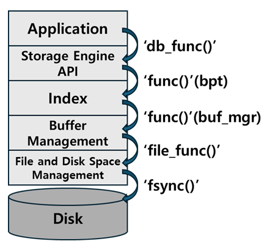
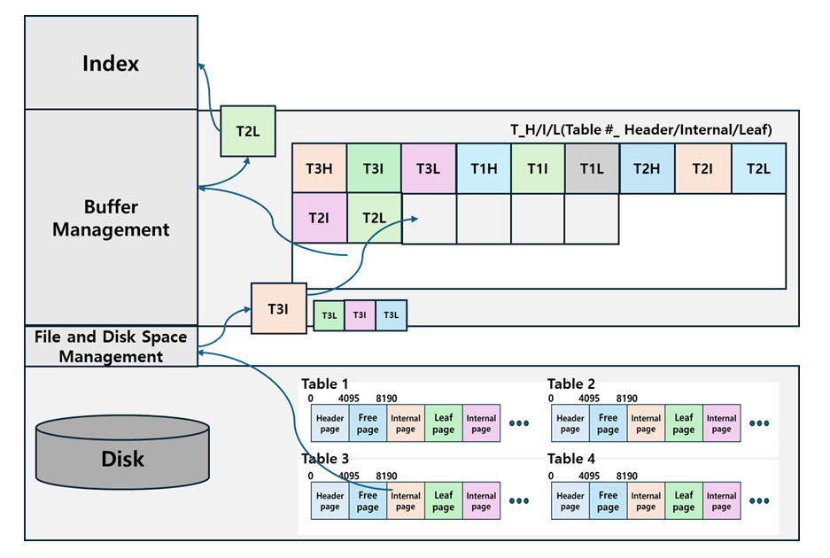
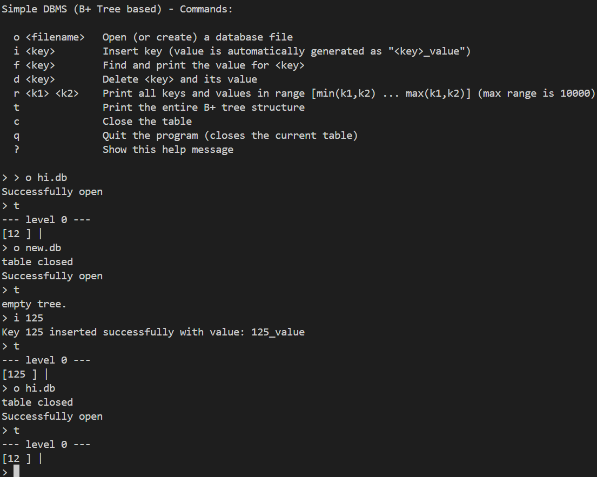
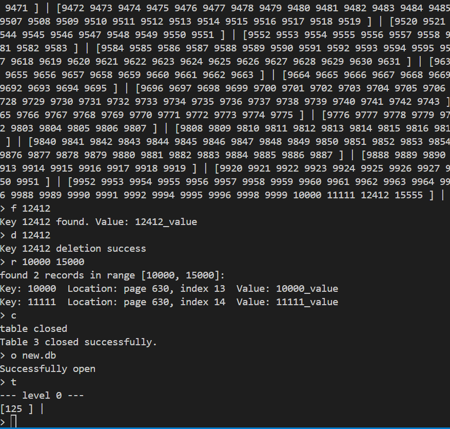

# simple-dbms
A simple, educational DBMS Storage Engine project.  
The goal is to implement core database infrastructure layers:   
File/Disk Management, Index Layer, Buffer Manager, and eventually, Concurrency Control and Table Locking. SQL parsing is intentionally excluded.

now, we are on buffer manager

---

## 프로젝트 설명

이 프로젝트는 **multi table**과 **buffer manager**를 구현하는 프로젝트입니다.  
이번 구현은 **DBMS**에서 **buffer management**를 구현합니다.  
버퍼 계층은 전반적인 성능을 크게 향상시킵니다.

이전 레이어의 구현은 [README:disk based b+ tree]()에서 볼 수 있습니다.  
  
원래는 이 프로젝트의 이전 계층을 c로 구현했었지만, 버퍼 매니저를 구현하면서 cpp의 STL을 활용해야 하는 상황이 발생함에 따라 c언어 + STL 형태의 구조로 전환되었습니다.


다음은 이 프로젝트의 **아키텍처** 입니다. ([design.md](design_buf.md) 참고)



다음은 이 프로젝트의 **버퍼 매니저**설계 입니다.



---

## 개발 환경 및 실행 (Development Environment)

개발환경:  
Ubuntu 24.04.3 LTS (GNU/Linux 5.15.167.4-microsoft-standard-WSL2 x86_64)

실행:

- main파일 생성: `make` (Makefile있는 폴더에서)
- main파일을 실행: `./main`
- libbpt.a라이브러리를 생성: `make` (Makefile 참고)
- libbpt.a라이브러리를 이용: `#include "libbpt.a"` (test/library_test.c 참고)
- 버퍼 매니저 로직 테스트 실행: `cmake .. -> make -> ctest` (build폴더에서 실행)

---


## 예시 실행 화면 (Sample Execution)

  
   
  

---


<details>
<summary><b> 요구사항(Requirements) </b></summary>

1. Extend the Disk-based B+Tree by adding an **in-memory Buffer Manager**  
   → All page I/O must go through the Buffer Manager, and the File Manager API must be called **only inside the Buffer Manager**.

2. **The buffer block structure must include at least the following fields (additional fields are allowed)**

```

* frame               : 4096 bytes (actual page content)
* table_id            : ID of the table(file) that this page belongs to
* page_num            : Page number within the file
* is_dirty            : Whether the page has been modified
* is_pinned           : Whether the page is currently in use (prevents eviction)
* (Any additional fields required for your design are allowed)

````

3. The resulting library (**libbpt.a**) must provide the following APIs

```c
1. int init_db(int buf_num);
   • Allocates a buffer pool with buf_num buffers and initializes the buffer manager  
   • Returns 0 on success, non-zero on failure

2. int open_table(char* pathname);
   • Opens the data file at pathname, or creates it if it does not exist  
   • If the same file is opened multiple times, the same table_id must be returned (pathname length ≤ 20)  
   • table_id starts from 1 and at most 10 tables can be opened simultaneously  
   • Returns table_id (≥1) on success, a negative value on failure

3. int db_insert(int table_id, int64_t key, char* value);
   • Inserts (key, value) into the B+Tree of the specified table_id

4. int db_find(int table_id, int64_t key, char* ret_val);
   • Searches for the given key in the specified table_id  
   • If found, copies the value into ret_val and returns 0

5. int db_delete(int table_id, int64_t key);
   • Deletes the record corresponding to the given key from the specified table_id

6. int close_table(int table_id);
   • Flushes all dirty pages related to the specified table to disk and closes the table  
   • Returns 0 on success, non-zero on failure

7. int shutdown_db(void);
   • Flushes all dirty pages to disk and releases the buffer pool  
   • Returns 0 on success, non-zero on failure
````

4. **Buffer Management Policy**

   * On page access, first search the buffer pool (determine cache hit/miss)
   * On a cache miss, select a victim using the LRU policy
   * If the victim is dirty, it must be written to disk before eviction
   * Pinned pages cannot be selected as victims

5. Additional Requirements

   * Support up to 10 tables open simultaneously
   * `close_table()` must flush only the dirty pages of the specified table
   * `shutdown_db()` must flush all dirty pages of all tables before termination
   * The file format and page structure from Project2 must be preserved as-is
   * All disk I/O must be performed through the buffer manager
     → The index manager code must not directly call `file_read_page` / `file_write_page`, etc.

</details>

---

## 디자인 설계 (Design)

버퍼 매니저의 역할은 디스크로부터 읽은 페이지들을 인메모리 상의 프레임에 임시로 저장하는 역할입니다.  
또한 동시에 인덱스 레이어와 파일 매니저 레이어 사이의 캐시 역할을 맡습니다.  
또한 이 프로젝트에서는 여러 개의 테이블이 가능해야 합니다.  
이전 프로젝트에선 단일 테이블에만 read/write했었는데 요구사항에 따라 이제 여러 테이블에도 접근 가능해야 합니다.  

### 버퍼 디자인 (buffer manager) ###
버퍼 매니저를 어떻게 설계할지 여러 가지를 생각해 봤습니다.
1. 단일 버퍼 공간
- 페이지, 테이블id, 페이지 숫자 등 페이지와 메타 데이터를 결합한 버퍼 컨트롤 블록(buf_ctl_block)을 만든다.
- 버퍼 컨트롤 블록들을 원소로 하는 배열을 버퍼 매니저가 관리한다.
- 다른 테이블이어도 동일한 버퍼 프레임 공간에 접근 가능하다.
2. 테이블 별 버퍼 공간
- 페이지, 테이블id, 페이지 숫자 등 페이지와 메타 데이터를 결합한 버퍼 컨트롤 블록(buf_ctl_block)을 만든다.
- 버퍼 컨트롤 블록들을 원소로 하는 배열을 버퍼 매니저가 관리한다.
- 테이블 별로 버퍼 매니저가 존재한다.
- 다른 테이블이면 동일한 버퍼 프레임 공간에 접근할 수 없다.

1번의 장점은 적은 버퍼 공간으로도 해결이 가능하다는 것입니다. 이것은 적은 RAM(메모리)로도 버퍼의 역할이 가능하다는 것을 의미합니다. 이는 현업에서의 관점이라면 저렴한 가격으로 직결됩니다. 하지만 단점은 여러 테이블이 공유하기 하나의 메모리 공간을 공유 가능하기 때문에 충돌이 일어날 수 있다는 것입니다. 또한 동시성 제어를 처리하기 번거로워집니다.  
2번의 장점은 구현이 쉽다는 것입니다. 테이블 별로 버퍼 공간을 분리하면 동일한 프레임 공간에 여러 테이블이 접근하는 것을 고려할 필요가 없습니다. 이는 동시성 제어에서 쉬운 난이도라는 이점을 얻을 것입니다. 하지만 큰 단점이 있는데, 테이블 별로 버퍼 메모리 공간을 분리한다면 그만큼 버퍼 공간에 대한 경제적인 비용이 많이 든다는 것입니다.  
저는 1번을 선택했습니다. 버퍼는 크면 클수록 성능 향상에 도움이 됩니다. 그러면 디스크만큼 큰 버퍼를 할당한다면 말그대로 인메모리 디스크도 가능하겠죠. 하지만 실제로 그렇게 하지 않습니다. 왜냐하면 버퍼를 위한 메모리는 비싸기 때문입니다. 그래서 이 프로젝트가 아무리 실제로 사용할 dbms를 구현하는 것이 아니더라도, 실제와 완전히 괴리감이 있게 버퍼 공간을 크게 잡기보다는 작게 유지하기로 했습니다.

---

## 아키텍처 설명 (Architecture Explanation)

```
[Application Layer]
(main.c)
- 사용자 입력 처리

=>

[Stroage Engine API]
(db_api.c)
- open_table()
- db_insert()
- db_find()
- db_delete()

=>

[Index Layer]
(bpt.c)
- B+tree 탐색/수정
- buffer manager API 호출

=>

[Buffer Management Layer]
(buf_mgr.c)
- file manager API 호출

=>

[File and Disk Space Management Layer]
(file.c)
- file_alloc_page()
- file_free_page()
- file_read/write_page()
- fsync()

=>

[Disk]
(data file)
```
이번 프로젝트부터 Index Layer는 File Layer로 직접적인 접근을 하지 못합니다.  
반드시 buffer manager 계층을 거쳐야 페이지에 read/write 가능합니다.  
다음과 같은 과정을 거칩니다.  
1. index layer에서 buffer manager에 read page 요구
2. page가 버퍼에 없다면, 버퍼 매니저는 file manager API를 호출해 읽어옵니다.  
   page가 버퍼에 있다면, 해당 페이지를 제공합니다.
3. index layer에서 페이지를 수정하고 나서, write buffer를 통해 버퍼에 수정된 페이지를 작성합니다.
4. 이후, 수정된 페이지는 버퍼 상에서 계속 존재합니다. 해당 페이지를 다시 read 요청할 경우, 버퍼 상의 페이지를 읽어옵니다. 만약 eviction이 발생하면, 해당 페이지는 디스크에 작성되고, 빈 버퍼 프레임을 제공합니다.
5. 테이블을 종료하거나, 프로그램 종료시, 수정된 페이지는 전부 디스크에 작성합니다.

---

### 버퍼 매니저 구현 (implementing buffer manager)
버퍼 매니저의 기본 구조는 다음과 같습니다.
```cpp
typedef struct {
  void* frame;
  tableid_t table_id;
  pagenum_t page_num;
  bool is_dirty;
  int pin_count;
  bool ref_bit;
  // fields will be added later
} buf_ctl_block_t;

typedef struct {
  buf_ctl_block_t* frames;
  int frames_size;
  int clock_hand;
  std::unordered_map<pagenum_t, frame_idx_t> page_table[MAX_TABLE_COUNT + 1];
} buffer_manager_t;

extern buffer_manager_t buf_mgr;
```
버퍼 매니저가 테이블 별로 디스크 상의 pagenum과 인 메모리 상의 frame_idx를 매핑해주는 page_table을 관리합니다.  
frame은 디스크 상의 페이지를 인메모리 상에 보유하는 공간이며, 메타 데이터와 함께 buf_ctl_block에 존재합니다. 또한 이 buf_ctl_block 배열을 버퍼 매니저가 관리합니다.  
  
이 프로젝트는 다중 테이블 환경이기 때문에, table_id, pagenum, frame_idx를 어떻게 매핑할지 여러 디자인을 고민했었습니다.  
  
1. table_id, pagenum 복합키 방식
```cpp
std::unordered_map<std::pair<tableid_t, pagenum_t>, frame_idx_t, KeyHash> page_table;

```

첫번째 방식은 table_id와 pagenum을 하나의 키로 묶는 방식입니다. 키를 복합키로 관리합니다. 이러한 구현은 `void flush_table_buffer(tableid)`와 같이 `db_api`계층에서 `table_id`만 아는 상황에서 `frame_idx`를 이용하는 작업을 처리할때 번거로움이 발생합니다.  
물론, 이를 보완하는 방법도 존재합니다.
```cpp
    // buf_ctl_block_t
    // 테이블별 연결 리스트를 위한 포인터/인덱스
    frame_idx_t prev_in_table; 
    frame_idx_t next_in_table; 

 
    // buffer_manager_t
    // 테이블별 연결 리스트의 Head/Tail을 저장하는 배열
    // table_id는 1부터 시작한다고 가정하고, 배열 크기는 MAX+1
    frame_idx_t table_head[MAX_TABLE_COUNT + 1]; 
    frame_idx_t table_tail[MAX_TABLE_COUNT + 1]; 
    
```
`buf_Ctl_block`을 연결 리스트처럼 관리하고, 각 테이블 별 헤더와 테일을 버퍼 매니저가 관리하는 것입니다. 그러면 복합 키 구조를 유지하면서 버퍼 매니저만으로도 손쉽게 특정 테이블의 프레임 리스트에 접근할 수 있습니다.  
  
2. pagenum 단일키 방식
```cpp
  std::unordered_map<pagenum_t, frame_idx_t> page_table[MAX_TABLE_COUNT + 1]; 
```
두 번째 방식은 테이블 별로 pagenum과 frame_idx의 매퍼를 관리하는 매퍼 배열을 만드는 것입니다. 이 방식은 테이블의 최대 숫자가 고정되어 있기 떄문에 구현도 쉬울 뿐 아니라 `db_api` 계층에서 아래 계층에 `table_id` 만 전달해도 `frame_idx`와 관련된 작업을 손쉽게 처리할 수 있습니다. 단지 `iterator`로 참고하기만 하면 됩니다.  
따라서, 두 번째 방식으로 구현했습니다. 
  
### eviction 처리 (how to handle eviction)
버퍼의 공간은 제한되어 있고, 여러 테이블이 공유하기 때문에 버퍼가 꽉 차는 상황은 발생할 수 밖에 없습니다. 따라서, 새로운 프레임 할당시, 사용하지 않는 프레임은 버퍼에서 제거(eviction)하는 로직은 반드시 필요합니다. 이를 처리하는 알고리즘은 여러 개가 존재합니다.  
1. **LRU(Least Recently Used)**  
대부분의 상황에서 유리한 알고리즘입니다. 사용한지 오래된 페이지를 제거합니다. 하지만 이는 버퍼 사이즈가 디스크 사이즈보다 작은 상황에서, 순차적으로 디스크에서 읽어오는 상황이라면(예를 들어, 버퍼 크기가 8인 상황에서 1,2,3,4,5,6,7,8,9를 반복해서 순서대로 읽음), 버퍼가 꽉 찬 상황에서 계속해서 페이지를 읽을때마다 cache miss가 발생합니다.  
2. **MRU(Most Recentlly Used)**  
MRU는 LRU의 worst case에 적합합니다. 버퍼가 꽉 찬 상황에서 계속해서 읽어도 1~9까지 읽더라도 cache miss는 한 번 밖에 일어나지 않습니다. 하지만 이러한 worst case를 제외하면 일반적인 상황에서 가장 최근에 참조한 페이지를 제거하는 것은 temporal locality 측면에서 비효율적 입니다.
3. **LRU with Clock algorithm (LRU approximation)**  
  buf_ctl_block마다 ref_bit(reference)를 할당하고, 해당 프레임이 사용중(읽기 시도)이라면 ref_bit를 켰습니다. 만약 clock_hand가 돌면서 꺼진 ref_bit를 가진 프레임을 발견한다면, 해당 프레임은 사용하지 않는 페이지면서 LRU와 유사하게 작동합니다. 만약, 전부 ref_bit가 켜진 상황이라면, clock_hand는 한바퀴 돌면서 켜진 ref_bit를 끕니다. 이 상황에서 다른 스레드가 어떤 페이지를 참조할 경우, 해당 페이지의 ref_bit는 켜집니다. 따라서 clock_hand가 한 바퀴 돌고나서도 꺼진 ref_bit의 프레임이라면, 해당 프레임은 제거해도 상관 없습니다.
  
기본적인 LRU 방식은 timestamp가 필요합니다. 언제 사용했는가를 저장하기 위해서 페이지 당 약 8byte 정도의 공간이 필요하게 됩니다. 안그래도 부족한 버퍼 공간에 페이지 하나에 8byte를 더 낭비하는 것은 메모리 소모가 큽니다. 하지만 이를 clock 방식을 이용하게 되면 reference bit 하나만으로도 LRU와 유사하게 처리 가능합니다. 따라서 이 프로젝트에선 3번 방식을 적용했습니다.  
  
LRU와 MRU를 조합해서 일반적인 상황에서 LRU를 사용하다가, LRU의 worst case가 발생하면 MRU를 사용하는 방식으로 하면 좋겠지만 아쉽게도 언제 worst case가 발생할지 저로서는 알 방법이 없습니다.  
LRU의 장점은 temporal locality가 좋다는 것입니다. 반면에 worst case에서는 처참합니다. 하지만 근본적으로 worst case는 디스크에서 페이지 하나씩만 읽을때 발생하는 상황입니다. 이를 보완하기 위해 prefetch 방식을 도입하여 한 번에 여러 페이지를 읽어온다면 spatial locality에도 좋을뿐만 아니라 LRU가 약한 sequential scan인 상황도 보완 가능합니다. 따라서 이 프로젝트에서는 LRU approximation + prefetch 방식을 도입했습니다.  
  
prefetch를 통해 실제 사용되는 페이지 외에도 디스크 상에서 연속된 페이지 몇 개를 더 버퍼에 가져옵니다. 하지만 prefetch를 통해 미리 읽어온 페이지들은 실제 참조되는 페이지들이 아니기 때문에 pin_count를 0으로 설정합니다. 이를 통해 추후에 미리 읽어온 페이지가 차지한 프레임 공간을 실제로 사용하지 않는다면 다른 페이지로 대체 가능하도록 구현했습니다.
    

  
  ### 프레임 참조 및 수정 구현 (implementing reference and edit case)
  하지만 여전히 `ref_bit`만으로는 버퍼 상의 페이지가 수정되었는지, 동일한 페이지를 여러 번 참조한 경우를 알지 못합니다.  
  이를 위해 도입한 것이 `buf_ctl_block`의 `pin_count`와 `is_dirty`입니다.  
  `pin_count`는 페이지가 참조 되었을때 카운트가 증가합니다. 참조가 끝났을 경우, `unpin`을 호출해서 감소시킵니다.  
  `is_dirty`는 버퍼에서의 페이지가 수정되었는지를 알기 위한 플래그입니다. 만약 버퍼 상의 페이지를 수정했다면, 나중에 테이블을 닫거나, 프로그램을 종료시킬때, 혹은 eviction이 발생할때, 수정된 페이지를 디스크에 작성해야 합니다. 이를 위해 버퍼 상에 페이지를 수정하는 `write_buffer`를 호출했다면, `is_dirty`는 체크되어야 합니다.

### 멀티 테이블 구현 (implementing multi tables)  
버퍼 매니저만 구현했더라면 비교적 수월했을 수도 있지만 여러 테이블이 기존 시스템과 버퍼에도 정상 작동하도록 구현하다 보니 여러 문제 상황이 발생했습니다.  
테이블은 고유의 테이블ID를 가져야 합니다. 이 고유 테이블ID를 처음에 open시에 반환된 fd(file descriptor)를 할까 고민 했었지만 테이블을 닫고나서 fd를 반환할 경우, os는 테이블을 open할때 반환된 fd를 재사용하는 경우가 있을 수도 있기 떄문에 해당 방법으로 구현하지 않았습니다.  
```cpp
  typedef struct {
  char path[PATH_NAME_MAX_LENGTH + 1];
  int fd;
} table_info_t;

extern table_info_t table_infos[MAX_TABLE_COUNT + 1];
```
대신, `table_infos`라는 배열을 만들어 순회하며 해당 `table_infos`가 비어있다면 해당 테이블ID를 할당하고, `path`에 경로를 저장했습니다. 테이블을 닫을때, 해당 `table_id`의 `table_infos`를 완전히 리셋해버리면 다른 테이블임에도 불구하고 같은 테이블ID를 가지는 상황이 발생할 수 있습니다. 이를 방지하기 위해 fd는 반환했지만, `path` 값은 유지했습니다.  

---

## 트러블 슈팅 (Trouble Shooting)
1. **flush all buffer가 buffer manager에 필요한가?**  
flush all buffer는 버퍼 상의 모든 페이지를 디스크에 작성하는 행위를 말합니다. `db_api`계층에서 프로그램 종료시 호출할 `shutdown db`를 구현해야 하고, `shutdown db`는 버퍼 상의 모든 페이지를 디스크에 작성하고 파일 디스크립터를 반환하는 등의 작업을 처리합니다.  
`flush_all_buffer`는 버퍼를 비우는 작업이기에 buffer manager 계층에서 구현되어야 합니다. 하지만 이를 처리하기 위해선 모든 테이블 id를 알아야 합니다. 왜냐하면 buffer manager 계층에선 단지 매퍼만 가지고 있는 것이지, 테이블ID가 뭐가 있는지 어떤 테이블ID가 사용되는지 알지 못하기 때문입니다. 그렇다고 버퍼 매니저가 모든  테이블ID를 알게 할 경우, 이는 layered architecture의 특성에 어긋나게 됩니다. 왜냐하면 어떤 테이블이 존재하는지, 테이블과 path 및 fd를 관리하는 역할은 db_api에서 담당하고 있기 때문입니다.  
따라서 이를 해결하고자 buffer manager에서는 전달받은 테이블ID에 한해서만 flush buffer하도록 했습니다. 그렇게 구현된 `flush_table_buffer`를 모든 테이블ID를 알고있는 db_api 계층에서 호출해서 처리하는 방식으로 구현했습니다.  
여기서 또 다시 고민이었던 점은 db_api 계층에서 index layer를 건너뛰고 buffer manager를 호출하는 것이 맞나 였습니다. 하지만 생각해보면 index layer가 buffer를 flush하는 작업에 관해서 관여할 필요가 없습니다. 그렇기 때문에 버퍼를 비우는 작업은 인덱스 계층을 거치지 않더라도 바로 버퍼 매니저 계층을 통하여 처리 가능하도록 헀습니다.
  
2. **pin과 unpin 호출의 위치**  
`pin(tableid_t table_id, pagenum_t page_num)`  
`unpin(tableid_t table_id, pagenum_t page_num)`  
pin은 pin_count를 증가시키고 ref_bit를 켜는 작업을 합니다. read_buffer는 버퍼 상의 페이지를 리턴합니다. pin은 언제 호출되어야 할까요? read_buffer를 하기 전에 해당 페이지를 pin할 수 있을까요? 예를 들어 pin -> read_buffer -> unpin 으로 처리하는 겁니다. pin구조가 대칭적이어서 안정적으로 보이고, 읽으려는 페이지가 evict된 후에 읽는 상황을 방지할 수 있을 것 같습니다. 하지만 이럴 경우, pin을 할려고 했을때 버퍼에 페이지가 존재하지 않는 경우 문제가 발생할 수 있습니다. 그러면 페이지 넘버 대신에 버퍼 상의 공간인 frame_idx를 pin에 전달해서 고정하면 되는게 아닌가 할 수 있습니다. 하지만 이럴 경우 index layer에서 버퍼 내부 페이지의 frame index까지 알게 되므로 레이어드 아키텍처에 어긋나게 됩니다. 따라서 read_buffer 내부에서 pin을 호출하는 것이 최적이 됩니다. read_buffer(pin) -> unpin 이 되는 거죠. 하지만 이럴 경우, 뭔가 비대칭적이어서 이게 맞나 싶겠지만 그렇다고 해서 read_buffer 내부에서 unpin을 호출할 수는 없습니다. 왜냐하면 버퍼에서 페이지를 읽은 후, 인덱스 계층에서 해당 페이지를 수정하거나 참조할 수도 있기 때문에 그 과정에선 pin 상태여야 하기 때문입니다. 따라서 pin을 read_buffer 내부에서 호출하고, unpin을 해당 페이지 작업 완료한 이후에 호출하도록 했습니다.
  
3. **make_node() in bptree_insert.cpp(index layer) 문제**  
기존 `make_node()`는 file manager API를 호출하여 `file_alloc_page`를 통해 디스크에 페이지를 새로 할당해서 가져온 다음에 함수 내부에서 해당 페이지를 초기화하는 방식으로 구현되었습니다. 하지만 이는 버퍼 매니저 도입시, 레이어드 아키텍처에 어긋난 구조입니다. 이를 위해서 버퍼 매니저의 `make and pin page`라는 함수를 만들어서 페이지를 디스크에 할당함과 동시에 버퍼에 올리는 작업을 처리하도록 했습니다. `make_node()`는 버퍼 매니저의 `make and pin page`를 호출해서 버퍼 내부의 페이지를 읽어오고, 해당 페이지를 초기화한 이후에 `write_buffer`를 호출하여 버퍼에 작성합니다. 하지만 문제점이 있었는데, write buffer는 pagenum만을 인자로 받는다는 것입니다. 왜냐하면 특정 pagenum의 페이지에 해당하는 버퍼 상의 frame을 write하는 작업을 버퍼 매니저가 처리하기 때문입니다. 그러나 `make_node`는 트리의 노드를 초기화하기 위해서 버퍼 매니저로부터 프레임을 가리키는 포인터를 전달받아야 했습니다. 그래서 `make_node`는 프레임 포인터는 알지만, 페이지 넘버는 알지 못하는 상황이 발생했습니다. 이를 해결하고자 고민한 결과, DTO를 떠올렸습니다. 
   ```cpp
   /**
    * dto for make_and_pin_page
    */
   typedef struct {
   page_t* page_ptr;
   pagenum_t page_num;
   } allocated_page_info_t;
   ```
   계층 간의 데이터 전달에 있어서 버퍼 매니저는 단지 포인터와 페이지 넘버를 묶어서 전달하기만 하면 되게 만들어서 계층간 간섭 없이 문제를 해결했습니다.

4. **Cache Inconsistency 문제**  
테스트를 진행하면서 겪은 에러입니다. 버퍼 상에 올라간 페이지와 디스크 상의 페이지가 불일치하는 문제였습니다. 사실 정확히 무엇이 원인인지 알 수 없었습니다. 버퍼 상의 페이지와 디스크 상의 페이지의 불일치는 버퍼 내부의 페이지를 수정한다면 필연적으로 발생하는 것이기 때문에, 왜 이런 에러가 떴는지 알 길이 없었습니다. 오랫동안의 디버깅 끝에 헤더 페이지의 num_of_pages(페이지 총 개수)가 불일치하다는 것을 찾아냈습니다. 버퍼를 통해 디스크 상의 페이지를 생성, 삭제한다면 버퍼 상의 헤더 페이지와 디스크 상의 헤더 페이지의 num_of_pages 수는 일치할 수 밖에 없습니다. 따라서, 페이지 수정과는 관련이 없는 오류인 것을 파악했습니다. 이후 페이지 생성과 삭제 부분을 집중적으로 검토한 결과, 기존 `file management layer`의 `file_alloc_page`에서 문제점을 발견했습니다. 기존 `file_alloc_page`를 수정하지 않았고 이 함수에서 헤더 페이지까지 디스크 상에 읽어서 수정해서 반영하는 작업을 처리했던 것입니다. 따라서 이를 수정하여 `file management` 계층에선 페이지를 read/write/free하는 작업만 처리하도록 변경했고, 모든 페이지에 대한 수정은 온전히 버퍼 계층을 통해서 이루어지도록 변경했습니다.

5. **malloc(): corrupted top size 문제**  
테스트를 진행하면서 겪은 에러입니다. 이는 malloc으로 할당된 힙영역을 넘어서 참조하는 순간에 발생하는 에러입니다. 버퍼 매니저를 구현하면서 `malloc`를 사용한 부분이 초기에 프레임을 힙에 할당하는 부분말고는 없었습니다. 그래서 테스트 코드를 잘못 짰나, 의심되는 부분을 찾아 봐도 문제를 발견할 수 없었습니다. 오랜 시간 투자해도 결국 못찾아서 malloc을 사용하는 부분을 전부 검토했습니다. 그 결과 문제점이 이전 프로젝트에서 진행했던 insert와 delete시에 record를 임시 저장할 temp array의 초기 크기 문제였다는 것을 발견했습니다. 당연히 테스트를 통해 이전 프로젝트에서 점검했던 부분이고 할 수 있는 테스트 내에서는 오류 없이 완성이라 생각했던 부분에서 버그가 발생해서 이후에도 완성했던 index layer까지 점검하기 시작했습니다.

6. **bad fild descriptor**  
테이블을 바꾸며 close한 파일 디스크립터를 그대로 재사용하도록 만든 결과 발생한 에러입니다. close table시 파일 디스크립터를 반환하고 table id만 기록한 다음, table id 기반으로 fd를 재사용하기 보다는 다시 open하는 방식으로 처리했습니다.

7. **double free or corruption (!prev) Aborted (core dumped)**  
테스트를 진행하면서 겪은 에러입니다. 이미 free한 부분을 다시 free하는 경우 보통 발생하는 에러입니다. 하지만 암만 찾아봐도 같은 포인터를 두 번 free하는 부분을 찾을 수 없었습니다. 가장 유력한 원인 후보인 flush buffer 관련 함수들에서도 똑같은 포인터를 중복 free하는 것을 찾을 수 없었습니다. 이외에도 free를 사용하는 테스트 코드 내부 및 기존 프로젝트의 모든 코드를 봤지만 도대체 어디서 문제가 발생한 것인지 알 수 없었습니다. 디버깅을 통해 알아볼려고 해도 버퍼매니저의 도입으로 컨텍스트가 워낙 복잡해져서 어느 함수에서 조차 발생하는지도 알기 어려웠습니다. 그래서 의심되는 함수 여러개에 디버깅용 출력문을 삽입하고, 특히 포인터가 사용되는 부분을 집중적으로 점검했습니다. 특히나 의심되는 버퍼 로직과 malloc과 free 부분 위주로 범위를 점점 좁힌 결과 오랜 시간을 투자한 끝에 write_buffer에서 버퍼 프레임에 페이지 포인터를 복사한 것이 원인임을 알 수 있었습니다. 이러한 구현 방식은 버퍼 관리자가 제어하는 힙 공간에서 버퍼 외부에 있는 메모리 주소나 스택 변수나 다른 프레임 등을 가리키는 상황을 야기할 수 있습니다. 이를 dangling pointer라고 합니다. 아무튼 포인터를 대입하는 방식에서 메모리 복사하는 방식으로 변경해서 해결할 수 있었습니다.  

8. **작업할때 페이지 내용이 의도치 않은 테이블의 페이지가 출력되는 문제**  
여러 테이블을 open close하면서 작업을 하는 상황에서 A테이블의 페이지 내용이 출력되어야 함에도 불구하고 B테이블의 페이지 내용이 출력되는 상황이 발생했습니다.  실제로 디스크의 내용이 변경된 것은 아니었습니다. 이는 모든 테이블에 해당하던 문제가 아니라 B테이블을 이용한 뒤에 다른 테이블 이용시 발생하던 문제였습니다. 
다른 테이블과 B테이블의 차이점은 B테이블은 버퍼륾 몇 번이나 다 채울 정도로 사이즈가 큰 테이블이라는 것입니다. 이를 통해 하나의 버퍼 공간을 여러 테이블이 사용하다 보니 메모리가 섞인 문제라고 추론했습니다. 이를 통해 페이지 숫자와 그에 대응되는 프레임 index를 출력한 결과, A테이블에 매핑된 프레임에 B테이블의 페이지 숫자를 저장하고 있음을 알게 되었습니다. 이는 eviction시 해당 프레임을 차지하고 있는 다른 테이블의 테이블 별 프레임 매퍼에서 프레임을 삭제하지 않아서 발생한 문제였습니다.  

9. **c기반의 테스트 프레임워크가 작동하지 않던 문제**  
버퍼 매니저에서 기존 cpp의 STL인 unordered_map을 사용함에 따라 파일 형식을 cpp로 전환했습니다. 하지만 이로 인해 기존 테스트 프레임워크인 Ceedling이 작동하지 않던 문제가 발생했습니다. Ceedling은 cpp를 지원하지 않았기 때문에 결국 다른 테스트 도구인 GTest를 채용했습니다. 또다시 테스트 도구를 완전히 새로 학습하는 것은 너무 비효율적이라고 판단했고, 테스트 부분에서 생성형 AI를 적극 활용했습니다. Ceedling기반의 테스트 코드를 GTest 기반의 테스트 코드로 전환을 부탁했고, 기본적인 GTest 사용법을 요청했습니다. 물론, 생성형 AI가 작성한 테스트 코드가 한 번에 정상 작동하지 않아 꽤 많이 수정을 했어야 했습니다. 그래도 어느정도 테스트 코드들이 프레임워크가 달라도 기본적인 구조가 다 비슷하다 보니 대강 '이게 뭐구나' 정도만 알아도 충분히 고칠 수 있었던 것 같습니다. 할루시네이션이 발생한 부분은 직접 검색하고 찾아보며 해결했습니다. 이를 통해 비교적 적은 시간에도 테스트 코드를 작성할 수 있었던 것 같습니다.