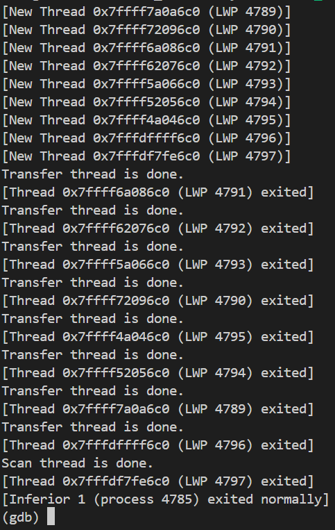
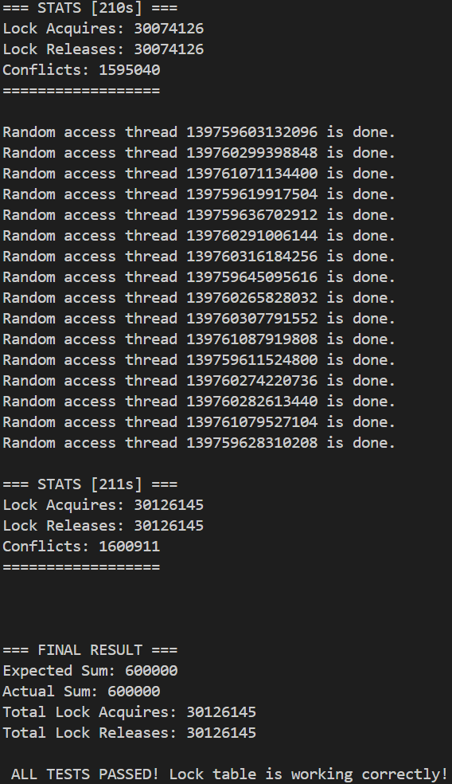
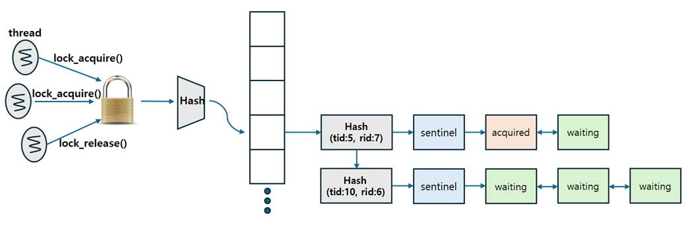
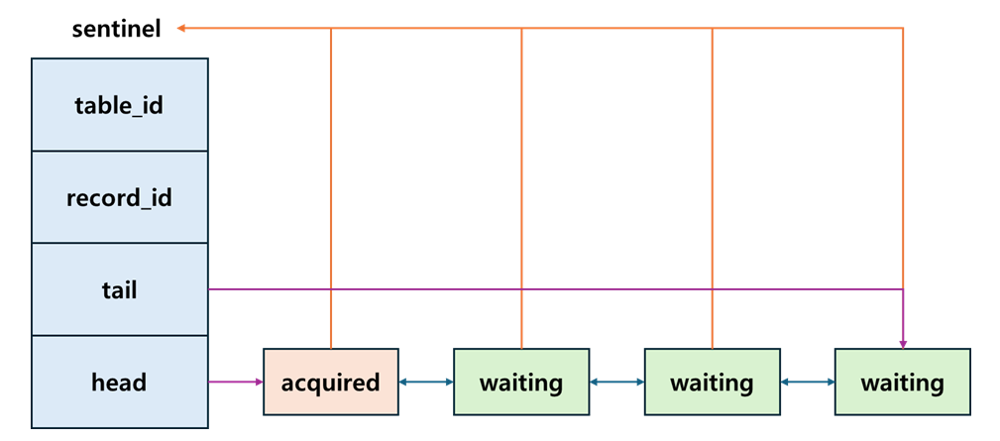

# simple-dbms – Lock Table Implementation

A minimal educational DBMS storage engine implementing **lock table**.  

---

## 프로젝트 설명

이번 구현은 **DBMS**에서 **멀티스레드** 환경에서 구동 가능한 **lock table**을 구현합니다.  

원래는 인덱스 계층까지는 c로 구현했었지만, 이후 추가 계층을 구현하면서 cpp의 STL을 활용해야 하는 상황이 발생함에 따라 c언어 + STL 형태의 구조로 전환되었습니다.


---

## 개발 환경 (Development Environment)

개발환경:  
Ubuntu 24.04.3 LTS (GNU/Linux 5.15.167.4-microsoft-standard-WSL2 x86_64)

---


## 테스트 화면 (Test Execution)

   

---

   

---

<details>
<summary><b>요구사항(Requirements)</b></summary>

The following Lock Table APIs must be implemented to ensure proper operation:

### `int init_lock_table(void)`

  * **Purpose:** Initialize all required data structures for the lock table implementation, such as the hash table, global lock table latch (mutex), and any other necessary components.
  * **Return Value:**
      * `0`: Success.
      * Non-zero value: Error occurred.

### `lock_t* lock_acquire(int table_id, int64_t key)`

  * **Purpose:** Attempt to acquire a lock on the record identified by `table_id` and `key`.
  * **Action:**
    1.  Allocate a new lock object (`lock_t`).
    2.  Append the new lock object to the lock list (queue) corresponding to the record's hash key.
  * **Concurrency:**
      * If a **predecessor** lock object exists in the lock list (meaning the record is currently locked or a thread is already waiting), the calling thread must **sleep** until the predecessor releases its lock.
  * **Return Value:**
      * Address of the newly allocated lock object (`lock_t*`): Lock successfully acquired (or appended to the queue).
      * `NULL`: An error occurred.

### `int lock_release(lock_t* lock_obj)`

  * **Purpose:** Release a previously acquired lock object.
  * **Action:**
    1.  Remove the `lock_obj` from its associated lock list.
    2.  If a **successor** lock object is waiting in the list for the current thread to release the lock, **wake up** that successor thread.
  * **Return Value:**
      * `0`: Success.
      * Non-zero value: Error occurred.

</details>

---

## 디자인 설계 (Design)

다음은 이 프로젝트의 **아키텍처** 입니다.



이번 프로젝트는 추후에 작업할 동시성 제어를 위해서 레코드에 대한 락이 가능한 락 테이블을 만드는 것입니다.  
기본적인 작동 시나리오는 다음과 같습니다.
```
시나리오 1:
스레드에서 테이블 접근을 위해 (table latch)lock acquire 요청
lock table latch를 얻지 못하면 대기
latch를 가지고 있던 스레드가 unlock
스레드는 latch를 얻고 lock acquire 내부 critical section에 진입
해시 테이블을 통해 테이블ID와 레코드ID 에 맞는 lock object list에 접근
이미 리스트가 있을 경우, 다른 스레드에서 먼저 헤당 레코드에 작업을 수행중이거나 권한을 가진 것이므로 waiting 상태로 진입하여 sleep
리스트가 없을 경우, sentinel을 만들고 현재 스레드가 해당 레코드에 대한 작업 권한을 얻음

시나리오 2:
스레드에서 테이블 접근을 위해 (table latch)lock release 요청
lock table latch를 얻지 못하면 대기
latch를 가지고 있던 스레드가 unlock
스레드는 latch를 얻고 lock release 내부 critical section에 진입
lock object list에서 해당 락 오브젝트를 제거
해당 lock object가 head였다면 다음 lock object를 wakeup

```

Lock Table은 여러 스레드가 동시에 접근하고 수정하는 공유 자료구조입니다. 이러한 임계 영역(Critical Section)을 보호하기 위해 동시성 제어 메커니즘인 Latch(Mutex)가 필요합니다.

**Mutex(상호 배제)** 와 **Semaphore(세마포어)** 는 모두 임계 영역 보호에 사용될 수 있지만, Lock Table Latch로는 Mutex 방식이 더 적합하다고 판단했습니다.

Mutex를 선택한 이유는 다음과 같습니다.  
**단순한 상호 배제 보장**: Lock Table Latch의 주된 목적은 오직 하나의 스레드만이 Lock Table의 내부 자료구조(해시 테이블, 연결 리스트)를 조작할 수 있도록 보장하는 것입니다. Mutex는 이처럼 자원에 대한 소유권을 한 번에 하나만 허용하는, 가장 단순하고 효율적인 상호 배제 기능을 제공합니다.  
**소유권 개념**: Mutex는 획득(Acquire)한 스레드만이 해제(Release)할 수 있다는 소유권 개념이 명확합니다. 이는 Lock Table의 무결성을 관리하는 데 있어 논리적 안정성을 높입니다. 세마포어는 이러한 소유권 개념이 없어 실수로 다른 스레드가 해제하는 오류 가능성을 배제하기 어렵습니다.  


테이블ID와 레코드ID를 하나의 쌍을 키로 하는 해시 테이블을 구현해야 했습니다. 또한 테이블ID와 레코드ID가 늘어난다면 hash digest값이 중복되는 상황이 발생할 수 있기 때문에 해시테이블은 hash collision 문제를 해결해야 합니다. 이를 위해 그러한 부분이 이미 구현된 `unordered_map`을 활용했습니다. unordered_map은 hash collision 문제를 단일 연결 리스트를 이용한 chaining 방식으로 해결합니다. 따라서 이 부분은 이미 구현되고 검증이 완료된 STL을 활용하는게 맞다고 판단하여 적용했습니다.  


다음은 이 프로젝트의 **락 오브젝트 리스트(lock object list)** 입니다.
  
`sentinel`노드는 락 리스트에 대한 메타 데이터 노드 입니다. `sentinel`노드에는 `head`와 `tail`포인터가 있고 이를 통해 더블 링크드 리스트 형태의 락 리스트와 연결합니다. 또한 각 락 리스트의 락 오브젝트는 sentinel 포인터를 가지고 있는 구조입니다.  
우선 락 오브젝트들이 있는 리스트를 어떻게 구현할지 고민했습니다. 여러 방식이 있었습니다.
1. **벡터나 단순 리스트 방식**  
배열 기반의 동적 배열을 이용하여 락 오브젝트를 관리하는 것입니다. 하지만 이러면 중간 락 오브젝트를 제거시 제거할 뿐만 아니라 그 뒤의 모든 요소를 당겨야 되는 O(N)의 시간이 소요됩니다. 어차피 테이블 락을 잡고 있을 락오브젝트는 head말고는 없기 때문이 상관없지 않나라는 생각을 할 수 도 있지만 추후 락 테이블 말고도 기능이 추가될시 중간 락 오브젝트에 접근해서 락 정보를 읽거나 제거하는 작업이 발생할 수 있다고 판단했습니다. 그래서 해당 방식은 채택하지 않았습니다.  
2. **단일 연결 리스트 방식**  
1번의 단점인 중간 락 오브젝트 삭제의 경우를 보완할 수 있는 방식입니다. 중간 오브젝트를 삭제하더라도 당기는 작업없이 단지 포인터를 연결하기만 하면 됩니다. 하지만 이는 마지막 락 오브젝트에 대한 작업시 접근만 할려고 해도 O(N)의 시간이 소요됩니다. 만약 tail이라는 포인터를 둔다고 해도, 마지막이 아닌 마지막에 가까운 포인터에 접근시 여전히 많은 시간이 소요됩니다.  
3. **양방향 연결 리스트 방식**  
그래서 이러한 단점도 보완하는 양방향 연결 리스트 방식을 채택했습니다. 하지만 이또한 중간 노드 접근시 O(1)이 걸리던 벡터나 리스트 방식과 다르게 O(N)의 시간이 소요되긴 합니다. 하지만 벡터 방식은 여전히 head 삭제 및 head 재설정 비용이 너무 크기 때문에 중간 노드를 빠른 시간으로 접근해서 얻는 이점보다 삽입과 삭제를 빠른 시간에 수행하는 이점이 크다고 판단하여 양방향 연결 리스트를 채택했습니다. 이뿐만 아니라 실제 lock_release의 경우, 이미 lock_object를 인자로 하여 호출하기 때문에 중간 노드의 위치를 찾는 작업은 실질적으로 발생하지 않습니다.
  
양방향 연결 리스트를 이용해 락 오브젝트 리스트를 구현하고, head와 tail의 포인터를 보관할 노드가 필요했습니다. 또한 각 락 오브젝트에 대해서 lock_acquire가 들어온 table_id와 record_id를 저장할 필요가 있었습니다. 이는 하나의 락 오브젝트 리스트의 모든 락 오브젝트가 공유하는 key값이기 때문에 각각의 락 오브젝트가 가지고 있기 보다는 이것을 하나의 공유 오브젝트에 넣어놓는게 맞다고 판단했습니다. 그래서 최종적으로 head와 tail 포인터와 메타데이터를 보관하는 sentinel node를 만들었습니다.  
그리고 lock object에는 sentinel을 가리키는 포인터를 필드변수로 가지고 있게 했습니다. 이 부분에서 어차피 record id와 table id 대신에 포인터를 저장하면 저장공간은 크게 차이 안나지 않나라고 생각할 수도 있습니다. 하지만 결국 포인터의 바이트 크기가 더 작기도 해서 저장공간 상으로도 이득이고, 또한 lock_release같은 상황에서 lock object가 주어지면 sentinel에 대한 해당 리스트의 head나 tail 정보를 갱신해야 하는 상황이 발생합니다. 그러한 상황에서 다시 table에서 key값에 대해 찾는 것보다 lock object의 포인터만으로도 수월하게 작업할 수 있습니다. 이러한 것도 해시테이블은 결국 find가 O(1)이 아니어서 상관 없는거 아닌가라고 할 수 있지만 해시 충돌이 발생하는 경우 O(1)이 아니라 O(N)까지 떨어집니다. 따라서 O(1)이 보장되는 방식을 사용하는게 맞다고 판단했습니다.

---

## 트러블슈팅 (Troubleshooting)
1. **thread가 전부 wait하는 문제**  
멀티 스레드 환경을 고려한 프로젝트이다 보니 디버깅이 어려웠습니다. 다음은 테스트 코드를 gdb로 디버깅하는 과정에서 무한 루프가 발생했고, 해당 상황에서의 스레드의 backtrace를 모두 출력한 결과입니다.  
    <details>
    <summary>(gdb) thread apply all bt</summary>

    ```

    Thread 10 (Thread 0x7fffdf7fe6c0 (LWP 2495) "test_lock_table"):
    #0  0x00007ffff7b91d71 in __futex_abstimed_wait_common64 (private=32767, cancel=true, abstime=0x0, op=393, expected=0, futex_word=0x55555555b128 <lock_table_cond+40>) at ./nptl/futex-internal.c:57
    #1  __futex_abstimed_wait_common (cancel=true, private=32767, abstime=0x0, clockid=0, expected=0, futex_word=0x55555555b128 <lock_table_cond+40>) at ./nptl/futex-internal.c:87
    #2  __GI___futex_abstimed_wait_cancelable64 (futex_word=futex_word@entry=0x55555555b128 <lock_table_cond+40>, expected=expected@entry=0, clockid=clockid@entry=0, abstime=abstime@entry=0x0, private=private@entry=0) at ./nptl/futex-internal.c:139
    #3  0x00007ffff7b947ed in __pthread_cond_wait_common (abstime=0x0, clockid=0, mutex=0x55555555b0c0 <lock_table_latch>, cond=0x55555555b100 <lock_table_cond>) at ./nptl/pthread_cond_wait.c:503     
    #4  ___pthread_cond_wait (cond=0x55555555b100 <lock_table_cond>, mutex=0x55555555b0c0 <lock_table_latch>) at ./nptl/pthread_cond_wait.c:627
    #5  0x0000555555555c14 in handle_pred_exists (lock=0x7fffd0000cf0, sentinel=0x7ffff00011d0) at ../src/lock_table.cpp:52
    #6  0x0000555555555da0 in lock_acquire (table_id=0, key=4) at ../src/lock_table.cpp:88
    #7  0x000055555555577c in scan_thread_func (arg=0x0) at test_lock_table.cpp:97
    #8  0x00007ffff7b95aa4 in start_thread (arg=<optimized out>) at ./nptl/pthread_create.c:447
    #9  0x00007ffff7c22c6c in clone3 () at ../sysdeps/unix/sysv/linux/x86_64/clone3.S:78
    --Type <RET> for more, q to quit, c to continue without paging--y

    Thread 9 (Thread 0x7fffdffff6c0 (LWP 2494) "test_lock_table"):
    #0  0x00007ffff7b91d71 in __futex_abstimed_wait_common64 (private=32767, cancel=true, abstime=0x0, op=393, expected=0, futex_word=0x55555555b128 <lock_table_cond+40>) at ./nptl/futex-internal.c:57
    #1  __futex_abstimed_wait_common (cancel=true, private=32767, abstime=0x0, clockid=0, expected=0, futex_word=0x55555555b128 <lock_table_cond+40>) at ./nptl/futex-internal.c:87
    #2  __GI___futex_abstimed_wait_cancelable64 (futex_word=futex_word@entry=0x55555555b128 <lock_table_cond+40>, expected=expected@entry=0, clockid=clockid@entry=0, abstime=abstime@entry=0x0, private=private@entry=0) at ./nptl/futex-internal.c:139
    #3  0x00007ffff7b947ed in __pthread_cond_wait_common (abstime=0x0, clockid=0, mutex=0x55555555b0c0 <lock_table_latch>, cond=0x55555555b100 <lock_table_cond>) at ./nptl/pthread_cond_wait.c:503     
    #4  ___pthread_cond_wait (cond=0x55555555b100 <lock_table_cond>, mutex=0x55555555b0c0 <lock_table_latch>) at ./nptl/pthread_cond_wait.c:627
    #5  0x0000555555555c14 in handle_pred_exists (lock=0x7fffcc000bd0, sentinel=0x7ffff0001110) at ../src/lock_table.cpp:52
    #6  0x0000555555555da0 in lock_acquire (table_id=2, key=1) at ../src/lock_table.cpp:88
    #7  0x0000555555555668 in transfer_thread_func (arg=0x0) at test_lock_table.cpp:66
    #8  0x00007ffff7b95aa4 in start_thread (arg=<optimized out>) at ./nptl/pthread_create.c:447
    #9  0x00007ffff7c22c6c in clone3 () at ../sysdeps/unix/sysv/linux/x86_64/clone3.S:78
    --Type <RET> for more, q to quit, c to continue without paging--

    Thread 8 (Thread 0x7ffff4a046c0 (LWP 2493) "test_lock_table"):
    #0  0x00007ffff7b91d71 in __futex_abstimed_wait_common64 (private=32767, cancel=true, abstime=0x0, op=393, expected=0, futex_word=0x55555555b128 <lock_table_cond+40>) at ./nptl/futex-internal.c:57
    #1  __futex_abstimed_wait_common (cancel=true, private=32767, abstime=0x0, clockid=0, expected=0, futex_word=0x55555555b128 <lock_table_cond+40>) at ./nptl/futex-internal.c:87
    #2  __GI___futex_abstimed_wait_cancelable64 (futex_word=futex_word@entry=0x55555555b128 <lock_table_cond+40>, expected=expected@entry=0, clockid=clockid@entry=0, abstime=abstime@entry=0x0, private=private@entry=0) at ./nptl/futex-internal.c:139
    #3  0x00007ffff7b947ed in __pthread_cond_wait_common (abstime=0x0, clockid=0, mutex=0x55555555b0c0 <lock_table_latch>, cond=0x55555555b100 <lock_table_cond>) at ./nptl/pthread_cond_wait.c:503     
    #4  ___pthread_cond_wait (cond=0x55555555b100 <lock_table_cond>, mutex=0x55555555b0c0 <lock_table_latch>) at ./nptl/pthread_cond_wait.c:627
    #5  0x0000555555555c14 in handle_pred_exists (lock=0x7fffd4000b70, sentinel=0x7ffff0001470) at ../src/lock_table.cpp:52
    #6  0x0000555555555da0 in lock_acquire (table_id=1, key=2) at ../src/lock_table.cpp:88
    #7  0x00005555555555f6 in transfer_thread_func (arg=0x0) at test_lock_table.cpp:59
    #8  0x00007ffff7b95aa4 in start_thread (arg=<optimized out>) at ./nptl/pthread_create.c:447
    #9  0x00007ffff7c22c6c in clone3 () at ../sysdeps/unix/sysv/linux/x86_64/clone3.S:78
    --Type <RET> for more, q to quit, c to continue without paging--

    Thread 7 (Thread 0x7ffff52056c0 (LWP 2492) "test_lock_table"):
    #0  0x00007ffff7b91d71 in __futex_abstimed_wait_common64 (private=32767, cancel=true, abstime=0x0, op=393, expected=0, futex_word=0x55555555b128 <lock_table_cond+40>) at ./nptl/futex-internal.c:57
    #1  __futex_abstimed_wait_common (cancel=true, private=32767, abstime=0x0, clockid=0, expected=0, futex_word=0x55555555b128 <lock_table_cond+40>) at ./nptl/futex-internal.c:87
    #2  __GI___futex_abstimed_wait_cancelable64 (futex_word=futex_word@entry=0x55555555b128 <lock_table_cond+40>, expected=expected@entry=0, clockid=clockid@entry=0, abstime=abstime@entry=0x0, private=private@entry=0) at ./nptl/futex-internal.c:139
    #3  0x00007ffff7b947ed in __pthread_cond_wait_common (abstime=0x0, clockid=0, mutex=0x55555555b0c0 <lock_table_latch>, cond=0x55555555b100 <lock_table_cond>) at ./nptl/pthread_cond_wait.c:503     
    #4  ___pthread_cond_wait (cond=0x55555555b100 <lock_table_cond>, mutex=0x55555555b0c0 <lock_table_latch>) at ./nptl/pthread_cond_wait.c:627
    #5  0x0000555555555c14 in handle_pred_exists (lock=0x7fffd8000bd0, sentinel=0x7ffff0001110) at ../src/lock_table.cpp:52
    #6  0x0000555555555da0 in lock_acquire (table_id=2, key=1) at ../src/lock_table.cpp:88
    #7  0x0000555555555668 in transfer_thread_func (arg=0x0) at test_lock_table.cpp:66
    #8  0x00007ffff7b95aa4 in start_thread (arg=<optimized out>) at ./nptl/pthread_create.c:447
    #9  0x00007ffff7c22c6c in clone3 () at ../sysdeps/unix/sysv/linux/x86_64/clone3.S:78
    --Type <RET> for more, q to quit, c to continue without paging--

    Thread 6 (Thread 0x7ffff5a066c0 (LWP 2491) "test_lock_table"):
    #0  0x00007ffff7b91d71 in __futex_abstimed_wait_common64 (private=32767, cancel=true, abstime=0x0, op=393, expected=0, futex_word=0x55555555b128 <lock_table_cond+40>) at ./nptl/futex-internal.c:57
    #1  __futex_abstimed_wait_common (cancel=true, private=32767, abstime=0x0, clockid=0, expected=0, futex_word=0x55555555b128 <lock_table_cond+40>) at ./nptl/futex-internal.c:87
    #2  __GI___futex_abstimed_wait_cancelable64 (futex_word=futex_word@entry=0x55555555b128 <lock_table_cond+40>, expected=expected@entry=0, clockid=clockid@entry=0, abstime=abstime@entry=0x0, private=private@entry=0) at ./nptl/futex-internal.c:139
    #3  0x00007ffff7b947ed in __pthread_cond_wait_common (abstime=0x0, clockid=0, mutex=0x55555555b0c0 <lock_table_latch>, cond=0x55555555b100 <lock_table_cond>) at ./nptl/pthread_cond_wait.c:503     
    #4  ___pthread_cond_wait (cond=0x55555555b100 <lock_table_cond>, mutex=0x55555555b0c0 <lock_table_latch>) at ./nptl/pthread_cond_wait.c:627
    #5  0x0000555555555c14 in handle_pred_exists (lock=0x7fffe0000b70, sentinel=0x7ffff0001470) at ../src/lock_table.cpp:52
    #6  0x0000555555555da0 in lock_acquire (table_id=1, key=2) at ../src/lock_table.cpp:88
    #7  0x00005555555555f6 in transfer_thread_func (arg=0x0) at test_lock_table.cpp:59
    #8  0x00007ffff7b95aa4 in start_thread (arg=<optimized out>) at ./nptl/pthread_create.c:447
    #9  0x00007ffff7c22c6c in clone3 () at ../sysdeps/unix/sysv/linux/x86_64/clone3.S:78
    --Type <RET> for more, q to quit, c to continue without paging--

    Thread 5 (Thread 0x7ffff62076c0 (LWP 2490) "test_lock_table"):
    #0  0x00007ffff7b91d71 in __futex_abstimed_wait_common64 (private=32767, cancel=true, abstime=0x0, op=393, expected=0, futex_word=0x55555555b128 <lock_table_cond+40>) at ./nptl/futex-internal.c:57
    #1  __futex_abstimed_wait_common (cancel=true, private=32767, abstime=0x0, clockid=0, expected=0, futex_word=0x55555555b128 <lock_table_cond+40>) at ./nptl/futex-internal.c:87
    #2  __GI___futex_abstimed_wait_cancelable64 (futex_word=futex_word@entry=0x55555555b128 <lock_table_cond+40>, expected=expected@entry=0, clockid=clockid@entry=0, abstime=abstime@entry=0x0, private=private@entry=0) at ./nptl/futex-internal.c:139
    #3  0x00007ffff7b947ed in __pthread_cond_wait_common (abstime=0x0, clockid=0, mutex=0x55555555b0c0 <lock_table_latch>, cond=0x55555555b100 <lock_table_cond>) at ./nptl/pthread_cond_wait.c:503     
    #4  ___pthread_cond_wait (cond=0x55555555b100 <lock_table_cond>, mutex=0x55555555b0c0 <lock_table_latch>) at ./nptl/pthread_cond_wait.c:627
    #5  0x0000555555555c14 in handle_pred_exists (lock=0x7fffe4000b70, sentinel=0x7ffff0001470) at ../src/lock_table.cpp:52
    #6  0x0000555555555da0 in lock_acquire (table_id=1, key=2) at ../src/lock_table.cpp:88
    #7  0x00005555555555f6 in transfer_thread_func (arg=0x0) at test_lock_table.cpp:59
    #8  0x00007ffff7b95aa4 in start_thread (arg=<optimized out>) at ./nptl/pthread_create.c:447
    #9  0x00007ffff7c22c6c in clone3 () at ../sysdeps/unix/sysv/linux/x86_64/clone3.S:78
    --Type <RET> for more, q to quit, c to continue without paging--

    Thread 4 (Thread 0x7ffff6a086c0 (LWP 2489) "test_lock_table"):
    #0  0x00007ffff7b91d71 in __futex_abstimed_wait_common64 (private=32767, cancel=true, abstime=0x0, op=393, expected=0, futex_word=0x55555555b128 <lock_table_cond+40>) at ./nptl/futex-internal.c:57
    #1  __futex_abstimed_wait_common (cancel=true, private=32767, abstime=0x0, clockid=0, expected=0, futex_word=0x55555555b128 <lock_table_cond+40>) at ./nptl/futex-internal.c:87
    #2  __GI___futex_abstimed_wait_cancelable64 (futex_word=futex_word@entry=0x55555555b128 <lock_table_cond+40>, expected=expected@entry=0, clockid=clockid@entry=0, abstime=abstime@entry=0x0, private=private@entry=0) at ./nptl/futex-internal.c:139
    #3  0x00007ffff7b947ed in __pthread_cond_wait_common (abstime=0x0, clockid=0, mutex=0x55555555b0c0 <lock_table_latch>, cond=0x55555555b100 <lock_table_cond>) at ./nptl/pthread_cond_wait.c:503     
    #4  ___pthread_cond_wait (cond=0x55555555b100 <lock_table_cond>, mutex=0x55555555b0c0 <lock_table_latch>) at ./nptl/pthread_cond_wait.c:627
    #5  0x0000555555555c14 in handle_pred_exists (lock=0x7fffe8000b70, sentinel=0x7ffff0001470) at ../src/lock_table.cpp:52
    #6  0x0000555555555da0 in lock_acquire (table_id=1, key=2) at ../src/lock_table.cpp:88
    #7  0x00005555555555f6 in transfer_thread_func (arg=0x0) at test_lock_table.cpp:59
    #8  0x00007ffff7b95aa4 in start_thread (arg=<optimized out>) at ./nptl/pthread_create.c:447
    #9  0x00007ffff7c22c6c in clone3 () at ../sysdeps/unix/sysv/linux/x86_64/clone3.S:78
    --Type <RET> for more, q to quit, c to continue without paging--

    Thread 3 (Thread 0x7ffff72096c0 (LWP 2488) "test_lock_table"):
    #0  0x00007ffff7b91d71 in __futex_abstimed_wait_common64 (private=32767, cancel=true, abstime=0x0, op=393, expected=0, futex_word=0x55555555b128 <lock_table_cond+40>) at ./nptl/futex-internal.c:57
    #1  __futex_abstimed_wait_common (cancel=true, private=32767, abstime=0x0, clockid=0, expected=0, futex_word=0x55555555b128 <lock_table_cond+40>) at ./nptl/futex-internal.c:87
    #2  __GI___futex_abstimed_wait_cancelable64 (futex_word=futex_word@entry=0x55555555b128 <lock_table_cond+40>, expected=expected@entry=0, clockid=clockid@entry=0, abstime=abstime@entry=0x0, private=private@entry=0) at ./nptl/futex-internal.c:139
    #3  0x00007ffff7b947ed in __pthread_cond_wait_common (abstime=0x0, clockid=0, mutex=0x55555555b0c0 <lock_table_latch>, cond=0x55555555b100 <lock_table_cond>) at ./nptl/pthread_cond_wait.c:503     
    #4  ___pthread_cond_wait (cond=0x55555555b100 <lock_table_cond>, mutex=0x55555555b0c0 <lock_table_latch>) at ./nptl/pthread_cond_wait.c:627
    #5  0x0000555555555c14 in handle_pred_exists (lock=0x7fffec000b70, sentinel=0x7ffff0001110) at ../src/lock_table.cpp:52
    #6  0x0000555555555da0 in lock_acquire (table_id=2, key=1) at ../src/lock_table.cpp:88
    #7  0x00005555555555f6 in transfer_thread_func (arg=0x0) at test_lock_table.cpp:59
    #8  0x00007ffff7b95aa4 in start_thread (arg=<optimized out>) at ./nptl/pthread_create.c:447
    #9  0x00007ffff7c22c6c in clone3 () at ../sysdeps/unix/sysv/linux/x86_64/clone3.S:78
    --Type <RET> for more, q to quit, c to continue without paging--

    Thread 2 (Thread 0x7ffff7a0a6c0 (LWP 2487) "test_lock_table"):
    #0  0x00007ffff7b91d71 in __futex_abstimed_wait_common64 (private=32767, cancel=true, abstime=0x0, op=393, expected=0, futex_word=0x55555555b128 <lock_table_cond+40>) at ./nptl/futex-internal.c:57
    #1  __futex_abstimed_wait_common (cancel=true, private=32767, abstime=0x0, clockid=0, expected=0, futex_word=0x55555555b128 <lock_table_cond+40>) at ./nptl/futex-internal.c:87
    #2  __GI___futex_abstimed_wait_cancelable64 (futex_word=futex_word@entry=0x55555555b128 <lock_table_cond+40>, expected=expected@entry=0, clockid=clockid@entry=0, abstime=abstime@entry=0x0, private=private@entry=0) at ./nptl/futex-internal.c:139
    #3  0x00007ffff7b947ed in __pthread_cond_wait_common (abstime=0x0, clockid=0, mutex=0x55555555b0c0 <lock_table_latch>, cond=0x55555555b100 <lock_table_cond>) at ./nptl/pthread_cond_wait.c:503
    #4  ___pthread_cond_wait (cond=0x55555555b100 <lock_table_cond>, mutex=0x55555555b0c0 <lock_table_latch>) at ./nptl/pthread_cond_wait.c:627
    #5  0x0000555555555c14 in handle_pred_exists (lock=0x7ffff0000b70, sentinel=0x7ffff0001470) at ../src/lock_table.cpp:52
    #6  0x0000555555555da0 in lock_acquire (table_id=1, key=2) at ../src/lock_table.cpp:88
    #7  0x00005555555555f6 in transfer_thread_func (arg=0x0) at test_lock_table.cpp:59
    #8  0x00007ffff7b95aa4 in start_thread (arg=<optimized out>) at ./nptl/pthread_create.c:447
    #9  0x00007ffff7c22c6c in clone3 () at ../sysdeps/unix/sysv/linux/x86_64/clone3.S:78

    Thread 1 (Thread 0x7ffff7a0b740 (LWP 2483) "test_lock_table"):
    #0  0x00007ffff7b91d71 in __futex_abstimed_wait_common64 (private=128, cancel=true, abstime=0x0, op=265, expected=2487, futex_word=0x7ffff7a0a990) at ./nptl/futex-internal.c:57
    #1  __futex_abstimed_wait_common (cancel=true, private=128, abstime=0x0, clockid=0, expected=2487, futex_word=0x7ffff7a0a990) at ./nptl/futex-internal.c:87
    #2  __GI___futex_abstimed_wait_cancelable64 (futex_word=futex_word@entry=0x7ffff7a0a990, expected=2487, clockid=clockid@entry=0, abstime=abstime@entry=0x0, private=private@entry=128) at ./nptl/futex-internal.c:139
    #3  0x00007ffff7b977a3 in __pthread_clockjoin_ex (threadid=140737347888832, thread_return=0x0, clockid=0, abstime=0x0, block=<optimized out>) at ./nptl/pthread_join_common.c:102
    #4  0x0000555555555a1e in main () at test_lock_table.cpp:151
    ```

    </details>
    메인 스레드인 thread1을 제외하고 모든 스레드가 wait 상태에서 기다리는 문제가 발생했습니다. 이는 모든 스레드가 pthread_cond_wait 에 갇혀 있는 상태인 것입니다. 도저히 이해할 수 없는 상황이었습니다. 분명히 테스트코드에서 해당 pthread_cond_signal을 호출하는데도 불구하고 lost wakeup이 발생한 것입니다. lost wakeup은 여러 스레드가 동시에 실행되다 보니 다음과 같은 상황에서 c->a->b->d 순서로 실행되어 결국 threadB는 무한 루프에 빠지는 상황을 말합니다.  
    
    ```cpp
    void threadA() {
        flag = 1 -a
        pthread_cond_signal(&cond); -b
    }

    void threadB() {
        while (flag == 0) { -c
            pthread_cond_wait(&cond); -d
        }
    }
    ```
    하지만 이는 결국 flag check과 sleep이 분리되어 실행될 수 있기 때문에 발생하는 것이고, 이를 해결하는 방법이 critical section 앞 뒤로 lock과 unlock을 배치하여 flag check과 sleep이 atomic하게 실행되도록 하는 것입니다. 이는 제 코드에서 이미 lock_table_latch를 lock, unlock하는 작업 사이에 critical section을 둠으로써 이미 해결한 부분입니다. lock_release가 호출되지 않는 건지도 의심되어 출력문을 통해서 확인해 봤었고 정상적으로 lock_release가 호출됨을 확인할 수 있었습니다.  
    그 이후에 고려해 본 것은 deadlock 발생 가능성입니다. 테스트 코드가 이상한가 싶어서 테스트 코드 또한 검토해봤지만 딱히 문제가 될게 없었습니다.  
    ```cpp
    func1:

    lock(&mutex_A)
    lock(&mutex_B)

    ​

    func2:

    lock(&mutex_B)
    lock(&mutex_A)
    ```
    데드락은 다음과 같이 스레드가 동시에 실행되어 서로 A, B락을 걸고 B,A를 기다리는 상황에서 발생하는데 이를 테스트코드에서 방지하고자 다음과 같이 송금 상황을 가정한 테스트에서 source record id와 destination record id가 오름차순으로 정렬된 순서인 경우만을 테스트 했기 때문입니다. 
    ```cpp
        if ((source_table_id > destination_table_id) ||
            (source_table_id == destination_table_id &&
            source_record_id >= destination_record_id)) {
        /* Descending order may invoke deadlock conditions, so avoid it. */
        continue;
        }
    ```
    따라서 잠금 순서를 고정했기 떄문에 데드락이 발생했을 가능성은 매우 적었습니다.  
    결국 원점으로 돌아가서 다시 스레드 backtrace를 출력한 상황을 검토하기로 했습니다. 문제 자체는 pthread_cond_wait를 중심으로 발생했었고, 이에 맞춰 pthread_cond_signal과 wait를 집중적으로 검토했습니다. 이러면 condition variable과 관련해서 뭔가 문제가 있는거 아닐까라는 추론에 도달하였습니다. 문제 상황에서 전역 테이블 래치와 전역 condition variable을 사용했었습니다. table latch가 전역인 것은 mutex 방식이기 떄문에 문제가 없다고 판단했고 condition variable이 전역일 필요가 있을까 싶어서 다시 한 번 고민해봤습니다. 그 결과 condition variable 관련한 문제임을 발견할 수 있었습니다.  
    원인은 전역 condition variable을 사용함에도 불구하고 pthread_cond_signal을 호출했다는 것입니다. pthread_cond_wait는 latch를 해제하고 조건 변수에 대한 신호가 올 때까지 기다립니다. 그리고 pthread_cond_signal은 해당 조건 변수에 대해 기다리는 임의의 스레드 하나를 깨웁니다. 깨워진 스레드는 다시 latch를 얻는 것을 시도합니다. 어쨌든 문제는 signal은 원하는 스레드 하나를 지정해서 깨우는 것이 아니라 동일한 조건 변수를 기다리는 스레드 하나를 깨운다는 것입니다. 이 부분을 착각해서 'release한 lock object의 next lock object가 당연히 깨어나겠지'라고 생각을 했었고 그 결과 의도치 않은 스레드에게 신호가 가서 결국엔 모든 스레드가 wait하는 상황이 발생헀던 것입니다. 그래서 이 부분을 해결하고자 했고 여러 방법을 생각해 봤습니다.  
    1. pthread_cond_wait(전역조건변수) + pthread_broadcast  
    이 경우, 기존의 전역 조건 변수를 활용하던 코드는 유지해도 됩니다. 단지 signal 부분을 broadcast로 바꾸면 됩니다. pthread_broadcast는 주어진 조건 변수를 기다리는 모든 스레드를 깨우기 때문에 문제도 해결됩니다. 하지만 이는 타겟 스레드가 아니라 다른 스레드까지 불필요하게 signal을 보내기 때문에 다시 latch를 잡으려는 경쟁이 발생할 수 있습니다. 이는 다시 불필요한 cpu낭비와 context switching 문제가 발생할 수 있습니다. 
    2. pthread_cond_wait(개별조건변수) + pthread_cond_signal
    이 경우, 기존 문제를 해결함과 동시에 원하는 타겟 스레드를 깨울 수 있습니다. 단지 스레드를 구별할 condition variable이 존재하면 됩니다. 이러한 조건변수를 스레드가 아닌 스레드가 작업하는 lock object마다 조건 변수를 할당해서 결국엔 lock object를 통해서 타겟 스레드에 조건 변수 신호를 보내는 방법으로 구현했습니다.  

    결국엔 2번 방법을 통해 해결할 수 있었습니다.

2. **nullptr 문제**  
이 부분은 구현에 대한 혼동으로 발생했던 문제입니다. 처음에 lock object list에서 lock_release할때 해제하는 락 객체 다음의 락 객체가 존재하면 무조건 pthread_cond_signal을 호출하여 깨우도록 구현했었습니다. 이는 '잠든 스레드는 latch를 얻기 위해서 잠든거고 lock_release를 호출하여 락 객체를 제거하는 스레드는 latch를 가지고 있으므로 그 다음 lock object를 설정하고 잠든 스레드를 당연히 깨워야 하는거 아닌가?'라는 생각에 의해서 발생했습니다. 실제로는 헤드 락 오브젝트의 스레드가 해당 레코드에 대한 권한을 가지게 된 것이고 헤드가 해제될때 다음 락 객체를 깨워서 권한을 넘겨주는 것이지, 모든 노드를 해제할때 다음 객체를 깨우다 보니 의도치 않는 결과가 발생했던 것입니다. 실제 락 테이블 latch와 락 테이블로 구현한 내부 데이터 락에 대한 혼동으로 발생했었습니다. 이 부분을 헤드가 아니면 그냥 삭제되는 방식으로 수정해서 해결할 수 있었습니다.
