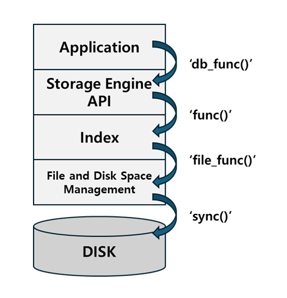
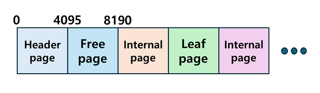
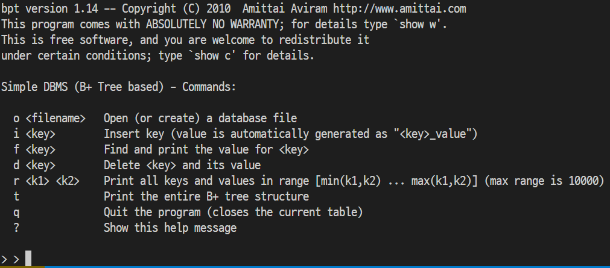
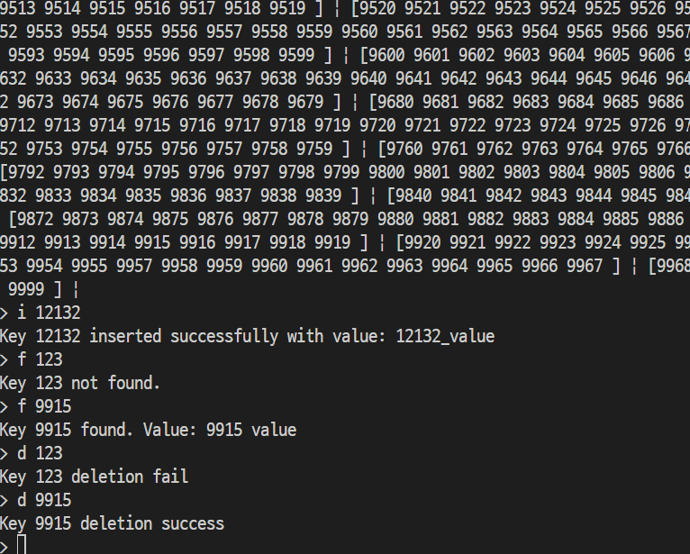
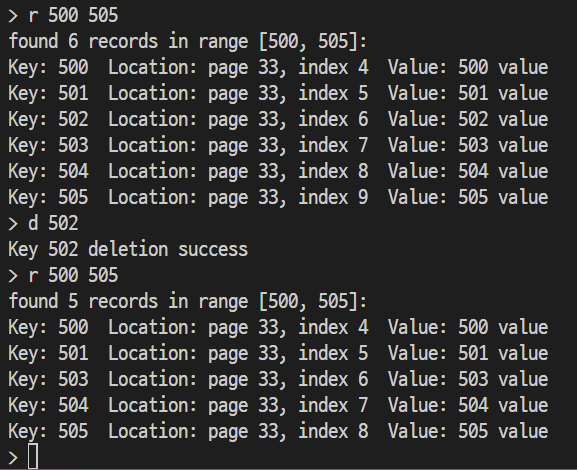
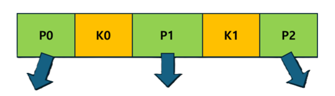
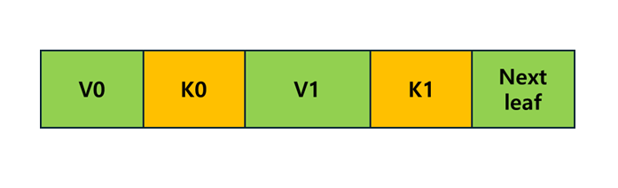
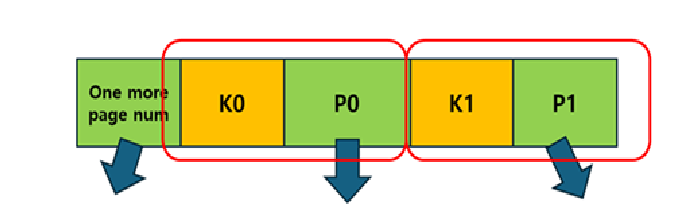
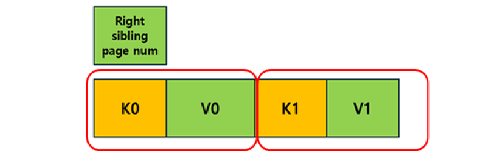

# DiskBasedBPlusTree

Transforming an in-memory B+Tree into a disk-based implementation.  
This project is designed to be easily extensible into a minimal DBMS in the future.

---

## 프로젝트 설명

이 프로젝트는 in-memory B+Tree를 **on disk B+Tree**로 전환하는 프로젝트입니다.  
이 구현은 **DBMS**에서 **file and index layer, disk space management layer**를 구현합니다.  
B+Tree 인덱스 구현은 DBMS에서 가장 중요한 작업입니다. 추후에 이 프로젝트는 간단한 DBMS를 구축하는데 확장될 수 있습니다.

다음은 이 프로젝트의 **아키텍처** 입니다. ([design.md](design.md) 참고)



다음은 이 프로젝트의 데이터 파일 **페이지 레이아웃** 입니다.



---

## 개발 환경 및 실행 (Development Environment)

개발환경:  
Ubuntu 24.04.3 LTS (GNU/Linux 5.15.167.4-microsoft-standard-WSL2 x86_64)

실행:

- main파일 생성: `make` (Makefile있는 폴더에서)
- main파일을 실행: `./main`
- libbpt.a라이브러리를 생성: `make` (Makefile 참고)
- libbpt.a라이브러리를 이용: `#include "libbpt.a"` (test/library_test.c 참고)
- B+ 트리 로직 테스트 실행: `ceedling test:all` (project.yml 참고)
- 파일 매니저 테스트 실행: `gcc -I../include ../src/file.c file_test.c -o file_test`
- 라이브러리 테스트 실행: `gcc library_test.c ../lib/libbpt.a -o library_test`

---

## 예시 실행 화면 (Sample Execution)

  
  


---

<details>
<summary><b> 요구사항 (Requirements) </b></summary>

1. in-memory B+Tree를 on-disk b+ tree를 구현할 것
2. data file(simple database)에 다음의 기능을 적용할 수 있도록 구현할 것

```
1. open <pathname>
 • Open existing data file using ‘pathname’ or create one if not existed.
 • All other 3 commands below should be handled after open data file.
2. insert <key> <value>
 • Insert input ‘key/value’ (record) to data file at the right place.
 • Same key should not be inserted (no duplicate).
3. find <key>
 • Find the record containing input ‘key’ and return matching ‘value’.
4. delete <key>
• Find the matching record and delete it if found.
```

3. 결과물 라이브러리(libbpt.a)는 다음의 함수를 지원할 것

```
 // database manuplation function
 1. int open_table (char *pathname);
 • Open existing data file using ‘pathname’ or create one if not existed.
 • If success, return the unique table id, which represents the own table in this database. Otherwise,
return negative value. (This table id will be used for future assignment.)
 2. int db_insert (int64_t key, char * value);
 • Insert input ‘key/value’ (record) to data file at the right place.
• If success, return 0. Otherwise, return non-zero value.
 3. int db_find (int64_t key, char * ret_val);
 • Find the record containing input ‘key’.
 • If found matching ‘key’, store matched ‘value’ string in ret_val and return 0. Otherwise, return
non-zero value.
 • Memory allocation for record structure(ret_val) should occur in caller function.
 4. int db_delete (int64_t key);
 • Find the matching record and delete it if found.
 • If success, return 0. Otherwise, return non-zero value.

 // file manager function
// Allocate an on-disk page from the free page list
 pagenum_t file_alloc_page(){
 }
 // Free an on-disk page to the free page list
 void file_free_page(pagenum_t pagenum){
 }
 // Read an on-disk page into the in-memory page structure(dest)
 void file_read_page(pagenum_t pagenum, page_t* dest){
 }
 // Write an in-memory page(src) to the on-disk page
 void file_write_page(pagenum_t pagenum, constpage_t* src){
 }
```

4. 다음의 페이지 구성을 만족할 것.

```
페이지 하나의 크기는 4096 바이트
1. Header Page(offset 0~4095)
 • Free page number: [0-7] - points the first free page (head of free page list)- 0, if there is no free page left.
 • Root page number: [8-15]- pointing the root page within the data file.- 0, if there is no root page.
 • Number of pages: [16-23]- how many pages exist in this data file now.

 2. Page Header: header of a page
 • Parent page Number [0-7]: If internal/leaf page,  this field points the position of parent page. Set 0 if it is the root page.
 • Is Leaf [8-11] : 0 is internal page, 1 is leaf page.
 • Number of keys  [12-15] : the number of keys within
 - reserved [16-127] : not used

3. Internal Page
 - page header: [0-127]
 - one more page number: [120-127]- points left most child
 - entries: [128-4095]: entry(key(8 bytes) + page number(8 bytes))

 4. Leaf Page
 - page header: [0~127]
 - right sibling page number: [120-127] - points to right neighbor
 - records: [128-4095] - record(key(8 bytes) + value(120 bytes))
```

5. 실제 디스크에 read/write 하여 반영할 것
6. 본인의 결과물이 아닌 위의 조건들을 만족한 타인의 결과물인 데이터베이스 파일에도 문제없이 2번, 3번 작업이 가능할 것

7. 라이브러리만 분리해서 사용해도 위의 작업들이 전부 가능하게 할 것

</details>

---

## 디자인 설계 (Design)

다섯 가지 디자인을 구상했습니다.

1. **페이지를 1번부터 차례대로 배치한다**

- 헤더 페이지는 0번에 위치
- 페이지의 종류에 상관없이 새 페이지는 차례대로 할당한다
- 프리 리스트는 가장 최근 빈 페이지를 헤더 페이지가 가리킨다

2. **내부 페이지와 리프 페이지의 할당 공간을 분리한다**

- 헤더 페이지는 0번에 위치
- 특정 번호까지는 내부 페이지를 배치하고, 특정 번호부터는 리프 페이지를 할당한다
- 프리 리스트는 가장 최근 빈 내부 페이지와 가장 최근의 빈 리프 페이지를 각각 헤더가 가리킨다

3. **페이지를 1번부터 차례대로 배치하되, 프리 리스트를 따로 관리한다**

- 헤더 페이지는 0번에 위치
- 페이지의 종류에 상관없이 새 페이지는 차례대로 할당한다
- 가장 최근 빈 내부 페이지와 가장 최근의 빈 리프 페이지를 각각 헤더가 가리킨다

4. **페이지를 1번부터 차례대로 배치하되, 프리 리스트를 물리적으로 따로 분리한다**

- 헤더 페이지는 0번에 위치
- 페이지의 종류에 상관없이 새 페이지는 차례대로 할당한다
- 빈 내부 페이지 번호들을 모은 내부 페이지 프리 리스트와 빈 리프 페이지 번호들을 모은 리프 페이지 프리 리스트를 디스크 맨 끝의 페이지 공간에 저장한다

5. **페이지를 1번부터 차례대로 배치하되, 프리 리스트를 아예 다른 공간에 저장한다**

- 헤더 페이지는 0번에 위치
- 페이지의 종류에 상관없이 새 페이지는 차례대로 할당한다
- 종류별 프리 리스트 각각을 페이지 저장 공간(데이터 파일) 외의 공간에 따로 저장한다

1번이 제일 무난하다고 생각했습니다. 구현이 다른 디자인의 베이스가 될 수도 있고 요구사항을 만족하는 가장 최소한의 디자인이라고 생각했습니다.
1번 이외의 디자인은 각각의 장단점이 있다고 생각합니다.

2번 디자인의 경우 디스크 IO의 코스트가 메모리 IO에 비해서 훨씬 높기 때문에 그러한 부분을 줄일 수 있는 캐시 효율성이 좋으며, 아무래도 실제로 내부 페이지는 내부 페이지끼리, 리프 페이지는 리프 페이지끼리 참조하는 경우가 많아 공간 locality에서 이점을 가질 수 있으며 성능이 좋을 수 있다고 판단했습니다. 하지만 단점은 내부 페이지의 할당 공간을 제한한다는 것입니다. 이는 데이터 파일 자체의 크기가 제한될 수 있다는 사실이며, 만약 특정 수치를 넘어 이후의 공간에는 1번처럼 다시 배치한다고 해도 그 이후부터는 2번 디자인의 장점이 퇴색될 수 있다고 판단했습니다. 하지만 만약 디스크 사이즈가 제한되어 있고 정해진 크기만을 저장하는 경우거나, 디스크 IO비용이 큰 HDD를 저장장치로 사용할 경우에는 명확한 장점을 가질 수 있다고 생각했습니다.

3번 디자인은 1번 디자인의 변형입니다. 하지만 내부 페이지의 프리 리스트와 리프 페이지의 프리 리스트를 따로 개념적으로만 분리할 경우 1번에 비해 명확한 장점을 가질 수 없다고 판단했습니다. 오히려 1번에 비해 구현을 더 신경 써야 하지만 그만큼의 장점을 가지지 못한다고 생각했습니다.

4번 디자인은 실제 페이지에 레코드를 배치하는 방식에서 영감을 받아 3번 디자인에 address indirection을 적용한 방식입니다. 1번과 2번은 링크드 리스트와 유사한 방식으로 프리 페이지를 구현했다면 4번의 디자인은 디스크의 맨 끝(편의상 footer라고 하겠습니다)에 물리적인 프리 페이지 리스트 공간을 마련해서 slotted page 방식과 유사하게 구성하는 겁니다. 프리 페이지 참조를 유연하게 수정 가능하며 프리 페이지를 한꺼번에 여러개를 요청할 경우에도 손쉽게 프리 페이지를 알아낼 수 있는 방식입니다. 하지만 단점은 저장공간인 데이터 파일의 맨 끝 공간을 어떻게 알아낼 것인가입니다. 페이지를 계속 삽입하여 데이터 파일의 크기를 늘릴 수 있기 때문에 결국 데이터 파일의 크기를 제한해야 합니다.

5번 디자인은 4번 디자인의 단점인 파일 크기 제한을 해결하고자 고안한 방법입니다. 현재 프로젝트는 실제 디스크에 write하긴 하지만 아무래도 실제로 HDD나 SSD에 바로 작성하지 않고 운영체제를 거쳐서 작업하기 때문에 데이터 파일 외에도 다른 메타 데이터 파일을 만들어서 구현 가능합니다. 그러나 이 구현 방식이 보통 DB에 적용되는 방식인 HDD나 SSD에 운영체제를 거치지 않고 작성하는 방식이라면 이를 위한 전용 하드웨어를 할당한다든지 해야할 것입니다. 이것이 일반적인 경우인가에 대해서 저는 확신할 수 없었기 때문에 굳이 선택하지는 않았습니다. 또한 과연 따른 하드웨어에 저장한다면 이또한 IO작업에 비용이 들텐데 과연 성능에서 이점을 명확히 가져갈 수 있을지 확신할 수 없었습니다.

위의 고민들을 종합적으로 고려하여 처음엔 2번 디자인으로 시작했습니다. 약 10000번의 페이지 공간까지는 내부 페이지에 할당하고, 이후에는 리프 페이지에 할당하고자 했습니다. 이렇게 file and disk space manager layer와 insertion과 deletion까지 구현하고, 올바르게 구현했나 테스트를 시도했습니다. 테스트 과정에서 바로 디스크 읽고 쓰는 통합 테스트를 진행하지는 않았고 4096bytes의 페이지가 20000개 있는 mock 배열을 할당하고 진행하고자 했습니다. c언어 테스팅 도구인 ceedling으로 진행했고 해당 테스트를 돌린 결과, 테스트가 계속 이유없이 터지는 상황이 발생했습니다. 그 이유를 고민하고 찾다보니 페이지 배열의 크기를 처음 구상했던 20000개가 아닌 훨씬 작은 수치로 변경하니 테스트가 돌아가는 것을 확인했습니다. 아마 스택 메모리를 초과해서 그런 것 같습니다. 원하는 10000개의 페이지 크기를 테스트하기에는 어려워 보였습니다. 또한 테스트를 고려하다 보니 미처 생각하지 못했던 요구사항의 6번 조건에 의하여 타인의 디비 파일을 읽어야 할 경우, 만약 타인이 페이지를 종류와 상관없이 차례대로 배치했다면, 해당 디스크의 파일 내부에 페이지를 리빌드 해야 하는 상황이 발생할 수 있겠구나 싶었습니다. 내부 페이지를 제 디자인 방식대로 리빌드는 한 번만 하면 되긴 하지만 이 과정 자체가 실제로 성능상의 이점들을 전부 갉아먹을 수 있다고 생각했습니다. 또한 요새는 데이터 저장 장치를 HDD대신 SSD를 사용하기도 해서 종류 무관하게 페이지를 배치하는 방식이 성능상 크게 단점이 아닐 수도 있다는 소리를 들은 것 같기도 해서(확실하진 않습니다) 1번 디자인으로 마음을 굳혔습니다. 그리하여 결국 진행하던 2번 디자인을 폐기하고 1번 디자인으로 전환하기로 했습니다.
다행히도 layered architecture를 바탕으로 구현했기 때문에 실제로 변경해야 하는 부분은 file manager 나 헤더 페이지 할당 부분을 제외하고는 없었습니다.

---

## 아키텍처 설명 (Architecture Explanation)

```
[Application Layer]
(main.c)
- 사용자 입력 처리

=>

[Stroage Engine API]
(db_api.c)
- open_table()
- db_insert()
- db_find()
- db_delete()

=>

[Index Layer]
(bpt.c)
- B+tree 탐색/수정
- file API 호출

=>

[File and Disk Space Management Layer]
(file.c)
- file_alloc_page()
- file_free_page()
- file_read/write_page()
- fsync()

=>

[Disk]
(data file)
```

**레이어드 아키텍처**를 적용하여 프로그램을 네 단계로 구분했습니다.

특히 인덱스와 파일 관리 및 디스크 IO 관련 계층을 전공서적 상에 있는 File and Index Layer 와 Disk Space Management Layer로 구분하는 것이 아닌 Index Layer 와 File and Disk Space Management Layer로 구분했습니다.

이 프로젝트는 OS의 시스템콜을 이용하여 디스크에 작성하기 때문에 실제 현업에서 직접 디스크에 작성하는 것과는 괴리감이 존재합니다. 그로 인해 Disk Space Management Layer의 경우 그 역할 비중이 단순한 디스크 IO 기능만을 담당하게 되었기 때문에 한 계층을 차지하기엔 애매해졌습니다. 또한 운영체제 상의 파일에 실제로 작성되는 것을 확인할 수 있기에 File Layer를 Index Layer와 같은 계층을 취급하기에는 저장장치에 읽고 쓰는 역할에 더 가깝다고 생각했습니다. 그로인하여 File Management 계층과 Disk Space Management 계층을 통합하여 file.c로 관리하고자 했습니다.

Index Layer는 B+트리 인덱스 방식을 사용하며, Storage Engine API 계층과 File Manager 계층 사이에 위치합니다. 실제로는 Index 계층과 Disk Management 계층 사이에 Buffer Management 계층이 존재할 수 있지만 이 프로젝트에서 마저 구현하지는 못했습니다. 단순히 기능 구현에만 집중했다면 잘하면 Buffer Management 계층까지도 구현이 가능할 수 있겠지만 현재 프로젝트에서 구축하는 계층이 DBMS에서 굉장히 중요한 부분이며 이후의 계층을 쌓아올린다 해도 현재 계층이 완전히 구축되지 않으면 무용지물이라는 생각하에 테스트와 리팩토링을 더 진행했습니다.

또한 Disk IO를 통해 읽은 헤더 페이지나 다른 페이지들을 매 번 접근해서 읽기보다는 캐시와 같은 방식을 이용하여 인 메모리 상에 임시로 저장하여 디스크 IO횟수를 줄일까 생각도 했지만 이는 추후에 Buffer Management 계층을 구현한다면 해당 계층에서 유사한 방식으로 성능 보완을 할 수 있기 때문에 실제로 구현하지는 않았습니다.

Storage Engine API 계층은 Application 계층에서 아래 계층에서 구현한 기능들을 호출하고자 할 때 필요한 API를 제공하는 계층입니다.

Application 계층은 그러한 API를 이용하여 실제 요구사항에 해당하는 기능들을 사용자가 수행 가능하게 만듭니다.

이러한 레이어드 아키텍처를 적용한 이유는 요구사항에 가장 적합한 구조이기도 하며 실제 DBMS의 레이어드 아키텍처에서 영감을 받아서 선택했습니다. 각각의 계층은 독립적으로 작동하며 반드시 디스크 IO는 File and Disk Space Management Layer를 거쳐서 작동해야 합니다.

---

## B+트리 (B+Tree)

B+트리는 이 프로젝트를 진행하면서 당연히 알아야 하는 부분이지만  
자료구조에 대한 설명을 하는 것은 이 프로젝트의 핵심이 아니기에 스킵하겠습니다.
해당 구현은 http://www.amittai.com/ 에 있는 인메모리 B+트리 코드를 이용하여 만들었습니다.
이 프로젝트에서 하나의 페이지는 하나의 디스크 상의 블록에 일대일 대응됩니다. 이는 불필요한 디스크 IO나 전처리 과정을 줄이고자 하는 것이며 이를 위해 실제 인메모리 상의 B+트리의 노드도 하나의 페이지를 담당하게 만들었습니다. 그리하여 인메모리 b+트리와 현재의 disk based b+트리와의 b+tree 자료 구조 자체에는 변환이 없습니다. 단지 노드를 페이지로 변환했으며 실제 노드의 변화가 파일과 디스크에 반영되어야 한다는 것에 차이를 가집니다. 하지만 실제로 구현해보면 b+트리 자료구조라는 큰 뼈대 논리적인 알고리즘을 제외하고는 대부분을 갈아 엎어야 했습니다.
전환하는 과정에서 겪은 문제들은 존재했습니다. 이는 문제 해결 부분에서 다루겠습니다.  
in-memory B+Tree를 disk based B+Tree로 전환함과 동시에 Delayed Merge도 적용했습니다. 트리의 split과 merge 과정에서 많은 페이지의 변화가 일어나기 때문에 그 결과 과한 Disk I/O로 인한 성능 저하가 발생하기 쉽습니다. 따라서 이를 어느정도 방지하고자 Delayed Merge를 적용했습니다. Delayed Merge를 구현하는 방법은 비교적 간단합니다. 원래의 B+트리는 보통 order/2 보다 작아지면 merge를 시작합니다. 그렇기 때문에 이 merge 시작 기준을 최대한 줄여서 아예 키가 전부 삭제되면 시작되도록 했습니다.

---

## 테스트 (Testing)

테스트는 Ceedling을 이용하여 진행했습니다. 사실 c언어를 이용한 프로젝트에서는 단순히 구현한 기능들을 이용하는 간단한 예시 프로그램을 만들어서 테스트하는 방식을 보통 사용하거나 아예 안하기도 했었습니다.
하지만 이번에 구현한 계층이 워낙 중요하기도 하고 메모리와 디스크 스페이스를 직접적으로 터치하며 워낙 코드 볼륨이 커지다 보니 테스트 도구의 필요성을 느꼈습니다. 이를 위해 여러 테스팅 도구들을 찾아보았꼬 그 결과 Ceedling을 채택했습니다.
https://www.throwtheswitch.org/ceedling
Ceedling은 c언어 유닛 테스트 Unity와 mock과 stub을 만들 수 있는 Cmock을 이용하기 편하게 제공하는 테스트 프레임워크입니다. 특히나 mock을 사용하기 편하다는 것에서 레이어드 아키텍처에 매우 적합하다고 느꼈습니다.

---

## 디버깅 (Debugging)

해당 프로젝트는 디버깅이 굉장히 어려웠습니다. 아무래도 기본 B+트리 코드가 워낙 길기도 하고 c언어를 이용하기에 사소한 인덱스 실수나 메모리 영역 조작 및 포인터를 이용하여 조작하다보니 실수를 하더라도 알아채지 못하고 놓치는 경우가 굉장히 많았습니다. 또한 코드를 올바르게 짰는지 확인하기 위한 방법으로 두 가지가 있었는데, 실제 모든 계층을 구현해서 작동시키거나, 테스트 코드를 작성해서 테스트가 돌아가는지, 해당 기능을 정상적으로 수행하는지 확인하는 방법 뿐이었습니다. 저는 후자를 먼저 수행했습니다. 테스트를 작동시키게 코드를 검토하며 수정하고, 이후엔 테스트가 정상적으로 통과되도록 재검토 및 gdb를 이용하여 흐름을 점검했습니다.

---

## 트러블 슈팅 (Trouble Shooting)

1. **디스크에 어떻게 적용할 것인지, 페이지 구조는 알지만 이를 어떻게 해야하는지**  
   맨 처음에 disk based b+tree를 어떻게 만들어야 하는지 감이 잡히지 않았습니다. 아무래도 부족한 정보 때문인지 아니면 제 부족한 지식 때문인지 몰라도 요구사항에 페이지 구조만 제시되어 있었기 때문에 뭘 어떻게 하라는지 몰랐습니다.  
   제게 주어진 정보는 페이지 정보와 인메모리 b+트리 코드 뿐 이었습니다. 처음에 그러면 파일에 쓰라는건가 근데 그러면 디스크에 써지는게 맞나라는 의문이 들었고 다행히 검색 결과 posix 시스템 콜을 이용하여 write 한 것을 디스크에 sync로 바로 반영이 가능하다는 것을 알게 되었습니다. 다행히 실제 하드웨어 장치에 제가 직접 작성하는 방식이 아니라 운영체제에 해당 책임을 맡기고 이미 잘 만들어진 api들을 이용하면 되는 것이었습니다. 어떻게 보면 파일 자체에 write하는 것도 일종의 디스크에 write하는 것과 유사하긴 합니다. 하지만 그부분은 운영체제가 관리하는 부분이고, 실제로 파일에 write한다고 해서 바로 디스크에 반영하지는 않는다고 합니다. 이는 매번 파일이 변경될때마다 디스크에 바로 반영하는 것은 그만큼 IO횟수가 증가하기 때문에 그런 것이죠. 하지만 실제로 데이터베이스를 접근할 때는 보통 일반 운영체제를 거치지 않거나 dbms에 최적화된 운영체제를 사용하는 경우가 대부분인 것으로 압니다. 따라서 그 부분을 학습자의 입장에서 이 프로젝트에서도 유사하게 동작하는 것처럼 만들기 위해 sync() 시스템콜을 호출해 디스크의 페이지와 메모리의 페이지가 synchronize 가능하도록 만들었습니다.

   이후의 고민은 비플 트리의 노드를 어떻게 할 것인가 입니다. 보통 자료구조 비플트리의 노드는 키와 포인터들로 구성됩니다. 또한 리프는 키와 값들의 쌍들로 구성되어 있으며 리프끼리는 링크드 리스트처럼 포인터로 다음 리프에 접근할 수 있게 되어 있습니다. 이러한 구조들이 제시된 내부 페이지와 리프 페이지와 유사하다는 것을 알았습니다. 따라서 페이지를 비플러스 트리의 노드로 다루면 되겠다 싶었습니다. 하지만 과연 인메모리 상의 페이지를 바로 디스크에 작성해서 디스크 상의 페이지도 동일한 크기의 페이지로 다루는 것이 좋을까 생각했습니다. 정확한 명칭은 메모리 상에서는 페이지, 디스크 상에서는 블록이지만 편의상 혼용했습니다.

   페이지의 크기가 블록의 크기보다 큰 경우 어떻게 될까 그러면 그만큼 페이지를 write하기 전에 전처리해서 여러 개의 블록으로 분할할 것입니다. 그러면 그만큼 또 많은 IO횟수를 가지게 됩니다. 이는 성능상 명백한 단점입니다.  
   페이지의 크기가 블록의 크기보다 작을 경우 어떻게 될까요? 그러면 여러 페이지들을 하나의 블록에 read write할 것이고, 그렇다면 오히려 lazy 방식으로 페이지 업데이트를 늦추거나 혹은 아무래도 공간 지역성으로 인해서 관련 페이지들을 한꺼번에 읽어오는 점에서 오히려 효율적일지도 모른다고 생각합니다. 하지만 오히려 디스크에 페이지의 변화를 바로 반영하지 않는다는 점, 그리고 한꺼번에 여러 페이지를 읽어오는 것이 오히려 불필요한 작업을 동반하고 성능상 그만큼의 이점을 가져오지 못할 지도 모릅니다.

   그래서 가장 무난한 페이지와 블록 1:1 매칭이 적절하다고 생각했습니다. 추가 작업이 필요한 것도 아니며 성능상에서도 안정적인 편이라고 생각했습니다.

2. **B+트리 구현 문제**  
   b+트리 insertion과 deletion을 구현하면서 처음에 단순히 노드를 페이지로 교체하면 되는거 아닌가 생각했었지만 실제로 구현하면서 어려움을 겪었습니다.  
   일단 페이지들 타입 간에 변화가 수월해야 했습니다. 왜냐하면 한 리프 페이지가 자리하고 있는 메모리 공간 또는 디스크 공간이 내부 페이지가 되기도 하고, 프리 페이지가 되기도 하고, 다시 내부 페이지가 될 수도 있기 때문입니다. c언어에서는 오류를 방지하기 위해 구조체 간의 타입 변환을 막아놨습니다. 자바의 경우 공통 인터페이스나 조상 클래스를 통해 손쉽게 페이지 전환이 가능할 것입니다. 이러한 로직을 해당 방식에 적용해보고자 했습니다. 어느 페이지 구조든 적용 가능한 공통 구조체 page_t를 만들었습니다. 하지만 여전히 page_t로 다른 페이지들의 전환이 가능하지는 않았습니다. 그렇다면 이것을 어떻게 해결할 수 있을까 구조체는 의미적 타입에 불과하다는 것입니다. 결국 메모리 영역을 차지하고 있는 페이지들이고 메모리의 관점에서 접근한다면 같은 페이지 타입이 아니라도 참조 가능하지 않을까 생각했습니다. 그래서 포인터로 접근했습니다. 실제 구조체 타입의 변환이 아닌 구조체 포인터의 변환으로 참조하고 있는 메모리 영역은 동일하지만 참조하는 관점의 차이가 생길 수 있는 것입니다. 아무튼 사실 이 부분이 제일 골치 아팠던 문제는 아닙니다.

   가장 골치아팠던 문제는 바로 B+트리 자료구조와 요구사항에서 구현하는 B+트리의 불일치 였습니다. 이는 인지하지 못하면 눈치채지 못해서 '왜 안돼?'를 정말 많이 생각했던 것 같습니다.

   **일반적인 인메모리 B+트리 노드 구조 (내부·리프 순)**  
     
   

   **이번 프로젝트에서 요구된 온디스크 B+트리 노드 구조 (내부·리프 순)**  
     
   

   일반적인 비플러스 트리의 경우, 내부 노드는 K0보다 작은 노드를 가리키는 P0 포인터부터 포인터를 할당합니다. 또한 리프 노드의 경우도 K0보다 작은 V0 값부터 할당하며 가장 마지막 인덱스에 해당하는 값에는 다음 리프 노드를 가리키는 값을 저장합니다.

   하지만 이 프로젝트에서는 내부 페이지는 K0 이상인 값을 모은 노드를 가리키는 P1 포인터 자리부터 P0를 할당하며, 그러한 K0와 P0를 하나의 엔트리 단위로 여깁니다. 그리고 원래 노드의 P0가 담당하고 있는 역할을 entry 이외의 포인터 one_more_page_num에 맡깁니다. 또한 리프 페이지의 경우도 K0 이상부터 V0를 할당하며, K0와 V0를 하나의 레코드 단위로 여깁니다. 또한 다음 리프 노드의 포인터를 해당 레코드와는 분리해서 관리합니다.  
   (참고: 설명할때 편의상 K0-P0-K1-P1 이라고 했지만 실제 코드 상에서는 one_more_page_num을 P0, 이후 값들을 K0-P1-K1-P2 처럼 여기고 작성했습니다.)

   이 사소한 구조의 차이가 구현에 있어서 엄청난 혼동을 일으켰습니다. 실제로 대부분의 디버깅 과정에서 해결한 문제는 인덱스 경계값 변경이었습니다. 또한 비직관적인 one more page num의 존재 때문에 원본 비플러스 트리의 P0와 혼동하여 발생한 문제가 많았습니다.

3. **테스트 프레임워크 문제**  
   테스트 프레임워크로 Ceedling을 선택했지만 워낙에 정보가 부족하고 부정확하거나 오래된 정보들이 많아서 사용에 있어서 골치 아팠습니다. 테스트 자체가 실행되지 않는 문제가 테스트 프레임워크 설정을 잘못해서인지 코드를 잘못 짜서인지 알지 못하는 경우가 있어서 stack overflow도 뒤져보고 700-800자 되는 insertion과 deletion 로직을 몇 번이나 재검토 했습니다. 특히나 b+tree 코드에서 정의한 상수값이 너무 크다보니 테스트를 위해서 작게 변경했어야 했는데 구글에서 검색해서 나온 해결방법들이 옛날 버전에서나 가능한 경우거나 정보가 너무 부족했습니다. 결국 이 부분을 생성형 AI에도 물어봤는데 정말 셀 수 없이 잘못된 정보를 제공했습니다. 여러 종류의 생성형 AI에 물어본 결과, 학습량이 부족해서인지 부정확한 정보 천지였습니다. 다행히 다음 날 다시 물어봤을 때 AI가 대답한 해결책을 만지작거리다가 “혹시 이렇게 하면 되나?” 싶어서 시도해 보니, 소 뒷걸음 잡다가 쥐 잡은 것처럼 우연히 작동해서 그 방식으로 문제를 해결할 수 있었습니다.

   테스트 프레임워크 활용 문제는 대부분 검색해서 해결할 수 있었지만 또 다시 한참을 헤멘 문제가 있습니다. bpt.c에서 b+tree를 전부 구현해서 파일 하나의 코드가 1700줄 가까이 되는 경우가 발생해서 이를 리팩토링하고자 bpt.h는 그대로하고 동일한 헤더를 여러 소스 파일과 링크하는 구조로 분할했습니다. 하지만 그 결과 테스트 프레임워크 작동을 하면 undefined reference to '함수이름' 같은 문제가 발생해서 분할된 파일들을 찾지 못하는 경우가 발생했습니다. 이또한 검색을 해보고 스택 오버플로우를 봐도 제대로된 해결책이 없었습니다. 결국 다시 생성형 AI에 물어봤었는데 또다시 할루시네이션이 발생했습니다. 한참을 지나도 동일한 문제가 발생해서 결국 테스트 프레임워크의 레포지토리에 가서 이슈를 뒤져봤습니다. 찾다보니 저말고도 동일한 문제가 제시 되었었습니다. 이는 Ceedling이 하나의 헤더파일에 하나의 파일만 매칭해서 발생한 문제였습니다. 이게 버그인지 애초에 설계를 그렇게 한 것인지는 모르겠으나 결국 이를 해결하기 위해 분할된 소스파일에 맞게 더미 헤더파일을 생성하여 프레임워크가 인식하게 해서야 문제를 해결할 수 있었습니다.  
   → 관련 이슈: [Header with multiple source files #753](https://github.com/ThrowTheSwitch/Ceedling/issues/753)

4. **테스트를 이용한 디버깅 문제**  
   올바르게 비플러스 트리 구현했는지 확인하는 방법에는 테스트를 이용해서 확인하는 방법이 있었습니다. file manager 부분을 mock으로 처리하고 순수하게 b+트리 로직만을 검증하고자 했습니다. 하지만 올바른 비플러스 트리인가를 제가 검증해야 했기 때문에 내부 엔트리와 레코드의 개수를 작게 줄여야 했습니다. 막상 order를 작게 줄이다보니 하나의 페이지가 차지하고 있는 메모리의 크기 또한 줄어들어서 mock된 저장공간에서 read write 과정에서 메모리 침범 문제가 발생했습니다. 원본 페이지 구조는 유지해야 테스트의 의미가 있다고 생각했기 때문에 페이지 하나의 크기를 줄이기 보다는 레코드와 엔트리를 원본과 동일한 비율로 줄이고 그만큼의 공간을 여유 공간인 reserved의 크기를 늘리는 방식으로 구현했습니다. 그러나 이 결과 record의 개수는 2개까지 줄일 수 있지만 entry의 개수는 여전히 16개로 상당히 많은 숫자여서 테스트케이스를 만들기가 쉽지 않았습니다. 특히나 insertion 과정에서 split을 할때, 내부 entry 공간마저 꽉 차서 내부 노드마저 스플릿하는 경우가 발생하는데 이경우를 테스트하기 위해 실제로 제가 정상작동하는 테스트 케이스 결과를 알아야 했기 때문에 직접 그려보는 수 밖에 없었습니다. 레코드 개수가 2개, 엔트리 개수가 16개인 트리를 height가 3이 되는 경우까지 고려하는게 어려웠습니다. 그래서 테스트를 했음에도 불구하고 테스트 케이스로 체크한 경우의 수가 적은 편이라 아쉽습니다.

5. **헤더 페이지를 1로 설정해서 발생한 문제**  
   처음에 요구사항에서 페이지가 존재하지 않는 경우 페이지 넘버 0울 가리키도록 하는 경우가 많아서 그러면 0번 페이지에 헤더 페이지를 위치시키면 문제가 발생할 수 있는거 아닌가 라는 생각에 처음에 1번 페이지를 헤더 페이지라고 하고, 2번 페이지부터 새 페이지를 할당했습니다. 실제로 1번 헤더 페이지를 바탕으로 내부 로직 자체를 테스트하는 것까지는 성공했지만 이후 샘플 db를 읽는 것을 실패했습니다. disk based 구조의 장점은 헤더 페이지에 메타 데이터를 담아놓고 실제 페이지를 참조할때 직접 트리를 리빌드하지 않고 헤더 페이지만을 이용해서 참조 가능하다는 것입니다. 이것의 핵심은 헤더 페이지인데 이 헤더 페이지 자체를 읽지 못해 문제가 발생했습니다. 다시 생각해보니 페이지가 존재하지 않더라도 0번 페이지를 가리키기만 하지 실제로 헤더 페이지를 조작하는 경우가 발생 가능하지만 이 때문에 처음 4096바이트를 낭비하는 것은 오히려 낭비라는 생각이 들었습니다. 그래서 공간 낭비를 줄이고 다른 샘플 데이터 파일을 읽는 것도 수월하게 진행하기 위해 0번 페이지로 전환했습니다. 다행히 레이어드 아키텍처를 적용했기 때문에 헤더 페이지 위치를 저장하던 상수 값을 변경하고 헤더 페이지 초기화 함수만 수정해서 간단히 전환할 수 있었습니다. 또한 다시 확인해보니 요구사항에서 데이터 파일의 0번부터 4095바이트는 헤더 페이지를 위치시키는 것을 발견해서 애초에 잘못된 구현을 했음을 알게 되었습니다.
