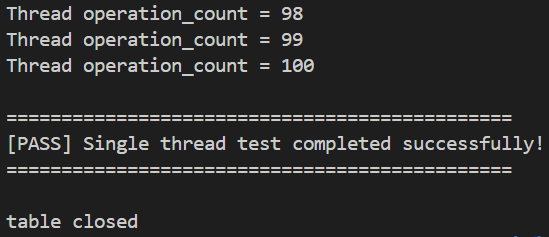
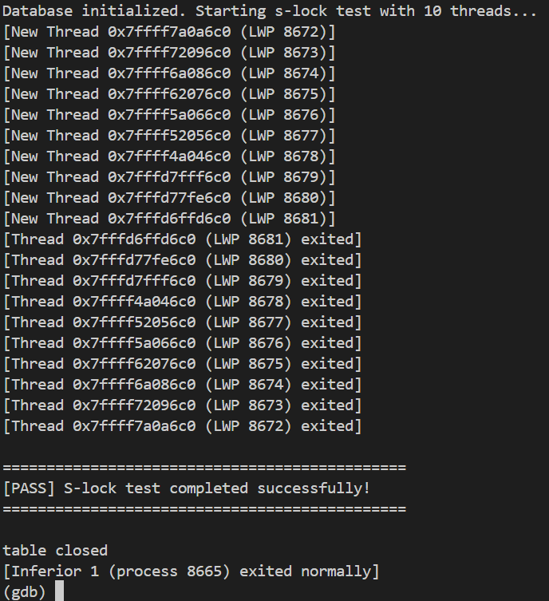
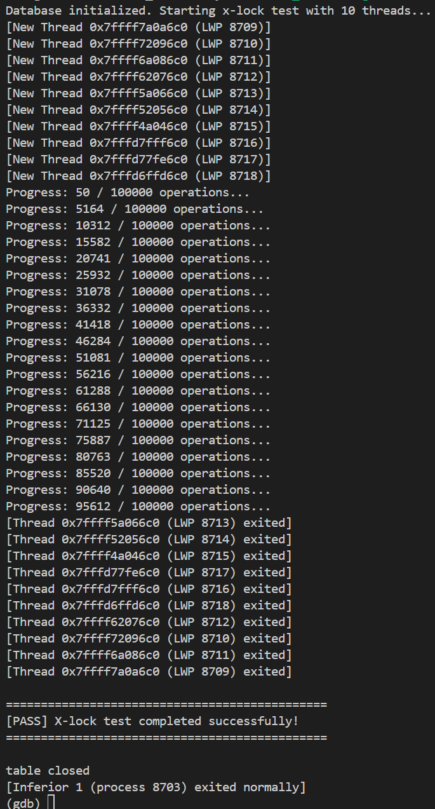
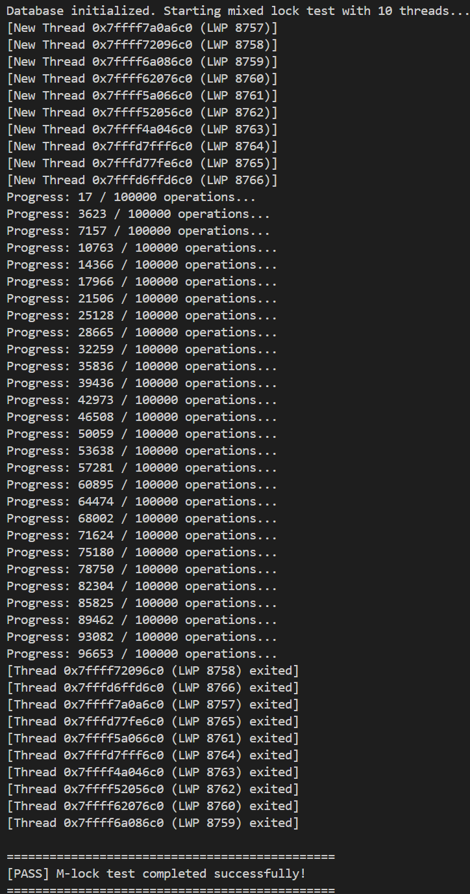
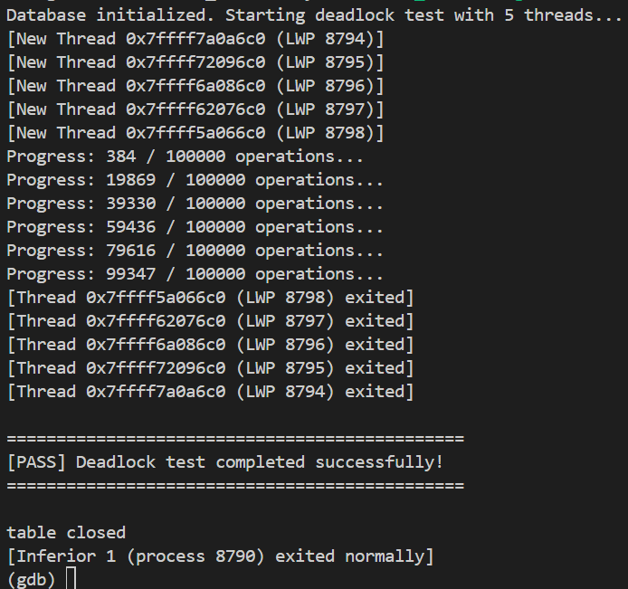
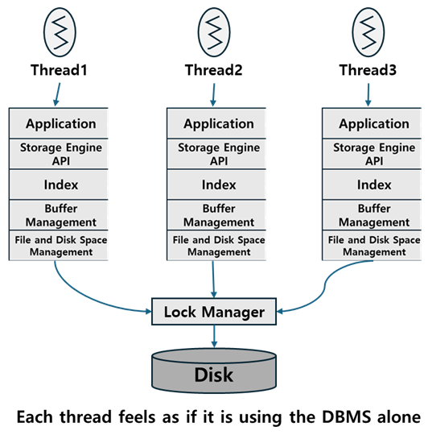
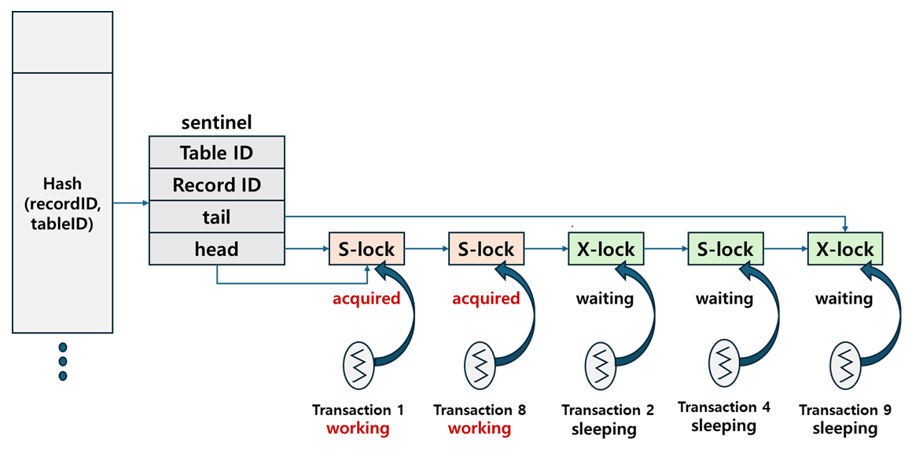
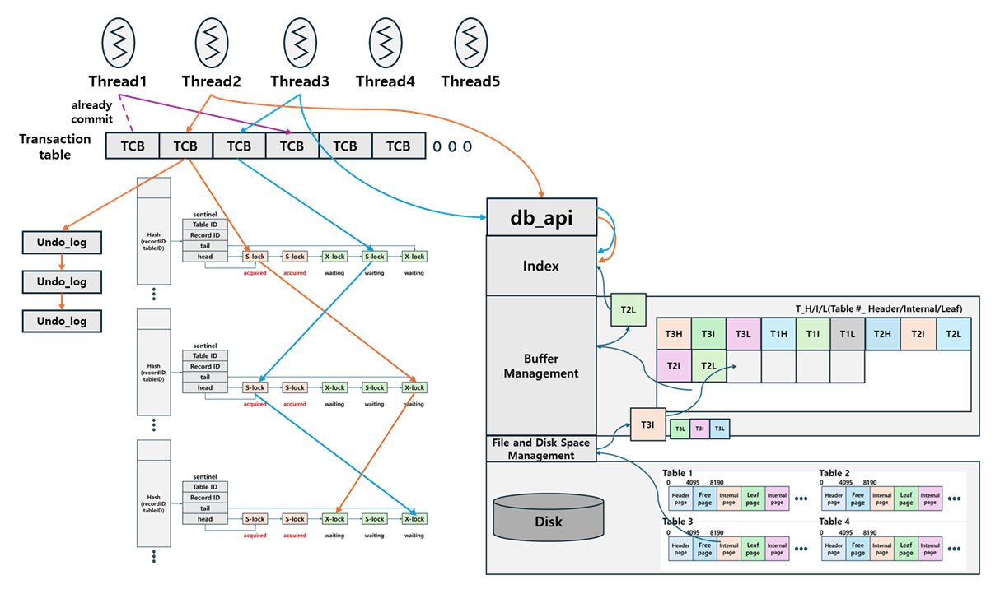

# simple-dbms – Concurrency Control(Lock Manager) Implementation

A minimal educational DBMS storage engine implementing Concurrency Control.  
This project implements Lock Manager that can safely operate in a multi-threaded environment.

database system is now supporting transaction.  
- Implement transaction concept that can support ‘Isolation’ and ‘Consistency’ lock manager (lock table).  

lock manager provides:  
- Conflict-serializable schedule for transactions
- Strict-2PL
- Deadlock detection (abort the transaction if detected)
- Record-level locking with Shared(S)/Exclusive(X) mode

---

## 프로젝트 설명

이번 구현은 **DBMS**에서 **멀티스레드** 환경에서 구동 가능한 **lock manager**을 구현합니다.  
이번 프로젝트를 통해서 다음을 지원합니다.  
- transaction concept that can support ‘Isolation’ and ‘Consistency’ lock manager
- Conflict-serializable schedule for transactions
- Strict-2PL
- Deadlock detection (abort the transaction if detected)
- Record-level locking with Shared(S)/Exclusive(X) mode


(참고)  
원래는 인덱스 계층까지는 c로 구현했었지만, 이후 추가 계층을 구현하면서 cpp의 STL을 활용해야 하는 상황이 발생함에 따라 c언어 + STL 형태의 구조로 전환되었습니다.  
+  
멀티스레드 및 트랜잭션 환경에서 b+tree를 거치며 insert/delete 들을 정상적으로 수행하려면 현재의 bptree 구조로는 불가합니다. 복잡한 split과 merge과정에서 동시성을 관리하는 것은 현재의 구조로 불가하기 때문입니다. 제가 알기론 B-link tree가 해당 내용을 보완하는 것으로 알고 있습니다.  
하지만 이는 지나치게 많은 시간의 투자가 필요하고 학습 수준을 벗어났다고 판단하여 트랜잭션 내의 operation을 find와 update으로 한정했습니다. 또한 요구사항에서도 find/update만 구현하도록 한정했기 때문에 insert와 delete가 필요없는 find와 update를 구현했습니다.  

---

## 개발 환경 및 실행 (Development Environment)

개발환경:  
Ubuntu 24.04.3 LTS (GNU/Linux 5.15.167.4-microsoft-standard-WSL2 x86_64)
  
실행:

- libbpt.a 라이브러리를 생성: `make` (Makefile 참고)
- libbpt.a 라이브러리를 test_cc 폴더로 이동
- 테스트 파일 make: `make` (test_cc의 Makefile 이용)
- single thread 테스트 실행: `./test single_thread_test` (test_cc 폴더 내에서)
- slock 테스트 실행: `./test slock_test`
- xlock 테스트 실행: `./test xlock_test`
- mlock 테스트 실행: `./test mlock_test`
- deadlock 테스트 실행: `./test deadlock_test`

---

## 테스트 화면 (Test Execution)  
몇몇 테스트 화면은 멀티스레드 환경임을 직관적으로 보이기 위해서 gdb에서 실행한 화면입니다.  

   

   

  





---

<details>
<summary><b>Transaction APIs</b></summary>

The following Transaction APIs must be implemented to manage transaction lifecycles and ensure ACID properties:

### `int trx_begin(void)`

* **Purpose:** Allocate a new transaction structure and initialize its properties.
* **Action:**
1. Generate a unique transaction ID.
2. This process must be protected by a mutex to ensure the transaction ID is unique for each transaction.


* **Return Value:**
* `Transaction ID (>= 1)`: Success.
* `0`: Error occurred.


### `int trx_commit(int trx_id)`

* **Purpose:** Complete the specified transaction and release all associated resources.
* **Action:**
1. Release all locks held by the transaction (Strict 2PL).
2. Wake up any threads waiting for the locks released by this transaction.
3. Deallocate the transaction structure associated with `trx_id`.


* **Return Value:**
* `trx_id`: Success.
* `0`: Error occurred (e.g., transaction ID not found).


</details>

<details>
<summary><b>Database APIs (with Concurrency Control)</b></summary>

The existing database APIs are extended to support transactions and record-level locking:

### `int db_find(int table_id, int64_t key, char* ret_val, int trx_id)`

* **Purpose:** Read a record value within a transaction using shared locks.
* **Action:**
1. Acquire a **Shared (S) lock** on the record identified by `table_id` and `key`.
2. If a deadlock is detected during lock acquisition, the transaction must be **aborted**.
3. After acquiring the lock, read the value and store it in `ret_val`.


* **Return Value:**
* `0`: Success.
* `Non-zero value`: Error occurred or transaction aborted due to deadlock.


### `int db_update(int table_id, int64_t key, char* value, int trx_id)`

* **Purpose:** Update a record value within a transaction using exclusive locks.
* **Action:**
1. Acquire an **Exclusive (X) lock** on the record identified by `table_id` and `key`.
2. If a deadlock is detected, the transaction must be **aborted** and all changes **rolled back**.
3. After acquiring the lock, update the record with the new `value`.


* **Return Value:**
* `0`: Success.
* `Non-zero value`: Error occurred or transaction aborted/rolled back.


</details>

---

## 디자인 설계 (Design)

### 아키텍처 설명  

다음은 이 프로젝트의 **아키텍처** 입니다.  

  

멀티 스레드 환경에서 트랜잭션 매니저는 필수적입니다. 트랜잭션 매니저는 여러 역할을 담당하지만 가장 핵심적인 부분은 concurrency control과 crash recovery입니다. 현재 프로젝트에선 트랜잭션 매니저의 concurrency control을 구현하며 이를 담당하는 부분을 보통 lock manager라고 합니다. 추후에 시간이 된다면 crash revoery까지 학습해서 구현 해보겠습니다.  
Lock Manager는 각각의 스레드가 DBMS를 마치 혼자 사용하는 것처럼 사용할 수 있게 만듭니다. 이번 구현에선 스레드와 pplication 계층을 테스트 코드가 담당합니다.  
  
  ---

### 변경된 락 테이블  

다음은 추가된 락 모드 및 트랜잭션 처리에 맞게 변경된 **락 테이블** 입니다.  

  
 
이번 프로젝트에선 이전에 구현했던 Lock Table을 멀티 스레드와 트랜잭션 환경에 적합하게 변경해야 했습니다. 트랜잭션 내부 오퍼레이션의 레코드 읽기/쓰기 를 수행하기 위해 락 블로킹을 통해 공유락(Shared Lock)과 배타락(Exclusive Lock)을 구현했습니다.  
  
**S-Lock** 은 레코드를 읽을때 사용되며, 레코드 수정이 필요없는 작업에 필요합니다. 또한 수정을 하지 않기 때문에 연속적으로 S-Lock이 락 큐에 배치될 경우, 동시에 락 권한을 획득 가능합니다.  
**X-Lock** 은 레코드를 수정하거나 쓰는 작업에 필요합니다. 레코드 내용을 변경하기 때문에 동시에 해당 권한을 얻을 경우 dirty reads 같은 동시성 문제가 발생할 수 있습니다. 따라서 연속적으로 X-Lock 요청이 들어오더라도 한 번에 하나의 트랜잭션에만 락을 부여합니다.  
  
트랜잭션은 트랜잭션 테이블에서 관리됩니다. 트랜잭션은 고유의 번호를 할당받습니다.  `txn_begin`을 통해 트랜잭션이 시작되며, `txn_commit` 또는 `txn_abort`를 통해 종료됩니다.  
각각의 트랜잭션은 `TCB(Transaction Control Block)` 이 부여됩니다. `TCB`는 트랜잭션에 대한 메타데이터를 가지고 있습니다. 이를 통해 각각의 스레드가 서로의 영역을 침범하지 않도록 isolation을 부여합니다. TCB가 각 트랜잭션의 메타데이터를 가지고 있으며 각 스레드가 서로의 영역을 침범하지 않도록 TCB 당 Latch가 필요합니다. 또한 트랜잭션 테이블에도 래치가 필요합니다.  
  
`txn_abort`는 데드락 발생 시, transaction을 abort하는데 호출됩니다. 단순히 트랜잭션을 종료하고 자원 정리만 하는 것 뿐만 아니라, 변경된 데이터가 있다면 롤백하는 과정이 필요합니다. 그렇기 때문에 변경된 레코드나 작업에 대해서 기록한 log가 필요합니다. 이 부분은 추후에 crash recovery까지 구현한다면 더 완성도 높을 수 있으나 현재 상황에선 간단한 링크드 리스트 기반의 stack 구조를 통해서 구현했습니다. 각 트랜잭션 별 undo log들이 필요했기 때문에 이러한 undo log stack 구조를 TCB 내부에 저장했습니다.  
다음은 해당 부분 관련 코드입니다.  
```cpp
typedef struct undo_log_t {
  int fd;
  tableid_t table_id;
  recordid_t key;
  char old_value[VALUE_SIZE];
  struct undo_log_t* prev;
} undo_log_t;

typedef struct tcb_t {
  txnid_t id;
  pthread_mutex_t latch;
  pthread_cond_t cond;
  lock_t* lock_head;
  lock_t* lock_tail;
  undo_log_t* undo_head;
  txn_state_t state;
} tcb_t;  // Transaction Control Block

typedef struct txn_table_t {
  std::unordered_map<txnid_t, tcb_t*> transactions;
  pthread_mutex_t latch;
} txn_table_t;
  ```
현재의 락 테이블 구조상 **deadlock** 이 발생 가능합니다. 예시는 다음과 같습니다.
```
테이블ID,레코드ID = 락 큐(락 오브젝트 리스트)
[] 는 acquired, 그 외는 waiting
S/X(transaction id)

1,5 = [S(1)-S(2)]-X(3)
2,3 = [X(3)]-X(1)
```
현재 1번 트랜잭션은 (1,5) 레코드의 S-Lock을 얻었고 (2,3) 레코드의 X-Lock을 기다리는 중입니다.   
3번 트랜잭션은 (1,5) 레코드의 X-Lock을 기다리고 있고, (2,3) 레코드의 X-Lock을 얻었습니다.  
각 트랜잭션은 서로가 기다리는 자원을 가진 채로 서로의 자원을 기다리고 있습니다.  
이를 해결하기 위해선 deadlock detection이 필요합니다. 이를 위해서 TCB 당 소유하고 있는 lock object를 링크드 리스트 형태로 가집니다.  또한 각 락 오브젝트는 현재 오브젝트를 소유하고 있는 트랜잭션 포인터를 가집니다.  
또한 각 트랜잭션이 어떤 트랜잭션을 기다리는지 표시하기 위해 Wait For Graph를 build하며 관리합니다.  
자세한 내용은 뒤에서 추가로 설명하겠습니다.

---

### Flow of Lock Manager
다음은 현재 프로젝트의 대략적인 코드 흐름이자 시나리오입니다.  

  

1. 스레드에서 `txn_table latch`를 얻고 현재 진행하는 트랜잭션에 대한 `TCB`와 `TCB latch`를 초기화합니다.  
2. `db_api`상의 API를 호출합니다.
3. index layer를 거쳐서 buffer layer상의 페이지를 찾습니다.
4. Buffer Management Layer도 마찬가지로 멀티스레드 환경에서 정상 작동해야 하기 때문에 `buffer manager latch`를 획득하고 접근해야 합니다. `buffer manager latch`를 얻은 후, 해당하는 `BCB(Buffer Control Block) latch`도 획득해야 합니다. 
5. 해당 페이지에 접근해서 페이지 락을 얻은 후, `lock table latch`를 획득하여 해당 레코드 락을 얻습니다. 이때, 얻을 수 있다면 acquired 상태가 됩니다.
6. 대기그래프(`Wait For Graph`)를 업데이트하고 DFS 탐색으로 `deadlock detection`을 수행합니다.
7. 사이클이 존재한다면, 해당 트랜잭션을 `abort`합니다. abort시에 해당 트랜잭션이 진행했던 변경 내역을 TCB의 `undo log`를 탐색하여 rollback하는 작업을 수행합니다. 사이클이 존재하지 않는다면 계속 operation을 진행합니다.
8. 트랜잭션의 operation을 모두 종료하면, `commit`하고 자원을 정리하고 모든 락을 해제합니다.
9. `abort` 또는 `commit`으로 종료되는 경우에, 해당 트랜잭션이 acquired lock에 있던 레코드 락 큐에 존재하는 waiting lock들을 깨웁니다.  
  
---

## 기술적 의사결정(Technical Decision)  
프로젝트를 설계하고 진행하는 과정에서 많은 동시성 문제를 고민하고 직면했습니다.

### Transaction Table    
transaction을 어떻게 관리할 것이고 어떤 자료구조를 쓸지 고민했습니다.   
#### Transaction Table Data structure
다음은 transaction table 자료구조의 후보들입니다.   
1. `vector<TCB*>`  
`vector`를 이용한 구현 방식의 장점은 `transaction ID`를 따로 관리하지 않을 수 있다는 것입니다. 단순히 인덱스를 활용하는 것으로 transaction ID를 대체할 수 있으며, 이를 이용한다면 transaction table 내부의 TCB에도 O(1)의 시간으로 쉽게 접근할 수 있습니다. 또한 메모리가 연속되기 때문에 캐시 효율이나 트랜잭션을 id 순으로 순차 순회하는 상황이 발생한다면 빠른 속도로 순회할 수 있다는 점에서 유리할 수 있습니다.  
하지만 인덱스로 트랜잭션 id를 이용하는 방식으로 계속해서 사용한다면, 트랜잭션이 commit이나 abort될 경우 중간 요소 삭제하는 작업이 동시성 문제를 야기할 수 있으며, 또한 이는 O(N)이 시간이 소요되는 작업입니다. 중간 요소를 삭제하지 않고 계속해서 증가시킬 경우, 이또한 메모리를 계속해서 잡아먹는 방법이기 때문에 위험합니다. 

2. `map<TID, TCB*>`  
cpp의 `map`으로 구현할 경우, `TID`값을 기준으로 오름차순으로 정렬되어 있게 됩니다. 이를 통해 트랜잭션 id 기준으로 순차 순회하거나 일정 범위의 TCB를 O(logN)으로 쉽게 얻을 수 있습니다. 또한 `vector`가 가지는 단점인 트랜잭션이 커밋되거나 abort되면 삭제하고 정렬하는 작업이 필요 없습니다. 단지 삭제만 하면 됩니다.  
하지만 cpp의 `map`은 균형 이진 탐색 트리 기반으로 구현되어 트리 구조로 인한 오버헤드가 발생해서 성능이 저하될 수 있습니다.  

3. `unordered_map<TID, TCB*>`  
cpp의 `unordered_map`은 해시 테이블 기반으로 구현되어 TID를 통한 탐색, 삽입, 삭제가 평균 O(1)의 시간으로 빠른 속도로 수행 가능합니다.  
하지만 TID 기반의 범위 탐색 작업같은 순회 작업이 필요할 경우 성능 저하가 발생합니다.  
  
  `vector`는 중간 요소 삭제시 정렬되는 오버헤드로 인해 고려대상에서 제외했고, `map`과 `unordrered_map`에서 선택해야 했습니다.  
    
  결국 TID 기반의 범위 순회와 탐색 성능의 trade off를 고려해야 했습니다. TID 기반의 range scan은 TID를 통해서 순서와 시점을 보장할 수 있기 때문에 관련 작업에서 사용될 수 있을 것입니다.  
    
  아마도 MVCC의 경우, 여러 버전의 DB상태를 관리해야 할 것이고 트랜잭션 테이블의 TID 기준으로 시점을 판단할 수 있을 것입니다. 또한 recovery과정에서도 특정 TID 기준으로 해당 범위의 트랜잭션 상태를 조사하여 어디서부터 redo/undo할지 결정해야 하는 상황에서 유리할 지도 모릅니다.  
    
하지만 현재의 S2PL 구조 및 recovery가 간단한 undo log stack을 통해서 관리되는 구조는 그러한 작업이 필요하지 않습니다. 단순히 transaction begin/abort/commit 위주의 작업을 수행하기 때문에 특정 TID의 TCB를 단순히 lookup하는 작업 위주입니다.  
  
  결론적으로, 3번 `unordered_map`기반으로 transaction table을 구현했습니다.
  
  #### Transaction Latch  
멀티스레드 환경의 DBMS에서 여러 스레드가 동시에 트랜잭션을 시작하거나 상태를 변경하려고 할 때, 트랜잭션 테이블(Transaction Table)이라는 공유 자원에 대한 Race Condition이 발생합니다. 이를 보호하기 위해 어떤 수준의 래치 설계를 가질지 고민했습니다.  

1. Transaction Table Latch  
트랜잭션 테이블 전체를 하나의 래치로 보호하는 방식입니다. 특정 트랜잭션의 상태를 읽거나 쓸 때, 혹은 새 트랜잭션을 추가할 때 테이블 전체에 락을 겁니다. 트랜잭션 관련 작업만 하면 단순히 락 걸고 해제하기만 하면 되기 때문에 설계와 구현이 비교적 쉽고 deadlock 발생 가능성이 낮습니다. 또한 단일 스레드 상황이나 동시에 테이블에 접근하는 트랜잭션 수가 적은 상황이라면 오히려 오버헤드가 적기 때문에 유리할 수 있습니다.  
하지만 트랜잭션이 많아질수록 모든 스레드가 하나의 래치를 기다려야 하므로 멀티코어 활용 능력이 급격하게 떨어집니다. 이는 심각한 병목 현상이 발생 가능합니다.  
  
2. Transaction Table Latch + 개별 TCB Latch  
테이블 전체를 보호하는 래치와 각 트랜잭션 제어 블록(TCB)을 보호하는 래치를 분리하는 방식입니다. 테이블 래치는 테이블에서 TCB를 찾거나 TCB를 추가/삭제할 때 짧게 획득합니다. 이는 서로 다른 트랜잭션의 상태(TCB)를 수정하는 작업을 병렬로 처리 가능하며 높은 동시성을 가질 수 있습니다.  
하지만 래치를 두 번 획득해야 하는 부분에서 오버헤드가 발생 가능하며 래치 간의 순서를 잘못 관리할 경우 데드락이 발생 가능합니다.  
  
  2번 방식의 구현이 가지는 장점에 비해 단점은 구현 과정에서의 불찰이거나 지극히 작은 오버헤드일 수 있습니다. 따라서 2번 방식으로 개별 TCB 래치까지 도입하기로 했습니다.

---

### Page Latch(BCB Latch)  
Buffer Manager도 당연히 동시성을 고려해야 했습니다.  
이를 위해 위의 트랜잭션 테이블과 같은 논리 하에 buffer manager latch와 개별 BCB latch를 설계했습니다.  
관련 래치 순서에 대한 고민은 밑에서 다루겠습니다

---

### Latch Crabbing  
페이지 래치(BCB latch)를 얻기 위해선 인덱스 레이어를 거쳐서 버퍼 매니저 레이어까지 접근해야 합니다.  
타겟 레코드에 접근하는 과정은 다음의 과정을 거칩니다.  
1. 해당 테이블의 헤더 페이지를 버퍼에서 읽음
2. 해당 테이블의 루트 페이지를 버퍼에서 읽음
3. 이후, key 값에 맞게 계속해서 tree를 타겟 페이지까지 내려가며 페이지를 버퍼에서 읽음
4. 타겟 페이지를 버퍼에서 읽음  

이 과정에서 래치를 어떻게 잡을 것인지가 중요합니다.  
맨 처음엔, 다음과 같이 생각했습니다.  
1. 페이지를 버퍼에서 읽어서 페이지 래치를 얻는다
2. 페이지 내부 값을 확인하고 타겟 페이지가 아니면 다음 traverse할 페이지 넘버를 얻고 페이지 래치를 해제한다.
3. 다음 페이지를 버퍼에서 읽어서 페이지 래치를 얻는다.  

하지만 이 방식은 동시성 문제를 가지고 있습니다. 현재 페이지 래치를 해제하고 다음 페이지 래치를 잡기 전까지 찰나의 순간에 다른 스레드가 해당 페이지를 삭제한다면 페이지 래치를 잡더라도 존재하지 않는 포인터를 잡는 dangling pointer현상이 발생합니다. 이 문제를 해결하는 방식이 다음의 방식입니다.  
  
1. 페이지를 버퍼에서 읽어서 페이지 래치를 얻는다
2. 페이지 내부 값을 확인하고 타겟 페이지가 아니면 다음 traverse할 페이지 넘버를 얻는다.
3. 다음 페이지를 버퍼에서 읽어서 페이지 래치를 얻는다.  
4. 현재 페이지 래치를 해제한다.

이 방식을 통해서 동시성 문제를 해결할 수 있고, 이는 Latch Crabbing이라고 합니다.  
하지만 이것을 실제로 구현하는 과정에서 문제가 발생했습니다. 이는 troubleshooting에서 다루겠습니다.

---

### Wait For Graph data structure  
deadlock detection을 위해선 대기 그래프가 필요합니다. 이를 어떻게 구현할지에 대해서 여러 디자인이 있었습니다.  
1. `unordrered_map<TID, TID>`  
한 트랜잭션이 단 하나의 트랜잭션만 기다릴 수 있다고 가정할 때 적합합니다. 구현이 매우 단순하지만, 멀티 리소스 대기 상황을 표현할 수 없습니다.  
예를 들어, S-Lock은 여러 개가 동시에 acquired인 상태로 존재할 수 있습니다. 이 관계를 이것만으로 완전히 구현할 수 없습니다.  
물론, 자신보다 앞에 있는 granted lock object들 중에서 가장 최신의 락 오브젝트를 소유한 트랜잭션 ID로 저장하는 방식으로 구현할 수 있습니다. 하지만 이는 구현이 지나치게 복잡해지는 것에 비해 장점이 더 적은 저장 공간이 가능할 수 있다는 것말고는 없다고 생각했습니다.

2. `unordrered_map<TID, unordrered_set<TID>>`  
1번의 단점을 해결 가능한 구조입니다. 1:N 관계를 표현 가능하며 동일한 트랜잭션 간의 대기 관계가 중복 추가되는 것을 방지할 수도 있으며 대기 관계의 추가 및 삭제를 전부 해시 기반의 O(1)에 처리할 수 있습니다.  

3. `unordered_map<TID, multiset<TID>>`  
동일한 TID간의 대기 간선을 중복해서 허용합니다. 한 트랜잭션이 특정 트랜잭션을 여러 개의 락 때문에 기다리고 있는 상황을 표현할 수 있습니다.

4. `unordered_map<TID, unordered_set<TID>>>`, `unordered_map<TID, multiset<count>>>`  
3번 방식에 TID 별로 각 대상 TID의 카운트를 추가한 구조입니다. 

5. `unordered_map<TID, unordered_map<TID, count>>>`  
굳이 카운트를 분리하지 않고 TID 별로 각 대상 TID와 카운트를 한꺼번에 관리하는 구조입니다.  

처음엔 2번 방식을 채택하여 진행했습니다. 하지만 구현 과정에서 문제가 발생했습니다. 그 결과 최종적으로 3번을 선택했습니다. 자세한 내용은 troubleshooting에서 다루겠습니다.  

---

### Latch Ordering  
멀티 스레드 환경에서 래치 락을 언제 락 걸고 해제하느냐에 따라 정상 작동하냐 안하냐가 갈렸습니다.  
하지만 이번 프로젝트에서 오류가 검출되지 않았다고 해서 동시성 측면에서 안전한 것도 아니고 퍼포먼스 측면에서도  
좋다고 장담할 수 없습니다. 따라서 그 두 관점을 최대한 만족시키려고 여러가지 시나리오를 구상했습니다 
맨 처음에 다음과 같은 방식으로 진행했습니다.  

1. 타겟 페이지 래치 해제 -> 타겟 레코드 락 얻기 -> 타겟 페이지 래치 재획득
(간략화하기 위해 버퍼 락 부분은 스킵)
  1. 트랜잭션에서 db API 호출
  2. 타겟 페이지 찾기까지 인덱스를 내려가며 페이지 래치 획득하고 해제하는 것 반복(latch crabbing)
  3. 타겟 페이지를 찾고 페이지 래치 해제
  4. 레코드 락을 얻는 것을 시도
  5. 레코드 락을 얻으면 다시 페이지 래치를 얻고 작업 수행
  
이 방식은 실제로 현재의 프로젝트에서 테스트를 통과하는 래치 시나리오입니다.  
언뜻 보기에 안정적으로 보이지만 문제는 레코드 delete를 고려하지 않은 방법이라는 것입니다.  
타겟 페이지를 찾기까지 탐색하는 2번 방식처럼 3번에서 그냥 타겟 페이지 래치 락을 해제하게 되면 레코드 락을 얻으려는 작업을 수행하는 동안 참조하고자 하는 레코드가 삭제되거나 split, merge 등으로 다른 페이지로 이동할 수 있습니다. 따라서, 레코드 락을 얻기 전에 페이지 래치를 해제하지 않아야만 합니다. 또한 레코드 락을 얻고나서 다시 페이지를 얻는 작업은 비효율적인 작업입니다.  
  
따라서, 이후에 다음과 같은 방법을 구상했습니다.   
2. 타겟 페이지 래치 유지 -> 타겟 레코드 락 얻기  
(간략화하기 위해서 버퍼 락 부분은 스킵)
1. 트랜잭션에서 db API 호출
2. 타겟 페이지 찾기까지 인덱스를 내려가며 페이지 래치 획득하고 해제하는 것 반복(latch crabbing)
3. 타겟 페이지를 찾고 페이지 래치 유지
4. 레코드 락 얻는 것을 시도
5. 레코드 락 획득 실패시(waiting)  
6. 스레드 sleep(wait)
하지만 이러면 레코드 락을 즉시 획득하지 못하면 스레드는 sleep 상태가 되고, 그 결과 페이지 래치와 락 테이블 래치를 잡은 상태로 잠들게 됩니다. 그 결과, 데드락이 발생하게 됩니다. 이러한 문제 때문에 보통 lock releasing befor latch를 수행하며, 1번 구현이 이러한 문제를 해결하기 위한 방법으로 고안될 수 있습니다.  
하지만 1번 구현 방법은 분명히 문제가 있는 방법이고, 그렇다고 해서 2번 구현으로는 불가능하니 진퇴양난으로 느껴졌습니다.  
2번 상황의 문제점은 페이지 락과 락테이블(매니저)의 락을 잡은 상태로 잠들게 된다는 것입니다. 만약, 잠들기 전에 해당하는 락들을 해제하면 어떻게 될까요? 이는 1번 구현처럼 다른 스레드의 삭제로 인해 문제가 생길 수 있는 것처럼 보이지만 1번 구현에서의 상황과 명확히 다른 점은 2번 구현에서는 현재 스레드는 waiting 상태이고, 이미 레코드 락을 잡은 다른 스레드가 존재한다는 것입니다. 따라서 이미 타겟 레코드락이 잡힌 상태이기 때문에 1번 구현과 같은 문제는 발생하지 않는다는 것입니다. 따라서, 스레드가 잠들기 전에 락을 해제하면 됩니다.  
하지만 이 구현도 여전히 문제는 존재합니다. 만약 이미 레코드 락을 얻은 스레드가 레코드 락을 해제하고 나서 해당 레코드 락을 다음 락을 요청했고 대기중인 스레드가 즉시 잡지 못한다면, 잠재적인 위험이 있습니다. 락을 해제하고 잠들어 있는 스레드가 wake up하기까지의 찰나의 순간에 다른 스레드가 해당 레코드 락을 획득하고 기다리던 스레드는 다시 잡지 못할 수 있습니다.  
이 부분에서 레코드 락 큐 구조여서 FIFO기 때문에 어차피 문제가 발생하지 않는 것 아닌가라고 생각했었습니다만 락 종류에는 S-Lock이 존재합니다. 기다리던 락들이 연속적인 S-Lock을 요청한 스레드들이었다면 해당 스레드들 중 일부는 레코드 락을 얻지 못하고 종료될 수 있습니다. 또한 트랜잭션의 상태(TCB에서의 트랜잭션 상태)가 변하기 직전의 찰나에 다른 스레드에서 새로 요청한 작업이 레코드 락을 가져갈 수 있습니다. 따라서 이 부분을 해결하기 위해 레코드 락을 쥐고 있던 스레드가 해제함과 동시에 다른 스레드가 해당 레코드 락을 가질 수 있도록 `pthread_cond_signal(TARGET LOCK OBJECT SIGNAL, WAITING TRANSACTION LATCH)`를 수행했습니다. 이렇게 하면, 정확히 원하는 타겟 레코드 락을 해제함과 동시에 원하는 트랜잭션(스레드)를 깨울 수 있습니다. 물론 이럴 경우, 트랜잭션 래치를 잡고나서 waiting단계에 들어갈 스레드는 트랜잭션 래치를 해제함과 동시에 waiting 상태가 될 수 있도록 `pthread_cond_wait(TRAGET LOCK OBJECT SIGANAL, MY TRANSACTION LATCH)`를 해야 합니다.  
최종적인 시나리오는 다음과 같습니다.  
(간략화하기 위해서 버퍼 락 부분은 스킵)  
1. 트랜잭션에서 db API 호출
2. 타겟 페이지 찾기까지 인덱스를 내려가며 페이지 래치 획득하고 해제하는 것 반복(latch crabbing)
3. 타겟 페이지를 찾고 페이지 래치 유지
4. 레코드 락을 시도하기 전에 트랜잭션 테이블 락 획득
5. 트랜잭션 테이블 락 획득 이후 트랜잭션 래치(TCB 래치) 획득
6. 트랜잭션 테이블 락 해제
7. 레코드 락 얻는 것을 시도
8. 레코드 락 획득 실패시(waiting)
9. 페이지 래치 해제, 락 테이블 래치 해제, TCB 래치 해제
10. 원자적 대기 전환(트랜잭션 래치를 해제함과 동시에 해당 락 오브젝트를 기다리는 상태로 들어감)
11. 타겟 레도크락을 잡고있던 트랜잭션이 10번에서 대기 상태로 들어간 트랜잭션 래치를 획득하고 깨우며 락 오브젝트 래치 및 트랜잭션 래치 해제
12. 10번에서 잠든 트랜잭션은 트랜잭션 래치를 자동으로 다시 얻으면서 깨어남
13. 잠든 사이에 레코드 내용이 바뀔 수 있기 때문에 다시 2번 과정으로 돌아가서 재탐색
14. 앞에 대기 레코드 락이 없기 때문에 이제 레코드 락을 얻음
  
### Deadlock abort victim  
deadlock detection 했다면, 트랜잭션을 abort해야 합니다. 하지만 어떤 트랜잭션을 종료해야 할지에 대해서 처음엔 다음과 같은 우선수위를 부여했습니다.    
1. S-lock only 트랜잭션
2. S-lock many, S-lock 수가 동일하다면 younger(TID가 큰 트랜잭션)
3. younger(TID가 큰 트랜잭션)
S-lock은 레코드 자체를 변경하지 않고 동시에 다른 S-lock을 가진 트랜잭션들도 존재할 수 있기 때문에 락을 해제하거나 wait for graph 정리 작업을 할 때 비교적 비용이 적게 듭니다. 또한 younger 트랜잭션의 경우, 비교적 늦게 참여했기 때문에 얽힌 컨텍스트가 얕을 확률이 높습니다 따라서 위와 같은 우선순위를 부여했습니다.  
  
deadlock detection을 수행한 트랜잭션에서 victim을 정했다면 다음과 같은 상황에 처합니다.  
1. 자기 자신이 victim
2. 다른 트랜잭션이 victim
1번의 경우 단순히 trasaction abort 단계에 들어가면 됩니다.  
하지만 2번의 경우 복잡해집니다. 아마 다음과 같은 행위를 통해 문제를 해결하고자 할 수 있습니다.  
1. deadlock detection한 트랜잭션이 victim 트랜잭션을 abort
2. deadlock detection한 트랜잭션이 victim 트랜잭션에게 알리고 victim 트랜잭션이 자기 자신을 abort
처음엔 1번으로 구현했습니다만, 구현 과정에서 lost wakeup, livelock 등 여러 동시성 문제를 직면했습니다. 도저히 문제를 해결해도 끝이 없어서 이 작업 자체가 위험한 방법임을 깨닫고 다른 방법을 고안한 결과가 2번의 방법입니다.  
2번은 victim 트랜잭션의 TCB에 abort flag를 세우고 detection한 트랜잭션은 victim 트랜잭션의 abort flag를 세우고 혹시나 해당 victim이 잠들어 있는 경우를 대비하여 signal을 보낸 다음, victim 트랜잭션이 완전히 abort되기 직전에 자신을 깨워주길 기대하고 잠에 듭니다. 이후, victim 트랜잭션이 작업 도중 또는 잠들었다가 깨어난 이후에 abort작업을 하고 완전히 정리되기 전에 deadlock detection을 수행한 트랜잭션을 깨우고 종료됩니다.  
이렇게 작업을 진행했지만 결국에 deadlock 및 lost wakeup 문제에 부딪혔고 그 문제를 해결하지 못했습니다. 뭔가 그럴듯한 설계였지만 제 생각엔 결국 2번 과정이 1번보다도 다른 스레드에 덜 영향을 주는 것처럼 보이긴 하지만 결국은 다른 스레드의 상태를 조작해야 하며 그것을 위해선 관련 락 작업을 acquire&release 작업을 수행해야 합니다. 그래서 아마 이 과정에서 꼬여서 문제가 발생한 것이 아닐까 생각합니다.  
어쩌면 이것은 설계의 문제가 아닐까라는 생각에 다시 한 번 로직을 검토했고 다른 작업을 진행 중인 스레드가 데드락 탐지를 하고 또 다른 작업을 진행중일지 모르는 스레드를 abort 시킨다는 근본적인 디자인의 문제가 아닌가 싶습니다. 이 부분은 deadlock detection에 대해서 더 자세히 다루겠습니다.  
이러한 설계가 문제가 아닐까라는 생각 하에 아예 근본적인 원인을 해결해고자 했습니다. 문제는 현재 트랜잭션을 진행중인 스레드가 다른 트랜잭션을 수행하는 스레드를 abort시키려는 것이 문제입니다. deadlock을 발견했을때 그 deadlock의 원인은 자신의 lock object가 추가됨으로 인해서 발생하는 것이기 때문에 결국은 해당 트랜잭션을 abort한다면 해결되는 문제입니다.  
결국 priority를 부여해서 victim을 선정한다는 디자인을 폐기하고 자기 자신을 abort하는 방식으로 변경했습니다.  
  
### Deadlock Detection  
deadlock detection을 어떻게 할 것인가는 Wait-For Graph를 이용해서 수행합니다. 대기그래프를 만들고 관리하는 작업은 어떤 구조로 대기그래프를 구현하느냐에 따라 다르겠지만 분명히 소요되는 시간이 큽니다. 이는 데드락 현상이 실제로 자주 발생하지 않는다면 deadlock detection을 매 번 하는 것이 근본적으로 오버헤드일 수 있겠다는 생각이 들었습니다.그래서 이를 주기적으로 탐지하는 방법으로 이번 프로젝트에 적용시켜보자라는 생각으로 구현을 진행했습니다.  
  
현재 프로젝트에선 `lock_acquire`을 통해 lock 획득 시도 및 상태를 얻습니다. 이후에 현재 스레드가 `NEED TO WAIT`상태를 리턴받으면 `lock_wait`작업을 통해 wait 상태로 들어갑니다. 주기적으로 수행하는 deadlock detection의 경우 결국 루프가 있어야 할 것입니다. 그리고 그러한 루프가 사용되는 부분 중 하나가 바로 `lock_wait`입니다. 그렇다면 어떤 스레드가 레코드 락을 얻기를 대기하면서 동시에 주기적으로 deadlock detection을 수행한다면 오히려 성능 상에 이점을 가져올 수도 있는거 아닌가 라고 생각했습니다.  
  
이를 구현한 시나리오는 다음과 같습니다.
1. 트랜잭션이 레코드락을 얻지 못하고 `lock_wait`를 호출합니다.
2. `lock_wait`에서 반복문 안으로 들어가고 deadlock detection을 수행합니다.
3. deadlock이 발견되면 abort하고 발견되지 않는다면 wait 상태로 들어갑니다.
4. 이떄 wait는 `pthread_mutex_wait`가 아닌 `pthread_mutex_timedwait`으로 수행되기 때문에, signal을 받지 않더라도 일정 시간 이후에 깨어나서 2번 작업을 수행합니다.
5. 앞의 granted 트랜잭션이 레코드 락을 해제하고 락을 넘겨줄때 signal을 보낼 것이고, 그러면 wait하고 있던 현재 스레드는 깨어납니다.

하지만 이렇게 하게 될 경우, 한 스레드는 다음과 같은 작업을 수행합니다.  
`deadlock detection -> wait -> 1초(일정시간) 이후 -> deadlock detection -> wait -> 1초 ...`  
막상 이렇게 구현해보니 deadlock detection을 위해 깨어나는 것과 signal을 받아 깨어나는 것이 동시에 일어난다면 문제가 발생할 수 있습니다. 그래서 이를 해결하기 위해 깨어나고 나서 flag 체크까지 수행합니다.  
  
그렇지만 이렇게 하더라도 이 방법은 생각한 것 만큼 퍼포먼스 측면에서 좋은 방법이 아님을 느꼈습니다. 실제 테스트를 수행할 때도 시간을 측정하지는 않았지만 체감 시간이 느려질 정도로 안좋아졌습니다. 그 이유가 뭘까 생각해보니 결국에 레코드 락 큐를 통해서 레코드 락을 부여하는 현재의 디자인에선 본질적으로 waiting transaction이 많을 수 밖에 없다는 것입니다. 결국 그 많은 waiting 트랜잭션이 전부 deadlock detection을 반복문을 돌면서 주기적으로 수행한다는 것이 굳이 현재 주기적으로 탐지한다는 디자인의 이점을 갖지 못함을 말합니다. 또한 동시에 많은 waiting 트랜잭션이 대기그래프 래치를 획득 시도한다는 것은 contention이 높아진다고 느꼈습니다.  
  
사실 이는 현재 구조의 본질적인 문제입니다. 현재는 스레드를 외부 테스트 코드를 통해 생성해서 트랜잭션 작업을 수행합니다. 그렇다면 결국 본질적으로 deadlock detection만 수행하는 스레드를 만들기가 외부 테스트 코드에 달려있음을 말합니다. 따라서 현재 설계 디자인에서는 단순히 deadlock detection을 수행하는 함수를 만들어 놓는다면 외부 테스트 코드가 deadlock detection만 담당할 수 있게 할 수 있습니다. 그렇기 때문에 이 구현 방식 자체는 만들기가 어렵지 않습니다.  
  
그래서 일단 `lock_wait`에서 주기적으로 detection 하던 디자인은 폐기했습니다. 이후, deadlock detection만 따로 빼놓고 구현할지 아니면 그냥 `lock_acquire`에서 락 부여 체크 작업을 수행하면서 동시에 deadlock detection을 수행할지 선택해야 했습니다. deadlock detection 전담 스레드를 만드는 것은 매우 효율적인 방법이라고 생각합니다. 어떻게 보면 권한과 책임의 분리가 가능하기 때문에 더 좋은 디자인에 가깝습니다.  
하지만 일단은 현재 단계에서 외부 테스트 코드에게 해당 책임까지 넘기는 것이 어떻게 보면 더 미완성에 가깝게 느껴져서 폐기했습니다. 오히려 트랜잭션이나 db api만을 호출하는 것을 외부 스레드에게 넘기는 것이 현재 구현 단계에서는 더 깔끔하지 않나 생각해서 이 부분은 `lock acquire`내부에서 deadlock detection을 처리하도록 했습니다.  
이 부분은 추후에 만약 더 많은 계층들이 올라간다면 충분히 쉽게 변경할 수 있는 부분이라 생각합니다.  
  
### 동일 트랜잭션이 동일 레코드 락에 대한 접근 및 작업  
동일한 트랜잭션이 이미 acquire한 레코드에 대해서 다시 레코드 락 요청을 하는 상황이 발생할 수 있습니다. 이 부분은 다음과 같이 처리했습니다.  
1. 동일한 락 모드(S-Lock이면 S-Lock, X-Lock이면 X-Lock)라면 이미 락을 얻었으므로 락 큐에 넣지 않는다.
2. 다른 락 모드(S-Lock일때 X-Lock, X-Lock일때 S-Lock)라면 해당 트랜잭션을 abort한다.  
1번의 경우 당연한 대처라고 생각합니다. 어차피 레코드 락을 잡고 있는 상태라면 해당 레코드에 대한 락 작업을 수행하기 위해서 다시 레코드 락을 요청할 필요가 없기 때문입니다.  
하지만 2번의 경우는 조금 고려해 볼 여지가 있습니다. 왜냐하면 현재 락 모드가 S-Lock일때 X-Lock을 얻는다면 권한이 읽기 모드에서 쓰기 모드까지 확장되는 것이기 때문입니다. 그렇다면 이것은 올바른 방법이라고 생각합니다. 하지만 중요한 점은 S-Lock이라는 레코드 락을 얻은 상태에서 X-Lock이라는 레코드 락 권한을 부여받는 Lock Upgrade를 구현하지 않았다면 이는 self deadlock이 발생하는 상황이라는 것입니다. 자기 자신이 레코드 락을 가지고 있는데 다시 레코드 락을 얻기를 기다린다면 이는 계속해서 wait하게 됩니다. 스레드는 결국 wait 단계에서 멈춰있기 때문입니다.  
그렇다면 lock upgrade를 구현하면 되지 않냐 싶지만, 이는 사실 복잡한 문제이기도 하고 요구사항 외적인 부분이기도 해서 일단은 넘어갔습니다. lock upgrade 과정은 deadlock이 발생하기 쉽다고 생각합니다.  
간단하게 예시를 들어보면  
  
하나의 레코드에 여러 개의 트랜잭션이 S-Lock을 잡은 상태입니다.
그렇다면 lock upgrade를 수행하려는 트랜잭션은 다른 S-Lock을 잡은 트랜잭션이 락을 해제하기를 기다려야 합니다. 왜냐하면 S-Lock은 어떻게 보면 한 번에 락을 부여받은 상태이기 때문에, 중간에 하나가 X-Lock으로 바뀌거나, 삭제하고 뒤에 추가받은 X-Lock에게 권한을 부여한다든지의 작업은 불가하기 때문입니다.  
그렇다면 데드락이 발생하는 상황은 다음과 같습니다.  
1. 하나의 레코드에 A,B의 트랜잭션이 S-Lock을 잡은 상태입니다.
2. A가 X-Lock으로 업그레이드 하기 위해서 B가 락을 해제하길 기다립니다.
3. B가 X-Lock으로 업그레이드 하기 위해서 A가 락을 해제하길 기다립니다.

이럴 경우 데드락이 발생합니다. 그렇다면 이를 해결하기 위해선 아마 더 오래된 트랜잭션에 우선순위를 부여한다든지 아니면 한 번에 하나의 트랜잭션만 lock upgrade가 가능하게 한다든지의 방법을 적용할 수 있을 것입니다만 이렇게 될 경우 다소 복잡해지는 감이 있어서 구현하지 않았습니다.  
  
그렇다면 트랜잭션에서 동일한 레코드에 대해서 S-Lock과 X-Lock 작업을 수행 못하는 것은 문제가 있는 설계가 아닌가 라고 할 수도 있겠지만 이 부분은 락 요청에 대한 정리를 아직 구현하지 않은 다른 계층(아마 Query Optimizer 라든지)에서 수행하는 부분이라면 해결되는 문제입니다.   
  
---

## 트러블 슈팅(Troubleshooting)  
1. **S-lock Test: Latch Deadlock으로 인한 스레드 전원 대기 현상**  
사실 모든 스레드가 wait단계에 들어간 현상은 프로젝트를 진행하면서 자주 발생한 문제입니다. 그 중에 생각나거나 기록했던 일부만 예시를 들어 어떻게 해결했는지 설명하겠습니다.  
    <details>
    <summary><b>gdb error log-1</b></summary>

    ```
    Thread 11 (Thread 0x7fffdeffd6c0 (LWP 2924) "test"): 
    #0 futex_wait (private=0, expected=2, futex_word=0x5555555846e0 <buffer_manager_latch>) at ../sysdeps/nptl/futex-internal.h:146 
    #1 __GI___lll_lock_wait (futex=futex@entry=0x5555555846e0 <buffer_manager_latch>, private=0) at ./nptl/lowlevellock.c:49 
    #2 0x00007ffff7b99101 in lll_mutex_lock_optimized (mutex=0x5555555846e0 <buffer_manager_latch>) at ./nptl/pthread_mutex_lock.c:48 
    #3 ___pthread_mutex_lock (mutex=0x5555555846e0 <buffer_manager_latch>) at ./nptl/pthread_mutex_lock.c:93 
    #4 0x0000555555568922 in read_buffer (fd=3, table_id=1, page_num=0) at src/buf_mgr.cpp:48 
    #5 0x0000555555568b72 in read_header_page (fd=3, table_id=1) at src/buf_mgr.cpp:95 
    #6 0x0000555555561084 in find_leaf (fd=3, table_id=1, key=4, out_frame_idx=0x7fffdeffcd00) at src/bptree/bptree_find.cpp:390 
    #7 0x000055555555b75a in find_with_txn (fd=3, table_id=1, key=4, ret_val=0x7fffdeffce10 "", txn_id=34) at src/bptree/bptree.cpp:150 
    #8 0x000055555555872d in db_find (table_id=1, key=4, ret_val=0x7fffdeffce10 "", txn_id=34) at src/db_api.cpp:183 
    #9 0x000055555555715e in SLT_func (args=<optimized out>) at test.c:299 
    #10 0x00007ffff7b95aa4 in start_thread (arg=<optimized out>) at ./nptl/pthread_create.c:447 
    #11 0x00007ffff7c22c6c in clone3 () at ../sysdeps/unix/sysv/linux/x86_64/clone3.S:78
    ```

    </details>

    S-lock 테스트 진행 중, 위과 같은 현상이 테스트를 시작한 메인 스레드를 제외하고 모든 스레드에서 발생했습니다. S-lock test는 스레드에게 S-Lock만을 얻는 작업인 `db_find` 만을 수행시킵니다.   
    위의 콜스택을 보면 `db_find`->`find_with_txn`->`find_leaf`->`read_header_page`->`read_buffer`에서 버퍼 매니저 래치를 잡지 못하고 `Self Deadlock`이 걸린 상태임을 알 수 있습니다. 이는 실제로 다음과 같은 상황입니다.  
    ```
    read_buffer(fd, table_id, page_num)
      └─ load_page_into_buffer
      └─ prefetch(fd, page_num, ...)
          └─ read_header_page(fd, table_id)
                └─ read_buffer(fd, table_id, HEADER_PAGE_POS)
                    └─ pthread_mutex_lock(&buffer_manager_latch)
    ```
    `read_buffer`에서 헤더 페이지를 이미 읽었는데 `prefetch`에서 다시 한 번 헤더 페이지를 참조하기 위해 read_buffer를 통해 버퍼 매니저 락을 건 상태에서 다시 버퍼 매니저 락을 요청하는 작업이 수행된 것입니다. 그래서 이를 해결하기 위해서 `prefetch`에서 재참조하는 것을 막고자 
    ```cpp
    void prefetch(int fd, pagenum_t page_num, tableid_t table_id,
                  frame_idx_t frame_idx,
                  std::unordered_map<pagenum_t, frame_idx_t>& frame_mapper,
                  header_page_t* header_page_ptr) 
    ```
    이렇게 헤더 페이지 포인터를 넘겨주는 방식으로 변경했습니다.  
    하지만, 이번엔 다른 문제에 직면합니다.  
    <details>
    <summary><b>gdb error log-2</b></summary>

    ```
    Thread 3 (Thread 0x7ffff72096c0 (LWP 3585) "test"):
    #0  futex_wait (private=0, expected=2, futex_word=0x5555555846e0 <buffer_manager_latch>) at ../sysdeps/nptl/futex-internal.h:146
    #1  __GI___lll_lock_wait (futex=futex@entry=0x5555555846e0 <buffer_manager_latch>, private=0) at ./nptl/lowlevellock.c:49
    #2  0x00007ffff7b99101 in lll_mutex_lock_optimized (mutex=0x5555555846e0 <buffer_manager_latch>) at ./nptl/pthread_mutex_lock.c:48
    #3  ___pthread_mutex_lock (mutex=0x5555555846e0 <buffer_manager_latch>) at ./nptl/pthread_mutex_lock.c:93
    #4  0x0000555555569b04 in unpin (table_id=1, page_num=3) at src/buf_mgr.cpp:448
    #5  0x00005555555611fd in find_leaf (fd=3, table_id=1, key=70, out_frame_idx=0x7ffff7208d00) at src/bptree/bptree_find.cpp:425
    #6  0x000055555555b75a in find_with_txn (fd=3, table_id=1, key=70, ret_val=0x7ffff7208e10 "48", txn_id=57) at src/bptree/bptree.cpp:150
    #7  0x000055555555872d in db_find (table_id=1, key=70, ret_val=0x7ffff7208e10 "48", txn_id=57) at src/db_api.cpp:183
    #8  0x000055555555715e in SLT_func (args=<optimized out>) at test.c:299
    #9  0x00007ffff7b95aa4 in start_thread (arg=<optimized out>) at ./nptl/pthread_create.c:447
    #10 0x00007ffff7c22c6c in clone3 () at ../sysdeps/unix/sysv/linux/x86_64/clone3.S:78

    Thread 2 (Thread 0x7ffff7a0a6c0 (LWP 3584) "test"):
    #0  futex_wait (private=0, expected=2, futex_word=0x5555555973c8) at ../sysdeps/nptl/futex-internal.h:146
    #1  __GI___lll_lock_wait (futex=futex@entry=0x5555555973c8, private=0) at ./nptl/lowlevellock.c:49
    --Type <RET> for more, q to quit, c to continue without paging--
    #2  0x00007ffff7b99101 in lll_mutex_lock_optimized (mutex=0x5555555973c8) at ./nptl/pthread_mutex_lock.c:48
    #3  ___pthread_mutex_lock (mutex=0x5555555973c8) at ./nptl/pthread_mutex_lock.c:93
    #4  0x00005555555689d3 in read_buffer (fd=3, table_id=1, page_num=3) at src/buf_mgr.cpp:58
    #5  0x00005555555610e4 in find_leaf (fd=3, table_id=1, key=51, out_frame_idx=0x7ffff7a09d00) at src/bptree/bptree_find.cpp:400
    #6  0x000055555555b75a in find_with_txn (fd=3, table_id=1, key=51, ret_val=0x7ffff7a09e10 "49", txn_id=56) at src/bptree/bptree.cpp:150
    #7  0x000055555555872d in db_find (table_id=1, key=51, ret_val=0x7ffff7a09e10 "49", txn_id=56) at src/db_api.cpp:183
    #8  0x000055555555715e in SLT_func (args=<optimized out>) at test.c:299
    #9  0x00007ffff7b95aa4 in start_thread (arg=<optimized out>) at ./nptl/pthread_create.c:447
    #10 0x00007ffff7c22c6c in clone3 () at ../sysdeps/unix/sysv/linux/x86_64/clone3.S:78
    ```

    </details>
    이는 다음과 같은 상황입니다.  

    ```
    부류 A (대부분의 스레드)
    read_buffer()
      pthread_mutex_lock(buffer_manager_latch)  ← 여기서 대기

    부류 B (최소 1개 이상)
    find_leaf()
      unpin()
        pthread_mutex_lock(buffer_manager_latch) ← 이미 다른 락 잡은 상태
    ```

    그리고 thread2를 보면 결정적인 단서가 있습니다.  
    ```
    Thread 2:
    #4 read_buffer(...)
    #3 ___pthread_mutex_lock (mutex=0x5555555973c8)


    0x5555555973c8
    → buffer_manager_latch가 아님
    → page_latch 중 하나
    ```
    이를 통해 다음을 알 수 있습니다. 이는 일종의 `AB-BA Deadlock`입니다.
    ```
    스레드 A
    page_latch (페이지 3)      <- 이미 잡고 있음
      ↓
    unpin()
      ↓
    buffer_manager_latch      <- 여기서 대기

    스레드 B
    buffer_manager_latch      <- 이미 잡고 있음
      ↓
    read_buffer()
      ↓
    page_latch (페이지 3)      <- 여기서 대기
    ```
    A스레드가 이미 `read_buffer`를 통해서 `page latch(BCB latch)`를 획득한 상태에서 `unpin()`에서 다시 `버퍼 매니저 래치`를 요청합니다.  
    B스레드는 `버퍼 매니저 래치`를 잡은 상태에서 `read_buffer`를 호출합니다.  
    이 문제는 사실 `unpin` 구현을 잘못했기 때문에 발생한 문제입니다. 
    ```cpp
    void unpin(tableid_t table_id, pagenum_t page_num) {
      pthread_mutex_lock(&buffer_manager_latch);

      auto it = buf_mgr.page_table[table_id].find(page_num);

      if (it != buf_mgr.page_table[table_id].end()) {
        frame_idx_t frame_idx = it->second;
        buf_ctl_block_t* bcb = &buf_mgr.frames[frame_idx];

        int next_pin_count = bcb->pin_count - 1;
        if (next_pin_count < 0) {
          next_pin_count = 0;
        }
        bcb->pin_count = next_pin_count;

        pthread_mutex_unlock(&bcb->page_latch);   // 이 부분
      }

      pthread_mutex_unlock(&buffer_manager_latch);
    }
    이 코드는 치명적인 문제를 가집니다. 
    코드의 락 프로토콜은 이렇게 되어 있습니다.

    read_buffer()
    buffer_manager_latch → page_latch 획득, page_latch를 잡은 채 반환
    caller (find_leaf, find_with_txn)
    [page 내용 사용]
    pthread_mutex_unlock(page_latch)
    unpin()

    즉, page_latch의 소유자는 caller입니다.
    그런데 unpin()이 caller도 아닌데 page_latch를 풉니다.
    이는 pthread_mutex의 설계 원칙(락을 획득한 스레드가 해제해야 함)을 위반할 뿐만 아니라, 상위 호출부의 로직을 꼬이게 만듭니다.
    ```

    이는 락 소유권 위반입니다. 따라서 이 부분을 페이지 래치를 해제하는 부분을 제거했습니다. 이외에도 lost wakeup 등 정말 많은 락 관련 문제가 있었지만 일부만 설명하겠습니다.  
    
---

2. **Latch Crabbing: Buffer Manager Latch 문제: Techinal Decision관련**  

    앞서 **Techinical Decision** 에서 다뤘듯이 버퍼에서 페이지를 읽는 과정에서 이상적인 래치 락 프로토콜은 다음과 같습니다.  

    ```text
    Buffer Manager Lock
          ↓
    BCB Lock(Page Lock)
          ↓
    Buffer Manager Unlock 
          ↓
    이후, 페이지 락을 잡은 상태로 작업 진행

    ```

    이론적으로 이상적인 래치 락 프로토콜이지만 이대로 구현할 경우 다음과 같은 문제에 처했습니다.  

    ```text
    find leaf 에서 read buffer 호출
          ↓
    read buffer(
      Buffer Manager Lock
          ↓
      BCB Lock(Page Lock)
          ↓
      Buffer Manager Unlock 
    )
          ↓
    find leaf( // root page 읽는 작업
      Buffer Manager Lock
          ↓
      BCB Lock(Page Lock)
          ↓
      Buffer Manager Unlock 
    )

    ```

    분명히 `find_leaf`에서 `read_buffer`로 헤더 페이지의 `페이지 락(래치)`를 얻는 것은 성공적으로 마쳤습니다. 하지만 이후에 헤더 페이지를 통해서 루트 페이지 정보를 얻고 루트 페이지를 버퍼에서 읽으려는 작업을 시도할 시에, 문제가 발생합니다.  
    스레드A는 **헤더BCB lock**을 들고 있습니다. 이후, **버퍼 매니저 락**을 얻으려고 합니다.  
    스레드 B는 헤더 페이지를 읽으려고 **버퍼 매니저 락**을 얻었습니다. 이후, **헤더BCB lock**을 얻으려고 합니다.  
    이는 마찬가지로 **AB-BA Deadlock** 입니다.  

    이를 어떻게 해결할 수 있을까요?  
    간단하게 생각해보면 다음의 방법들을 생각해 볼 수 있습니다.  

    1. `read buffer` 에서 버퍼 매니저 락 획득/해제 단계를 삭제한다
    2. root page를 참조하기 전에, header page 참조가 끝났으니 unpin 및 page latch 해제한다  

    우선 첫 번째 방법은 불가능합니다. 만약 `read buffer`에서 버퍼 매니저 락을 잡지 않고 page lock만 잡을 경우, page eviction 발생 시나 레코드 삭제 시 문제가 발생합니다.  
    그렇다면 2번을 할 수 있을 것입니다. 참고로 troubleshooting 1번에선 `unpin`에 buffer manager lock/unlock 과정이 있었지만 이후에 여러 락 관련 문제를 해결해가면서 해당 부분은 삭제했습니다. 아무튼 2번 방법은 엄연히 말하면 래치 크래빙에 어긋나나 싶기도 합니다. 하지만 헤더페이지와 루트페이지의 관계가 엄밀히 말하면 부모-자식 관계는 아니어서 우길 수도 있습니다.  

    이렇게 2번 방법으로 했다고 하면 다음엔 다시 똑같은 문제가 발생합니다. Latch Crabbing 과정에서 마찬가지로 현재 페이지 래치를 얻은 상태에서 자식 페이지를 버퍼에서 읽기 위해 `버퍼 매니저 래치 획득 -> 자식 페이지 래치 획득 -> 버퍼 매니저 래치 해제`의 과정을 거칩니다.  
    이상적인 락 프로토콜은 버퍼 매니저 래치를 잡고 페이지 래치를 잡는 것인데, 결국 래치 크래빙을 위해서 페이지 래치를 잡고 버퍼 매니저 래치를 잡는 상황이 발생함으로써 데드락이 발생하는 것입니다. 그렇다고 해서 Latch Crabbing을 버리는 것은 동시성 문제에서 안전하지 못합니다.  

    결국, 이상적인 락 프로토콜을 훼손하는 방법 밖에 없습니다.  
    `Buffer Manager Lock -> Buffer Manager Unlock -> Page Lock` 작업을 수행하는 것입니다. 하지만 이는 데드락은 탈출하지만 또다른 동시성 문제가 발생할 수 있습니다.  
    이를 어떻게 해결해야 할까요?  
    저는 기존에 구현해놨던 pin_count를 이용했습니다.  

    ```text
    find leaf 에서 read buffer 호출
          ↓
    read buffer(
      Buffer Manager Lock
          ↓ page pin count++
      Buffer Manager Unlock 
          ↓
      BCB Lock(Page Lock)
    )
          ↓
    find leaf( // root page 읽는 작업
      Buffer Manager Lock
          ↓ page pin count++
      Buffer Manager Unlock 
          ↓
      BCB Lock(Page Lock)
    )

    ```

    일반적으로 `Buffer Manager Lock -> Buffer Manager Unlock -> Page Lock` 이렇게 하지 못하는 이유는 페이지 락을 잡기 전에 1.페이지가 삭제되거나, 2.레코드가 삭제될 수 있기 때문입니다.  
    하지만 첫번째 문제를 **pin** 만으로 해결할 수 있습니다. 페이지가 버퍼에서 삭제되는 경우는 결국 **page eviction** 과 **모든 레코드가 삭제된 상태** 입니다.  
    
       
    page eviction의 경우는 pin count가 0보다 크면 이는 참조하고 있는 작업이 있다는 의미를 뜻하기 때문에 page eviction 대상에서 벗어날 수 있습니다.  
       

    모든 레코드가 삭제된 상태는 레코드가 삭제될 수 있는 문제와 함께 다룰 수 있습니다. 다른 스레드가 찾고자 하는 레코드 외의 레코드를 삭제하는 것은 별다른 문제가 없습니다. 하지만 찾고자 하는 레코드를 삭제하게 될 경우, **pin count** 가 있더라도 문제라고 생각할 수 있습니다. 그러나 이는 예상과 다르게 문제로 이어지지 않습니다.  
      
    왜냐하면, 현재 `find->find_leaf`순서로 타겟 레코드 정보를 읽는 작업을 수행하고 `find_leaf`에선 단지 `leaf page`를 읽기만 합니다. 그이후, 그 레코드가 실제로 해당 리프 페이지에 있는지는 다시 `find`에서 `read buffer`를 호출하여 수행합니다. 이때 이미 `find leaf`에서 페이지 래치를 들고 있는 상태고, 래치 크래빙 과정도 아니기 때문에 굳이 버퍼 매니저 래치를 걸고 버퍼를 참조할 필요가 없습니다. 단지 버퍼에서 해당 프레임 인덱스를 바탕으로 읽기만 하면 됩니다. 그리고 `find`에서 실제 해당 페이지에 타겟 레코드가 있는지 찾는 작업이 진행됩니다. 그리고 현재 스레드가 `find leaf`를 벗어난 순간부터는 이미 페이지 락을 얻었기에 다른 스레드는 해당 스레드의 타겟 레코드를 삭제할 수 없습니다. 왜냐하면 해당 페이지 락을 얻은 싱테여야만 레코드 락 접근 시도가 가능하기 때문입니다.  

    그러면 해당 트랜잭션이 waiting단계에 들어가기 전에 모든 락을 해제하기 때문에 레코드락을 잡지 못하면 레코드가 삭제되는 문제가 발생하는거 아닌가 할 수 있지만, 어차피 wake up 이후에 다시 한 번 `find leaf`과정을 통해 페이지를 새로 읽어서 다시 검토하기 때문에 문제가 발생하지 않습니다.  
    이렇게 `unpin`을 통해 이론적으로 이상적인 락 프로토콜에 벗어나더라도 안전하게 페이지를 읽을 수 있습니다.

    ---

3. **Wait-for Graph: 자료구조 선정 및 중복 간선 문제: Techinical Decision 관련**

    데드락 감지를 위해 대기 그래프(Wait-for Graph)를 구현해야 합니다. 트랜잭션 간의 대기 관계를 어떻게 저장할지에 대해 다음과 같은 디자인 후보들이 있었습니다.

    1. `unordered_map<TID, TID>`: 1:1 대기만 가능. S-Lock 등 멀티 리소스 대기 표현 불가.
    2. `unordered_map<TID, unordered_set<TID>>`: 1:N 대기 가능. 중복 제거됨.
    3. `unordered_map<TID, multiset<TID>>`: 1:N 및 중복 간선 허용 (BST 기반).
    4. `unordered_map<TID, unordered_set<TID>>` + `unordered_map<TID, multiset<count>>`
    5. `unordered_map<TID, unordered_map<TID, count>>`: Hash 기반 카운팅 관리.

    처음에는 2번 방식을 채택했습니다. 구현이 단순하고 해시 기반이라 빠를 것이라 생각했기 때문입니다. 하지만 실제 테스트 과정에서 로직이 깨지는 문제가 발생했습니다.

    **왜 2번(`unordered_set`) 방식이 안 되는가?**  

    2번 방식은 동일한 트랜잭션 간의 중복 간선을 저장할 수 없다는 치명적인 단점이 있습니다. 예를 들어 다음과 같은 상황을 가정해 보겠습니다.

    ```text
    트랜잭션 A가 트랜잭션 B를 기다리는 상황:
    1. 페이지 10번의 락을 얻기 위해 B를 대기 (Edge A -> B 추가)
    2. 페이지 20번의 락을 얻기 위해 B를 대기 (Edge A -> B 추가 시도 -> 중복이라 set에 안 들어감)

    ```

    이 상태에서 **페이지 10번의 락이 해제**되어 대기 관계를 삭제해야 한다고 합시다.
    2번 방식(`set`)에서는 `graph[A].erase(B)`를 수행하는 순간, A와 B 사이의 **모든 대기 관계가 사라집니다.** 하지만 실제로는 페이지 20번 때문에 여전히 A는 B를 기다리고 있어야 합니다. 이로 인해 그래프상에서는 대기 관계가 없는데 실제로는 대기 중인 상태가 되어 데드락 감지 로직이 오작동하게 됩니다.
  
    **해결책: 중복 삭제가 가능한 3번 방식 채택**  
  
    이를 해결하기 위해 `multiset`을 사용하는 3번 방식으로 변경했습니다.

    ```cpp
    // 3번 방식의 간선 삭제 로직
    auto it = graph[A].find(B);
    if (it != graph[A].end()) {
        graph[A].erase(it); // 중복된 값 중 딱 하나(iterator)만 삭제 가능
    }

    ```

    이렇게 하면 페이지 10번에 대한 간선만 지우고, 페이지 20번에 대한 간선은 남겨둘 수 있습니다. 덕분에 대기 관계를 정확하게 카운팅하며 관리할 수 있게 되었습니다.
  
    **사후 검토: 더 나은 대안(5번 방식)**  
  
    현재는 구현을 완료하여 3번 방식을 사용 중이지만, 검토 과정에서 **5번 방식(`unordered_map<TID, unordered_map<TID, count>>`)** 이 성능상 더 좋다는 점을 인지했습니다.

    * **시간 복잡도 문제:** 3번의 `multiset`은 내부적으로 Tree 구조라 삽입/삭제에 **O(logN)**이 걸립니다.
    * **효율성:** 반면 5번 방식은 Hash Map 안에 Hash Map을 두어 카운트 값을 직접 관리하므로 평균 **O(1)** 에 처리가 가능합니다. 메모리 측면에서도 동일 TID를 여러 번 저장하는 것보다 정수 하나(count)만 관리하는 것이 훨씬 효율적입니다.

    비록 현재는 3번으로 안정적인 동작을 확인했으나, 차후 성능 최적화가 필요한 시점에는 5번 방식으로 리팩토링하는 것이 기술적으로 더 타당한 결정이 될 것입니다.

---

4. **mlock test: Lock 객체 구조와 TCB 참조 최적화**

    처음 락 객체(`lock_t`)를 설계할 때는 데드락 감지(Deadlock Detection)를 위해 어떤 트랜잭션이 이 락을 소유하고 있는지 알아야 했습니다. 그래서 다음과 같이 락 객체 내부에 `owner_txn_id`를 직접 저장하는 방식을 채택했습니다.

    ```cpp
    typedef struct lock_t {
      lock_t* prev;
      lock_t* next;
      pthread_cond_t cond;
      sentinel_t* sentinel;
      bool granted;
      LockMode mode;
      txnid_t owner_txn_id; // 데드락 감지를 위해 저장
      lock_t* txn_next_lock;
      lock_t* txn_prev_lock;
    } lock_t;

    ```

    그런데 이 구조로 테스트를 진행하다 보니 다음과 같은 비효율과 위험 요소가 발견되었습니다.

    **문제점: 불필요한 락 경합 및 데드락 위험**

    락을 획득하지 못해 대기 상태로 들어갈 때(`lock_wait`), 현재 설계상으로는 `owner_txn_id`를 통해 해당 트랜잭션의 상태를 확인해야 합니다.

    문제는 이미 락 테이블 래치(Lock Table Latch)를 해제하고 대기 로직으로 넘어왔는데, 다시 `owner_txn_id`를 바탕으로 트랜잭션 정보에 접근하기 위해 **트랜잭션 매니저 락(Transaction Manager Lock)** 을 잡아야 하는 상황이 빈번하게 발생한다는 점입니다. 이는 불필요한 오버헤드일 뿐만 아니라, 락 테이블 래치와 트랜잭션 매니저 락 사이의 순서가 복잡해지면서 또 다른 데드락을 유발할 가능성이 컸습니다.

    **시행착오: Owner TCB 필드 추가와 초기화 문제**

    이를 해결하기 위해 ID 대신 트랜잭션 제어 블록의 주소를 직접 가리키는 `owner_tcb` 필드를 추가하기로 했습니다. 하지만 여기서 또 다른 문제에 직면했습니다.

    기존 `lock_acquire` 루틴은 `txn_id`만 인자로 전달받습니다. 락 객체를 생성하고 초기화하는 구간에서는 성능을 위해 트랜잭션 매니저 락을 잡지 않도록 설계했는데, 이 때문에 ID만으로는 `owner_tcb` 주소를 알아내어 초기화할 수 없는 상황이 발생한 것입니다.

    **해결책: TCB 포인터를 직접 전달하는 인터페이스 변경**

    결국, `lock_acquire` 호출 시점부터 아예 **TCB 포인터를 인자로 넘겨주는 방식**으로 변경했습니다.

    물론 "락 객체가 트랜잭션 컨트롤 블록(TCB)의 주소까지 들고 있는 구조가 계층적으로 적절한가?"라는 의문이 들 수 있습니다. 객체 간의 의존성이 강해지는 설계이기 때문입니다.

    하지만 성능적인 측면에서 보았을 때, 매번 ID를 가지고 해시 테이블을 뒤져서 TCB를 찾기 위해 트랜잭션 매니저 락을 획득/해제하는 비용을 지불하는 것보다, **이미 확보된 TCB 주소를 직접 참조하는 것이 효율적**입니다. 결과적으로 이 설계를 통해 불필요한 락 경합을 제거하고 데드락 감지 로직의 속도를 향상시킬 수 있었습니다.

---

5. **Latch Hierarchy 수립: 전역 메타데이터 간의 순서 정립**

    Lost Wakeup이나 래치 순서 뒤바뀜으로 인한 데드락 문제가 워낙 빈번하게 발생했습니다. 특히 전역 래치들(Lock Table, Wait-for Graph, Txn Table)이 얽히는 구간에서 "대기 관계를 추가할 것인가, 아니면 상태를 먼저 확인할 것인가"와 같은 기준이 없어 락 관련 문제 때문에 고통 받았습니다.  
    물론 애초에 래치를 몇 개 잡지 않고 프로젝트를 진행했다면 동시성적인 측면에서 성능이 떨어지더라도 프로젝트는 더 빨리 완성할 수 있었겠지만 그렇게 해서 보여주기식 프로젝트를 진행하는 것이 의미가 있나 싶어서 구상한 래치를 없애지는 않았습니다.  
    설계 과정에서 구상했던 래치보다 실제 구현 과정에서 생각보다 더 많은 래치가 필요해서 래치를 늘렸던 것 같습니다. 래치 하나가 늘때마다 난이도가 급격히 올라간 것을 느꼈습니다.  
      
    결국 이를 근본적으로 해결하기 위해 프로젝트 전체에 적용될 **Latch Hierarchy**를 아래와 같이 정의하고 엄격히 준수하기로 했습니다.  

    ```text
    Level 1: lock_table_latch (전역)
        ↓
    Level 2: wait_for_graph_latch (전역)
        ↓
    Level 3: txn_table.latch (전역)
        ↓
    Level 4: tcb->latch (트랜잭션별)
        ↓
    Level 5: page_latch (페이지별)

    ```

    **적용 과정에서의 문제: 데드락 감지(L2)와 트랜잭션 상태(L4)의 교착**

    가장 골치 아팠던 문제는 락을 얻지 못해 대기 그래프를 업데이트(L2)하는 과정과, 데드락 감지기가 돌면서 각 트랜잭션의 TCB(L4)를 참조하는 과정 사이의 충돌이었습니다.

    **[상황]**

    1. **Thread A (Lock Acquire):** 락 획득 실패 후 `wait_for_graph_latch`(L2)를 잡은 상태에서, 대기 관계를 추가하기 위해 대상 트랜잭션의 상태를 확인하려고 `tcb->latch`(L4)를 요청합니다. (L2 → L4)
    2. **Thread B (Deadlock Detector):** 데드락 감지를 위해 `txn_table.latch`(L3)를 잡고 트랜잭션들을 순회하며 이미 각 `tcb->latch`(L4)를 점유한 상태입니다. 여기서 그래프의 사이클을 확인하기 위해 `wait_for_graph_latch`(L2)를 요청합니다. (L4 → L2 역행 발생)

    결국 **L2를 잡고 L4를 기다리는 스레드**와, **L4를 잡고 L2를 기다리는 스레드**가 부딪혀 시스템 전체가 굳어버리는 전형적인 계층 위반 데드락이었습니다.

    **해결책: 엄격한 하향식 점유 강제**

    이를 해결하기 위해 아무리 급해도 **상위 레벨의 래치를 잡지 않은 상태에서 하위 래치를 먼저 잡는 것을 금지**했습니다.

    * 데드락 감지기(Detector)가 작동할 때는 무조건 `wait_for_graph_latch`(L2)를 가장 먼저 확보한 뒤에 `tcb->latch`(L4)에 접근하도록 순서를 강제했습니다.
    * 반대로 락 관리자가 그래프를 수정할 때도 이미 L1이나 L2를 확보한 상태이므로, L4(TCB)를 건드리는 것은 안전하지만 그 역방향은 절대 허용하지 않았습니다.

    **결론**

    래치 계층 구조를 수립한 덕분에, "이 타이밍에 이 래치를 잡아도 되나?"라는 고민하는 경우가 적어졌습니다. 프로젝트를 진행하면서 가장 현명했던 구상이라고 생각합니다. 전역 메타데이터부터 개별 페이지까지 흐름을 한 방향으로 통일한 것이 데드락을 없애는데 많은 도움이 되었습니다.  
