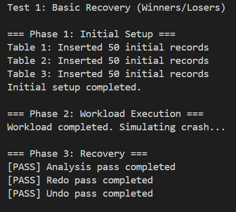
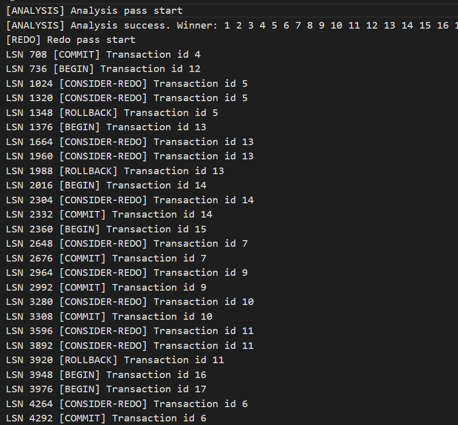
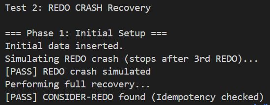
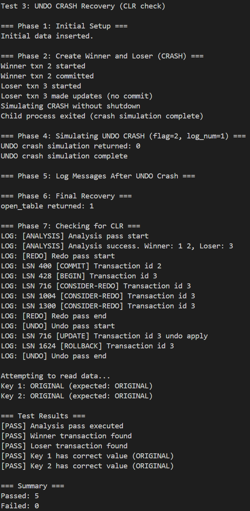
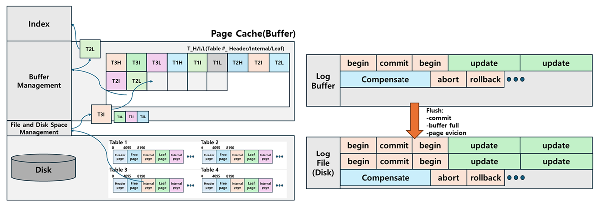

# simple-dbms – Transaction Logging & Three-Pass Recovery

A DBMS storage engine implementing ARIES-based recovery with transaction logging.  
This project implements a Log Manager that ensures **Atomicity** and **Durability** through a three-pass recovery algorithm (Analysis, Redo, and Undo).

The database system now supports robust recovery:  
- **No-force / Steal policy**: Efficient buffer management with UNDO/REDO support.  
- **Write-Ahead Logging (WAL)**: Ensures logs are written before data pages.  
- **Three-Pass Recovery**: Analysis, Redo, and Undo passes to restore the database to a consistent state after a crash.  
- **Compensate Log Records (CLR)**: Supports progress during repeated failures by avoiding redundant undos.


---

## 프로젝트 설명

이번 구현은 **DBMS**의 **Log Manager**를 구현하여 시스템 장애 발생 시에도 데이터의 무결성을 보장하는 **Three-Pass Recovery** 알고리즘을 적용합니다.
이번 프로젝트를 통해서 **Atomicity**와 **Durability**를 보장하게 되며, 다음을 지원합니다:

- **ARIES 기반 회복 알고리즘**: Analysis, Redo, Undo 단계를 거치는 완벽한 회복 메커니즘.  
- **로그 매니저 (Log Manager)**: WAL(Write-Ahead Logging) 원칙을 준수하며 로그 레코드를 관리.  
- **CLR (Compensate Log Record)**: Undo 단계 중 시스템 재크래시가 발생해도 진행 상황을 유지할 수 있는 'Undo Next LSN' 지원.  
- **조건부 Redo (Consider-Redo)**: 이미 디스크에 반영된 변경사항은 중복 적용하지 않아 회복 속도를 최적화.


(참고)  
원래는 인덱스 계층까지는 c로 구현했었지만, 이후 추가 계층을 구현하면서 cpp의 STL을 활용해야 하는 상황이 발생함에 따라 c언어 + STL 형태의 구조로 전환되었습니다.  
이번 프로젝트는 테스트가 충분히 이뤄지지 않았습니다.  

---

### Limitations & Assumptions  

본 프로젝트는 ARIES 회복 알고리즘의 핵심 메커니즘을 정확히 구현하고 검증하는 것을 최우선 목표로 하며, 이에 따라 다음과 같은 제약 사항 및 가정을 포함합니다.

1. **Torn Page Write 미고려**  
현상: 페이지를 디스크에 쓰는 도중 시스템이 중단되어 페이지가 부분적으로 파손되는 현상.  
가정: 운영체제나 스토리지 계층에서 Atomic Write를 보장하거나, 하드웨어적인 Double Write Buffer가 구현되어 있다고 가정합니다.  
이유: 페이지 파손 복구라는 부가적인 문제보다, 로그 레코드를 활용한 **Three-pass recovery** 로직의 무결성 검증에 집중하기 위함입니다.  

2. **Checkpoint 메커니즘 미구현**  
설명: 회복 시점의 분석 범위를 줄여주는 체크포인트 기능을 포함하지 않습니다.  
동작: 따라서 시스템 재시작 시, 로그 파일의 시작점(LSN 0)부터 전체 로그를 전수 조사하여 회복 프로세스를 시작합니다.  
이유: 기초적인 **WAL(Write-Ahead Logging)** 원칙과 전체 로그 대상의 완전한 회복 프로세스를 명확히 구현하는 것에 우선순위를 두었습니다. 또한, 체크포인트는 정합성 유지와 구현 난이도가 매우 높은 작업이므로, 현재 단계에서는 로그 매니저의 기본 성능과 안정성 확보에 집중하였습니다.  
DPT 관련 사항: 본 프로젝트에서는 **DPT(Dirty Page Table)** 를 구현하여 관리하고 있으나, 체크포인트 로그가 존재하지 않으므로 Redo의 시작 지점을 앞당기는 등의 최적화 이득을 실질적으로 얻지는 못합니다. 대신 모든 로그를 순차적으로 읽으며 Page LSN을 비교하는 Consider-Redo 방식을 통해 데이터 정합성을 보장합니다.

---

## 개발 환경 및 실행 (Development Environment)

개발환경:  
Ubuntu 24.04.3 LTS (GNU/Linux 5.15.167.4-microsoft-standard-WSL2 x86_64)
  
실행:

- libbpt.a 라이브러리를 생성: `make` (Makefile 참고)
- libbpt.a 라이브러리를 test_recovery 폴더로 이동
- 테스트 파일 make: `make` (test_recovery의 Makefile 이용)
- normal recovery 테스트 실행: `./basic_test` (test_recovery 폴더 내에서)
- redo crash recovery 테스트 실행: `./redo_test`
- undo crash recovery 테스트 실행: `./undo_test`

---

## 테스트 화면 (Test Execution)  
   

   

  



---

<details>
<summary><b>Log Record Structure (LSN as End Offset Version)</b></summary>

이 버전은 LSN 값이 해당 로그 레코드가 끝나는 지점의 파일 오프셋을 가리키는 구조입니다.

### 1. Common Log Header (28 Bytes)

모든 로그 레코드의 시작 부분에 위치하며, `BEGIN`, `COMMIT`, `ROLLBACK` 로그의 전체 구조이기도 합니다.

| Field | End Offset | Size (Bytes) | Description |
| --- | --- | --- | --- |
| **LSN** | **8** | 8 | 현재 로그의 Sequence Number (파일 내 **끝** 오프셋) 
| **Prev LSN** | **16** | 8 | 동일 트랜잭션의 이전 로그 LSN 
| **Transaction ID** | **20** | 4 | 로그를 생성한 트랜잭션 ID 
| **Type** | **24** | 4 | 로그 타입 (0:BEGIN, 1:UPDATE, 2:COMMIT, 3:ROLLBACK, 4:CLR) 
| **Log Size** | **28** | 4 | 로그 레코드의 전체 크기 
 |

### 2. Update Log Record (288 Bytes)

데이터 수정 시 생성되며, 공통 헤더 뒤에 아래 필드들이 추가됩니다.

| Field | End Offset | Size (Bytes) | Description |
| --- | --- | --- | --- |
| **Header Fields** | **28** | 28 | 위 Common Log Header와 동일 
| **Table ID** | **32** | 4 | 수정된 테이블의 ID 
| **Page Number** | **40** | 8 | 수정된 페이지 번호 
| **Offset** | **44** | 4 | 페이지 내 데이터 수정 시작 오프셋 
| **Data Length** | **48** | 4 | 수정된 데이터의 길이 
| **Old Image** | **164** | 116* | 수정 전 데이터 (Undo용) 
| **New Image** | **284** | 120 | 수정 후 데이터 (Redo용) 
| **Log Size** | **288** | 4 | Update 로그 전체 크기 (재기재) 
 |

### 3. Compensate Log Record (CLR) (296 Bytes)

Undo 작업 중 생성되며, Update 로그 구조 끝에 'Next Undo LSN' 필드가 추가됩니다.

| Field | End Offset | Size (Bytes) | Description |
| --- | --- | --- | --- |
| **Update Fields** | **284** | 256 | 위 Update Log의 필드 구조와 동일 
| **Next Undo LSN** | **292** | 8 | 다음에 Undo해야 할 로그의 LSN 
| **Log Size** | **296** | 4 | CLR 전체 크기 (재기재) 
 |

</details>

---

<details>
<summary><b>Recovery APIs & Requirements</b></summary>

### `int init_db(int buf_num, int flag, int log_num, char* log_path, char* logmsg_path)`

* **Purpose:** Initializes the DBMS and performs the recovery process by analyzing the log files.
* **Action:**
1. **Analysis Pass**: Scans the log to identify Winner and Loser transactions.
2. **Redo Pass**: Reapplies all necessary changes. Checks `Page LSN` to prevent redundant applications (**Consider-Redo**).
3. **Undo Pass**: Rolls back the operations of Loser transactions in reverse order and writes **CLRs**.


* **Recovery Test Flags:**
* `flag 1`: Stop after processing `log_num` records during the **Redo** pass (Redo Crash Test).
* `flag 2`: Stop after processing `log_num` records during the **Undo** pass (Undo Crash Test).


* **Return Value:**
* `0`: Success (Recovery completed or intentionally stopped by test flags).
* `Non-zero`: Error occurred.


### `int txn_abort(int txn_id)`

* **Purpose:** Explicitly aborts a running transaction.
* **Action:**
1. Roll back all modifications made by the transaction by following the `Prev LSN` chain.
2. Generate a **CLR** for each rollback step.
3. Release all locks held by the transaction.


* **Return Value:** * `txn_id`: Success.
* `0`: Failure.


</details>

---

## 디자인 설계 (Design)  

다음은 이 프로젝트의 **디자인**입니다.  



**페이지 버퍼**와 **로그 버퍼**를 구분해서 관리합니다.  
페이지 버퍼는 실제로 캐시에 가깝습니다.  
로그 버퍼는 실제로는 flush만 하기 때문에 버퍼에 가깝습니다.  
**페이지를 저장하는 DB Disk**와 **로그 레코드를 저장하는 로그 파일(디스크)** 를 구분해서 관리합니다.  

복구 과정은 **ARIES Recovery** 알고리즘을 따르는 **3-Pass Recovery**를 수행합니다.  
복구 과정은 **Analysis-Redo-Undo** 과정으로 진행되며 각 recovery 과정에서 crash가 발생할 수 있습니다.  
각각의 발생 가능한 crash 상황을 basic test, redo test, undo test를 수행하여 진행했습니다. 실제 crash나는 상황을 완전히 재현하는 것은 불가능에 가깝고 대신에 다음과 같은 방법을 사용했습니다.  
  
 `int init_db(int buf_num, int flag, int log_num, char* log_path, char* logmsg_path)`  
 `flag`를 통해 crash 종류를 지정할 수 있고, `flag`종류의 recovery pass과정에서 일정 `log_num` 이상의 크래시가 발생하면 `exit()`를 통해 강제 종료시켰습니다. `exit()`를 이용하기 위해 실제 스레드 방식이 아닌 `fork()`를 통한 프로세스 복제 방식을 이용했습니다.  

---

## Recovery Algorithm Details

본 프로젝트는 ARIES 알고리즘을 기반으로 **Analysis - Redo - Undo**의 3단계 복구 프로세스를 수행합니다. 특히 메모리 내에서 복구 상태를 관리하는 `recovery_state_t` 구조체를 통해 정확하고 효율적인 회복을 보장합니다.

### 1. Analysis Pass (상태 재구성)

로그 파일의 시작(LSN 0)부터 끝까지 스캔하며 장애 시점의 메모리 상태인 **ATT(Active Transaction Table)** 와 **DPT(Dirty Page Table)** 를 복구합니다.  
**ATT**는 "누가(Winner/Loser) 어디서부터(Last LSN) 취소되어야 하는가"를 결정합니다.  
**DPT**는 "어떤 페이지가 어디서부터(recLSN) 다시 쓰여야 하는가"를 결정하여 Redo 범위를 최적화합니다.  
이 두 테이블 덕분에 전체 로그를 다 읽지 않고도, 필요한 부분만 정확하고 빠르게 복구할 수 있습니다.  


**핵심 자료구조 구현**:
* **ATT (Active Transaction Table)**: `std::unordered_map<txnid_t, uint64_t> active_txn_table`
    * **역할**: 각 트랜잭션 ID별로 가장 최근에 발생한 로그의 LSN(`last_lsn`)을 저장합니다.
    * **목적**: Undo Pass에서 Loser 트랜잭션을 역추적할 때, 로그 파일의 어디서부터 거꾸로 읽기 시작해야 하는지 결정하는 시작점 역할을 합니다.


* **DPT (Dirty Page Table)**: `std::unordered_map<std::pair<tableid_t, pagenum_t>, uint64_t, LogHash>`
    * **역할**: 수정되었지만 아직 디스크에 반영되지 않았을 가능성이 있는 페이지와 해당 페이지의 최초 수정 LSN(**recLSN**)을 매핑합니다.
    * **목적**: Redo Pass에서 불필요한 I/O를 줄이고, 전체 로그 중 어디서부터 Redo를 시작해야 하는지(`min recLSN`) 결정하는 근거가 됩니다.


* **Winner/Loser 집합**: `std::set<txnid_t>`를 사용하여 `COMMIT/ROLLBACK` 여부에 따라 복구 대상(Loser)을 선별합니다.


**동작**: 로그를 순차 스캔하며 `UPDATE` 로그 발견 시 DPT에 해당 페이지가 없으면 현재 LSN을 등록하고, 모든 로그에 대해 해당 트랜잭션의 ATT 정보를 최신 LSN으로 갱신합니다.

### 2. Redo Pass (기록 재현 - "Repeating History")

장애 전의 상태를 그대로 복구하기 위해 DPT에 기록된 최소 `recLSN`부터 모든 로그를 재실행합니다.

* **동작**:
1. DPT에서 가장 작은 `recLSN`을 찾아 해당 지점부터 로그 스캔을 시작하여 효율성을 높입니다.
2. **Consider-Redo (최적화)**: 페이지 I/O를 최소화하기 위해 다음 조건을 체크합니다.
    * 대상 페이지가 DPT에 없거나, 현재 로그 LSN이 DPT의 `recLSN`보다 작으면 이미 디스크에 반영된 것이므로 **Skip** 합니다.


3. 위 조건을 통과한 경우에만 페이지를 읽어 **`Page LSN >= Current LSN`** 인지 최종 확인 후 Redo를 수행합니다.
4. **CLR Redo**: 이전 복구 시도 중 작성된 CLR 로그도 Redo 하여 Undo 진행 상황을 복원합니다.


### 3. Undo Pass (논리적 롤백)

완료되지 못한 Loser 트랜잭션들을 장애 발생 역순으로 되돌립니다.

* **Priority Queue (Max-Heap) 최적화**:
    * **구현**: `std::priority_queue<std::pair<uint64_t, txnid_t>> undo_pq`
    * **역할**: 여러 Loser 트랜잭션의 로그가 섞여 있는 상황에서, **전체 시스템 관점에서 가장 최신(큰) LSN**을 먼저 처리해야 합니다.
    * **효율성**: 모든 Loser의 `last_lsn`을 PQ에 넣고  성능으로 다음 undo 대상 로그를 추출함으로써, 대량의 트랜잭션 복구 시 정렬 비용을 획기적으로 낮췄습니다.


* **CLR (Compensate Log Record) 처리**:
    * `UPDATE` 로그 취소 시 `old_image`로 복구 후 **CLR**을 작성합니다. 이때 CLR의 `next_undo_lsn` 필드에 현재 로그의 `prev_lsn`을 저장합니다.
    * **중복 Undo 방지**: 복구 중 `CLR`을 만나면 이미 취소된 작업이므로, 실제 복구는 건너뛰고 해당 CLR의 `next_undo_lsn`을 다시 PQ에 넣어 다음으로 취소해야 할 지점으로 즉시 점프합니다.


---

## 기술적 의사결정 (Technical Decision)

**1. LSN(Log Sequence Number) 관리 방식**

* **결정:** 로그 파일 내의 **바이트 오프셋(Byte Offset)** 을 LSN으로 사용합니다.
* **이유:** 전역 변수 방식보다 직관적이며, LSN 값만으로 별도의 매핑 없이 파일 내 위치를 즉시 찾아갈 수 있어 디스크 접근이 효율적입니다.

**2. 오프셋 관리: Start Offset vs End Offset**

* **결정:** **End Offset** 방식 채택 (LSN이 로그 레코드의 끝 지점을 가리킴).
* **이유:** 
    * 기존 방식과의 비교: Start Offset 방식은 현재 LSN + 로그 크기로 다음 로그의 위치를 계산하기 쉬워 로그를 '읽는' 단계에서는 직관적입니다. 하지만 본 프로젝트에서는 로그를 "디스크에 쓰고 관리할 때"의 효율성에 더 큰 비중을 두었습니다.

    * WAL 원칙과의 정합성: LSN을 파일 오프셋과 일치시켰기 때문에(1번 결정), 현재 로그 파일의 크기(File Size)가 곧 마지막으로 안전하게 기록된 Flushed LSN이 됩니다. 덕분에 데이터 페이지를 디스크에 쓰기 전 로그가 먼저 써졌는지 확인할 때(WAL check), 별도 연산 없이 파일 크기와 LSN을 직접 비교할 수 있어 매우 유리합니다.

    * 자주 발생하는 상황 판단: 시작 지점을 찾기 위해 LSN - 로그 크기라는 추가 연산이 필요하다는 단점이 있지만, DBMS 운영 환경에서는 Recovery(읽기) 상황보다 로그를 작성(쓰기/관리)하는 상황이 훨씬 빈번하므로 End Offset 방식이 전체적인 시스템 성능과 관리 면에서 이점이 크다고 판단했습니다.

**3. 로그 버퍼 구조**

* **결정:** **Circular Buffer** 방식.
* **이유:** 메모리를 재사용할 수 있어 효율적이며, 공간이 부족할 때 Flush 스레드가 공간을 비워줄 때까지 대기하는 동기화 구현에 적합합니다.

**4. 롤백(Rollback) 시 데이터 읽기**

* **결정:** **TCB(Transaction Control Block)에 Undo 로그 저장**.
* **이유:** 트랜잭션 취소 시마다 디스크에서 로그를 읽어오는 것은 성능 저하가 큽니다. 메모리 내 TCB에 관련 정보를 들고 있어 빠른 롤백을 지원합니다.

**5. 크래시 상황에서의 페이지 Flush**

* **결정:** **테스트를 위해 가능한 상황에서만 디스크에 기록**.
* **이유:** 실제 크래시는 여유가 없지만, 강제 종료(`exit`)가 아닌 제어 가능한 테스트 상황에서는 일부 Dirty Page를 디스크에 써서 **Undo와 Redo가 동시에 필요한 복잡한 상황**을 만들어 검증하기 위함입니다.

**6. Undo Pass에서의 LSN 관리**

* **결정:** **ATT(Active Transaction Table)의 Last LSN** 활용.
* **이유:** 크래시 이후에는 TCB가 증발하므로, 분석 단계(Analysis)를 통해 복구한 ATT의 마지막 LSN을 기점으로 로그를 역추적합니다.

**7. Checkpoint 부재 시 ATT/DPT 구현 여부**

* **결정:** **실익이 적더라도 둘 다 구현**.
* **이유:** 체크포인트가 없어 DPT를 통한 최적화 효과는 낮지만, ARIES 알고리즘의 완전한 구현과 향후 확장성을 위해 자료구조를 유지합니다.

**8. TCB와 ATT의 LSN 중복 관리**

* **결정:** **런타임은 TCB, 복구 시에는 ATT**.
* **이유:** 정상 가동 중에는 TCB가 로그 체인 형성을 위해 관리하고, 복구 시에는 로그 분석으로 얻은 정보를 ATT에 담아 Loser를 식별해야 하기 때문에 두 역할은 분리되는 것이 맞습니다.

**9. 로그 버퍼 여유 공간 부족 처리**

* **결정:** **Condition Variable을 이용한 블로킹 대기**.
* **이유:** 버퍼가 가득 차면 로그 손실을 막기 위해 Flush가 완료될 때까지 해당 스레드를 대기시키고, 공간 확보 시 다시 깨워서 작업을 진행합니다.


---

## 트러블 슈팅(Troubleshooting)  

### 1. 로그 매니저 래치 추가로 인한 AB-BA 데드락 (Deadlock)

* **문제**: `txn_abort`나 복구 중 Undo를 수행할 때 시스템이 응답 없음 상태에 빠지는 현상이 발생했습니다.
* **원인**: 래치 획득 순서의 불일치 때문이었습니다.
* **상황 A**: `txn_abort` 호출 시 **Lock Table Latch**를 먼저 잡고, 내부에서 Undo 로그를 처리하기 위해 **Buffer Latch** 및 **Page Latch**를 요청.
* **상황 B**: 일반적인 `db_update` 수행 스레드가 **Page Latch**를 잡은 상태에서 `lock_acquire`를 위해 **Lock Table Latch**를 요청.
* 두 자원을 서로 반대 순서로 요청하며 **AB-BA 데드락**이 발생했습니다.


* **해결**: Undo 시나리오에서 래치 점유 범위를 분석하여, Lock Table 래치를 유지한 채 페이지 버퍼에 접근하지 않도록 로직을 분리하거나 순서를 계층화하여 해결했습니다.

### 2. 크래시 복구 시 테이블 메타데이터 유실 및 FD(File Descriptor) 오류

* **문제**: REDO 복구 중 `lseek error: Illegal seek` 발생.
* **원인**: `init_db`가 재호출될 때 모든 테이블 정보가 초기화되면서, 기존에 열려있던 파일 디스크립터(fd)가 유실되었습니다. 특히 `CLR` 로그 처리 시 테이블을 자동으로 열어주는 로직이 누락되어 `-1`인 fd로 파일 읽기를 시도했습니다.
* **코드 예시 (해결 전후 비교)**:

```cpp
// 해결 전: fd가 -1인 경우 lseek 에러 발생
file_read_page(fd, page_num, frame_ptr); 

// 해결 후: Recovery 중에도 유효한 fd를 보장하도록 수정
int fd = get_fd(table_id);
if (fd == FD_FAIL) {
    fd = open_table(table_name); // 테이블이 닫혀있으면 다시 열어 fd 갱신
}
file_read_page(fd, page_num, frame_ptr);

```

### 3. 페이지 타입별 LSN Offset 불일치

* **문제**: 헤더 페이지의 LSN과 일반 페이지의 LSN 위치가 달라 복구 시 `Page LSN` 체크가 오작동했습니다.
* **원인**: 구조체 정의 시 헤더 페이지의 필드 바이트 크기 차이로 인해 LSN의 시작 오프셋이 어긋났습니다.
* **구조체 수정 내용**:

```cpp
// Header Page와 일반 Page의 LSN 위치를 동일한 Offset으로 통일
typedef struct {
    pagenum_t free_page_num;
    pagenum_t root_page_num;
    pagenum_t num_of_pages;
    char reserved[8];    // 24바이트 (다른 page에선 page_lsn 위치)
    uint64_t page_lsn;   // 모든 페이지의 LSN 시작 위치(24) 통일
    char reserved_rest[HEADER_PAGE_RESERVED];
} header_page_t;

```

### 4. 컴파일러 구조체 패딩(Padding)으로 인한 로그 크기 불일치

* **문제**: 로그 파일의 바이트 오프셋과 메모리 구조체의 크기가 일치하지 않아 데이터가 오염되었습니다.
* **원인**: 64비트 컴파일러가 성능을 위해 멤버들 사이에 자동으로 패딩 바이트를 삽입하여, `base_log_t`가 예상보다 커지는 문제가 있었습니다.
* **해결**: `#pragma pack`을 통해 1바이트 단위 정렬을 강제하여 로그 레코드의 물리적 크기를 설계(28, 288, 296 Bytes)와 일치시켰습니다.

```cpp
#pragma pack(push, 1)  // 패딩 제거 시작
typedef struct base_log_t {
    uint64_t lsn;       // 8
    uint64_t prev_lsn;  // 8
    uint32_t txn_id;    // 4
    uint32_t type;      // 4
    uint32_t log_size;  // 4 -> Total 28 Bytes (No Padding)
} base_log_t;
#pragma pack(pop)      // 패딩 설정 복구
```

---
